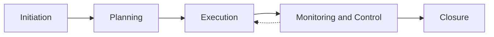

# Lecture 2 — The Delivery Lifecycle, End to End

> **Duration:** ~2 hours. **Outcome:** You can name the five lifecycle phases in order, state the artifact and the decision each phase produces, and explain — with a real example — why skipping initiation is where projects quietly die.

Every project, regardless of industry, size, or whether the team calls itself "Agile," moves through the same five phases. Waterfall does them once, in strict sequence. Agile does them too — it just compresses planning/execution/monitoring into small repeating loops instead of one long pass. Understanding the five phases as *decisions and artifacts*, not as a rigid calendar, is what lets you recognize them inside any methodology later in this course.

*The five phases run mostly in sequence, but monitoring and execution loop together continuously until closure.*

## 1. The five phases, at a glance

| Phase | Core question it answers | Key artifact(s) | Typical failure if skipped |
|---|---|---|---|
| **Initiation** | Should we do this, and what does "done" mean? | Charter, sponsor sign-off | Team builds the wrong thing, confidently |
| **Planning** | How will we do it, and what will it cost/take? | Delivery plan, backlog, estimates, risk register | Team discovers the real scope mid-execution, at the worst time |
| **Execution** | Is the work getting built? | Working software, updated board, sprint output | (Rarely skipped — but done badly without 1–2) |
| **Monitoring & Control** | Are we still on track, and what do we do if not? | Status reports, change log, updated risk register | Problems surface too late to react cheaply |
| **Closure** | Did we deliver what we promised, and what did we learn? | Acceptance sign-off, retrospective, handover docs | Same mistakes repeat next project; no one "owns" the ending |

These are not strict calendar blocks that happen once and never again — in Agile delivery (Week 2), planning/execution/monitoring repeat every sprint in miniature, while initiation and closure typically happen once per project. Hold both pictures in your head: the big-picture sequence *and* the fact that inside it, smaller loops of the same phases repeat.

## 2. Initiation — should we do this, and what does "done" mean?

Initiation is where someone with authority (a sponsor) decides a problem is worth solving and authorizes spending time and money on it. At Northlight, this is Priya deciding Team Workspaces matters enough to staff a team against it, because three enterprise renewals are at risk.

**The core output of initiation is a charter** (Lecture 3 goes deep on writing one) that answers, in writing, before a single line of code is written:

- What problem are we solving, and why now?
- What does success look like — specifically, measurably?
- What's explicitly *out* of scope, so nobody assumes it's included?
- What constraints are fixed (a hard deadline, a fixed budget, a compliance requirement)?
- Who has authority to make which decisions?

**Why skipping this is where projects quietly die:** imagine Northlight skips initiation and Marcus's team just starts building "some collaboration stuff" because Priya mentioned it in a hallway conversation. Three weeks in, Elena assumed "collaboration" meant real-time co-editing (expensive, complex); Marcus assumed it meant simple commenting (cheap, simple); Priya assumed it meant sharing a read-only link (barely a feature). Nobody's wrong — nobody ever agreed on a definition. The team ships *something* in six weeks, it satisfies none of the three mental models, and everyone is quietly furious at everyone else. This isn't a hypothetical — it is the single most common failure pattern in technology projects, and it is 100% preventable with one short document and one signature. **The charter is cheap. The alternative is not.**

## 3. Planning — how will we do it, and what will it take?

Once a charter is signed, planning turns "what" into "how, by when, with what resources." At Northlight this phase produces:

- **A backlog** — Elena and Marcus break "Team Workspaces" into concrete pieces: workspace creation, invite teammates, shared dashboard view, commenting, permissions. (Week 3 goes deep on writing these as proper user stories.)
- **Estimates** — Marcus's team sizes each piece (Week 4 covers story points and relative sizing) so the team can reason about how much fits in the available time.
- **A delivery plan** — the PM sequences the backlog against the team's capacity and the target date, and produces a realistic (not hopeful) plan: which pieces ship in which sprint, and what the critical path is.
- **A risk register** — what could derail this? (Third-party API reliability, a teammate going on leave, an unclear permissions model.) Week 6 goes deep; for now, know that planning is when you *first* write these down, not when they happen.
- **A chosen delivery approach** — predictive, iterative, or Agile (Lecture 3, section 4). This decision belongs in planning because it shapes everything downstream: how the backlog is sequenced, how often the plan gets revisited, and what "on track" even means.

Planning is where the charter's optimistic scope meets the team's actual capacity, and that meeting is often uncomfortable. If Elena's full wishlist doesn't fit before the renewal deadline, planning is where that gets discovered and negotiated — cut scope, extend the date, or add people (rarely a real option; more people usually slows a project down before it speeds it up, especially mid-project) — **not** discovered three days before the deadline during execution.

## 4. Execution — is the work getting built?

This is the phase most people picture when they hear "project": engineers writing code, designers designing, the backlog moving across the board. It's also, correctly, the phase where the PM does the *least* direct work and the *most* enabling work — clearing blockers (Lecture 1), keeping the plan current, and making sure execution stays connected to what initiation and planning agreed to.

A subtlety worth naming: execution is where scope creep is easiest and most dangerous. Someone on the Atlas team notices dashboards would be nicer with a dark mode toggle — small, reasonable-sounding, not in the charter. Add ten "small, reasonable" additions like that during execution and a six-week project becomes a ten-week project with nobody able to point to the moment it happened. The PM's job during execution isn't to say no to every idea — some are genuinely worth adding — it's to make sure every addition is a **visible decision** against the charter's stated scope and constraints, not a silent one.

## 5. Monitoring & control — are we still on track?

Monitoring runs *alongside* execution, not after it — think of it as the project's nervous system, constantly checking the plan against reality. Its outputs:

- **Status reporting** — the honest, early, small updates Lecture 1 described. At Northlight, a weekly async update to Priya: what shipped, what's next, what's at risk.
- **A change log** — when scope, date, or budget actually changes (not silently drifts — *changes*, with a decision behind it), it's written down: what changed, who approved it, why.
- **A living risk register** — risks get reassessed as the project moves; new ones appear, old ones resolve or get retired.
- **Variance detection** — is the team actually delivering at the rate the plan assumed? If Atlas planned five stories per sprint and the team is landing three, that's a monitoring signal to act on *now*, while there's still time to adjust — cut scope, negotiate the date, or find out what's actually slowing the team down — rather than a surprise at the end.

Monitoring is what makes the difference between "we found out on day 40 of a 42-day project that we're not going to make it" (useless — no time left to react) and "we found out on day 12 that our pace implies a two-week slip, and here are three options" (useful — there's still room to choose).

## 6. Closure — did we deliver, and what did we learn?

Closure is the most frequently skipped phase, and skipping it is expensive in a way that doesn't show up until the *next* project. At Northlight, closing Project Atlas means:

- **Formal acceptance** — Priya and Elena confirm, against the charter's success criteria, that what shipped is what was promised (or agreeing, explicitly, on what changed and why). This isn't a rubber stamp — it's the moment the charter's promises get checked against reality.
- **Handover** — Marcus's team hands ongoing ownership of Team Workspaces to whoever maintains it long-term (it's now *product* work, not project work — see Lecture 1, section 2). Documentation, on-call ownership, and known issues transfer cleanly.
- **Retrospective** — the team looks back honestly: the third-party API risk that was logged in planning actually did cause a one-week slip in week 4 — what would have caught that sooner? This is where the *next* project gets better, and it's the single highest-leverage 90 minutes in the whole lifecycle, because it compounds across every future project a team runs.
- **Celebrating and closing out** — sounds soft, it isn't: a team that never gets to hear "we shipped it, and here's the impact" burns out faster and trusts the next charter less.

A project that ships code but never formally closes tends to leave loose threads: nobody's quite sure if it's "done," minor bugs linger with no clear owner, and the retrospective that would have prevented next quarter's version of the same mistake never happens.

## 7. Walking Project Atlas through all five phases

To tie it together, here's Atlas end to end:

1. **Initiation (week 0):** Priya identifies the renewal risk, sponsors the project, and signs a charter Elena and the PM drafted defining scope (workspace creation, sharing, commenting; explicitly *not* real-time co-editing) and success criteria (three named accounts renew; workspace adoption ≥30% of active accounts within 60 days of launch).
2. **Planning (week 1):** Elena and Marcus break the charter into a backlog of ~18 stories; Marcus's team estimates it; the PM builds a 6-sprint delivery plan and logs the third-party sharing-API risk.
3. **Execution (weeks 2–7):** the team builds in two-week sprints; the PM clears blockers (the permissions decision from Lecture 1) and keeps the board honest.
4. **Monitoring & control (weeks 2–7, continuous):** weekly status to Priya; in week 4 the sharing API risk materializes (the sandbox environment goes down for three days) and the PM, Elena, and Marcus agree, in writing, to cut real-time presence indicators (never core to the charter's success criteria) to protect the launch date — a visible, approved scope change, not a silent slip.
5. **Closure (week 8):** Priya and Elena formally accept the shipped feature against the charter's success criteria; the team runs a retrospective (lesson: pressure-test third-party sandbox reliability *during planning*, not week 4); Team Workspaces hands off to ongoing product ownership.

## 8. Check yourself

- Name the five phases in order, and the one artifact you'd point to as proof each phase happened.
- Why does monitoring run *alongside* execution instead of after it?
- Explain, using Project Atlas's week-4 API risk, the difference between a visible scope change and silent scope creep.
- What's lost, specifically, when a team skips the retrospective in closure?
- A teammate says "we don't need a charter, we're Agile, we just start building." What's wrong with that argument, using this lecture's vocabulary?

If those are automatic, Lecture 3 writes Project Atlas's actual charter — the artifact initiation depends on.

## Further reading

- **PMI — "A Guide to the Project Management Body of Knowledge (PMBOK), process groups overview":** <https://www.pmi.org/pmbok-guide-standards>
- **Atlassian — "Project lifecycle explained":** <https://www.atlassian.com/agile/project-management/project-management-lifecycle>
- **Project Management Institute — "The Standard for Project Management" (free summary):** <https://www.pmi.org/about/what-is-project-management>
