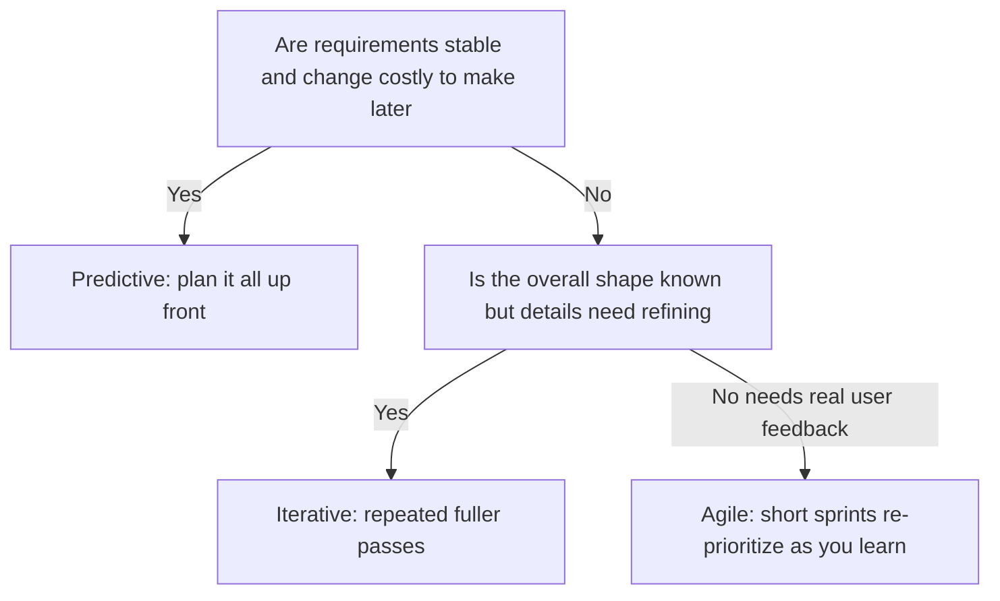

# Lecture 3 — Charters, Scope, and Success Criteria

> **Duration:** ~2 hours. **Outcome:** You can write a defensible one-page project charter — objectives, in/out-of-scope, constraints, and measurable success criteria — explain the triple constraint and how quality trades against it, and choose a delivery approach (predictive, iterative, or Agile) for a given brief and defend the choice.

Lecture 2 established that initiation lives or dies on one document: the charter. This lecture teaches you to write one that actually holds up — the kind a skeptical sponsor and a skeptical tech lead would both sign without rolling their eyes.

## 1. What a charter is for

A charter is not a status report, not a design document, and not a schedule. It's a **one-page agreement** that answers, before work starts, the questions that are cheapest to answer now and most expensive to answer later:

- Why are we doing this?
- What, specifically, does success look like?
- What's in scope — and just as important, what's explicitly *not*?
- What constraints are non-negotiable (date, budget, compliance, a fixed integration)?
- Who has authority over what kind of decision?

A charter is short **on purpose**. A 20-page requirements document doesn't get read before a decision needs to be made under time pressure; a one-pager does. Detail belongs in the backlog (Week 3) and the delivery plan (Week 4–5) — the charter is the load-bearing wall everything else hangs off, and load-bearing walls should be simple and strong, not ornate.

## 2. Anatomy of a charter, section by section

### Objective

One or two sentences: the business reason this project exists, tied to something the sponsor actually cares about. Not "build team workspaces" (that's a solution) — **why** team workspaces, tied to a real consequence.

> **Weak:** "Add collaboration features to Northlight Insights."
> **Strong:** "Enable teams to share and discuss dashboards inside Northlight Insights so that at-risk enterprise accounts (currently single-user only) see enough value to renew, and Northlight closes its most-requested competitive gap."

The strong version tells you *why this matters enough to fund* — which is what lets you (and everyone else) make good trade-off calls later. If a scope-cut decision comes up in week 4, "does this still serve the renewal-risk objective?" is a sharper test than "does this still feel like collaboration?"

### Success criteria

The part most charters get wrong: vague aspirations instead of measurable targets. Lecture 2's Atlas example used:

> - At least 3 named at-risk enterprise accounts renew their contracts.
> - Workspace adoption reaches ≥30% of active accounts within 60 days of general availability.
> - No P1 (critical) incidents in the first 30 days post-launch.

Each of these has a **number**, a **timeframe**, and is checkable by someone who wasn't in the room when it was written. Compare to "customers love the new collaboration features" — nobody can ever definitively say whether that's true or false, which means it can never be *used* to make a decision. A success criterion that can't fail isn't one.

**The test for a good success criterion:** could two reasonable people, six months from now, look at the data and agree on whether it was met? If yes, it's usable. If it depends on someone's mood or memory, rewrite it.

### Definition of done

Distinct from success criteria (which measure business outcome) — definition of done defines when the *project itself* is considered complete, independent of whether the business outcome eventually materializes. For Atlas:

> Team Workspaces is "done" when: workspace creation, teammate invites, shared dashboard viewing, and commenting are shipped to all customers; the feature has been through security review; support documentation exists; and Priya and Elena have formally accepted it against the charter's scope.

Notice this says nothing about the 30% adoption target — that's a success criterion you'll only know 60 days *after* done. Done is about the project; success criteria are about the outcome the project was funded to produce. Conflating them is a common mistake — "done" that secretly means "successful" leaves a team unable to close a project until an outcome months away is known, which is exactly backwards.

### Scope — in and out

List concretely what's included, and — this is the part people skip and shouldn't — what's explicitly excluded, even if nobody's asked for it yet. Excluding things preemptively is cheap insurance against scope creep.

> **In scope:** workspace creation and management; inviting teammates by email; shared read/write dashboard viewing; threaded comments on dashboards; basic role permissions (owner/editor/viewer).
>
> **Out of scope (this release):** real-time simultaneous co-editing (cursors, live typing); workspace-level billing/seats beyond existing account limits; mobile app support (web only); SSO/SCIM provisioning for workspace members (existing account-level SSO still applies).

When someone later asks "does Atlas include real-time cursors?", the charter already answered it — you don't need a meeting, you need to point at a sentence. That's the entire value of writing "out of scope" down explicitly.

### Constraints

The fixed, non-negotiable facts of the project — not goals, facts:

> - Target date: general availability by end of Q3 (tied to the renewal window for the three at-risk accounts).
> - Team: existing 4-engineer squad; no additional headcount approved.
> - Must reuse the existing dashboard rendering engine — a rewrite is out of scope for cost reasons.
> - Must pass Northlight's standard SOC 2 security review before GA (compliance requirement, not optional).

Constraints are what makes trade-off conversations possible later — if the date is truly fixed and headcount is truly fixed, then when planning discovers the backlog doesn't fit, the only lever left is scope, and everyone already agreed to that logic when the charter was signed.

### Decision authority

One line naming who decides what, drawing on Lecture 1's role boundaries: "Priya approves scope/budget/date changes; Elena approves feature-level scope trade-offs within the approved backlog; Marcus approves technical approach; [PM name] owns the delivery plan and escalates when any of the above is at risk." This single line prevents an enormous amount of future argument.

## 3. The triple constraint, and how quality trades against it

The classic model: every project balances **scope**, **time**, and **cost**. Move one, and — assuming the team is already working effectively — at least one of the others has to move too. You cannot add scope for free, hold the same date, and hold the same team size; something gives.

```
        Scope
         /\
        /  \
       /    \
      /      \
     /________\
   Time      Cost
```

**Quality is not a fourth corner you can freely trade** — it's usually the silent casualty when a team tries to pretend the triangle doesn't apply. If Priya insists Atlas keeps its original scope *and* its original date *and* no more engineers are added, and the team can't say no, what actually happens is quality erodes invisibly: tests get skipped, security review gets rushed, technical debt gets taken on without anyone deciding to take it on. That's the worst outcome, because it's a **silent** trade rather than a **chosen** one — nobody signed off on "we'll ship it buggier," it just happened.

A good PM's job when the triangle is under pressure is to make the trade-off **explicit and chosen**: "we can hit the date with this scope, or hit this scope with two more weeks, or hit both if we cut real-time presence indicators — which do you want?" That's a much healthier conversation than silently absorbing pressure and hoping quality doesn't visibly suffer.

## 4. Predictive, iterative, and Agile — choosing a delivery approach

Not every project should be run the same way. Three broad approaches, and when each fits:


*Choosing predictive, iterative, or Agile depends on how stable requirements are and how much user feedback is needed.*

### Predictive (a.k.a. "waterfall")

Plan the whole project up front in detail, then execute the plan mostly as written. Phases happen once, in sequence: all requirements, then all design, then all build, then all test, then ship.

**Fits when:** requirements are genuinely stable and well understood up front (a known regulatory report format, a well-specified data migration), the cost of changing course mid-project is very high (hardware, safety-critical systems, fixed-price contracts with a defined deliverable), or a customer/regulator requires a detailed upfront plan before work can start.

**Doesn't fit when:** you don't yet know exactly what "good" looks like and need real user feedback to find out — which describes most software features, including Atlas.

### Iterative

Build in repeated passes, each one a fuller version of the whole, refining based on what you learn. Less rigid than predictive, but still typically plans a full release in advance rather than continuously re-prioritizing.

**Fits when:** the overall shape of the solution is known but the details benefit from a first rough pass you refine (early-stage prototypes converging toward a known target, gradually increasing fidelity of a design).

### Agile

Build and ship in short, fixed cycles (sprints), continuously re-prioritizing the backlog based on what's learned each cycle, with working software as the primary measure of progress. Requirements are expected to evolve.

**Fits when:** you're building something where user feedback should shape the details (most product feature work, including Atlas — Elena expects to learn from how customers actually use commenting and adjust priorities), the team benefits from shipping incrementally and course-correcting, or the full scope genuinely isn't knowable up front without building some of it first.

**Doesn't fit when** stakeholders need a fixed, detailed, all-at-once plan for contractual or regulatory reasons and can't tolerate "we'll figure out the details as we go" — Agile's flexibility becomes a liability, not a strength, in that context.

**Project Atlas's choice:** Agile, in two-week sprints. The charter's scope is reasonably well understood, but Elena expects real customer feedback on commenting and permissions to change priorities within the release, and the team benefits from shipping workspace creation early and learning from it before building sharing and comments. A predictive approach would lock in decisions about comment threading UX in week 1 that are better made after watching real usage in week 3.

This decision belongs *in the charter or immediately after it* — it shapes how planning (Lecture 2) actually happens, and Week 2 goes deep on running Agile well once you've chosen it.

## 5. Check yourself

- Write, in one sentence, the difference between a success criterion and a definition of done.
- What makes "customers love the new feature" a bad success criterion? Rewrite it as a good one.
- Why is writing down "out of scope" as valuable as writing down "in scope"?
- Priya wants to add real-time co-editing to Atlas without moving the date or the team size. Using the triple constraint, name the two honest responses (not "sure, we'll just work harder").
- Give one project that should be predictive and one that should be Agile, and defend both choices in one sentence each.

If those are automatic, you're ready for this week's exercises and the mini-project — writing a real charter of your own.

## Further reading

- **PMI — "Project Charter" overview:** <https://www.pmi.org/learning/library/project-charter-quick-reference-6754>
- **Atlassian — "Waterfall vs. Agile":** <https://www.atlassian.com/agile/project-management/project-management-intro>
- **Scrum.org — "What is the Definition of Done?":** <https://www.scrum.org/resources/what-definition-done>
