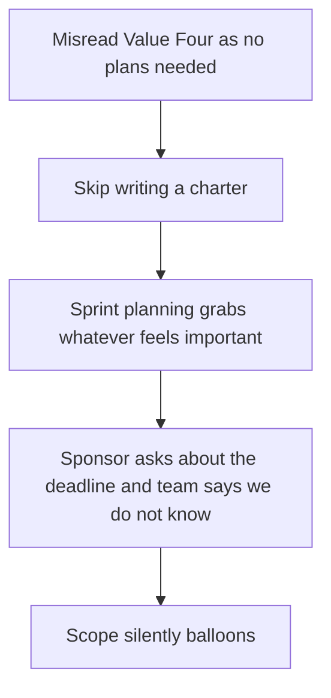

# Lecture 1 — Agile Values, in Practice

> **Duration:** ~2 hours. **Outcome:** You can explain each of the Agile Manifesto's four values in your own words, connect each to a real decision Project Atlas makes, name the twelve principles' main themes, and catch the single most common way "Agile" gets used as an excuse for having no plan.

Seventeen software practitioners met in 2001 and wrote a short declaration of values that has since been printed on more posters, sewn onto more hoodies, and misquoted in more job descriptions than almost any other document in software. Most teams that say "we're Agile" have never read past the poster. This lecture reads past the poster — not to recite the Manifesto, but to understand what each value actually **changes about a real decision**, using Project Atlas.

## 1. Why a manifesto, and why four values

By the late 1990s, most software was built the predictive way Week 1 described: write a complete requirements document, get it signed off, design the whole system, build the whole system, test the whole system, ship. This worked reasonably well for problems that were genuinely well understood in advance. It worked badly for the growing share of software where nobody — not the customer, not the team — actually knew the right answer until users touched a working version. Predictive process punished teams for learning anything after the requirements were signed, because "the requirements changed" was treated as a failure of planning rather than a normal, expected outcome of building something new.

The seventeen authors weren't proposing a new process. They were naming a **set of trade-offs** — for each pair, both things have value, but one should win when they conflict:

1. **People and interactions** over processes and tools.
2. **Working software** over comprehensive documentation.
3. **Customer collaboration** over contract negotiation.
4. **Responding to change** over following a plan.

Read literally, each line says "the thing on the right still matters — the thing on the left matters more when they're in tension." That qualifier is the entire document. Lose it, and the Manifesto becomes an excuse; keep it, and it's a genuinely useful decision rule.

## 2. Value 1 — people and interactions over processes and tools

**What it doesn't mean:** throw out your process; tools don't matter; just let people do whatever feels right.

**What it means in practice:** when a process is getting in the way of two people solving a problem together, the process should bend, not the people. At Northlight, imagine Atlas's ticketing tool requires every status change to go through a formal approval workflow designed for a 200-person engineering org. For a 4-engineer squad, that workflow adds friction without adding safety — two engineers pairing through a tricky permissions bug shouldn't have to stop and route a ticket through three approval states to reflect what they already agreed on in a five-minute conversation. The tool exists to serve the collaboration, not the other way around.

**Where it shows up this week:** every Scrum ceremony (Lecture 2) is a *structure for people to interact*, not a form to fill out. A standup that's fifteen people reading a status field off a screen one at a time, with no side conversation and no real listening, has kept the process and lost the value entirely.

## 3. Value 2 — working software over comprehensive documentation

**What it doesn't mean:** never write anything down; documentation is worthless; skip the charter.

**What it means in practice:** the *primary* evidence that a project is progressing is a version of the thing that actually runs — not a document describing what will eventually run. At Northlight, imagine two versions of a week-4 status update on Atlas's comment threading feature:

> **Documentation-heavy version:** "Comment threading design doc is 90% complete, covering data model, API contract, and three UI mockups reviewed by design."
>
> **Working-software version:** "You can create a comment, reply to it, and see it show up live in a shared workspace right now — here's a two-minute recording. Notifications and @mentions aren't built yet."

The second version tells Priya and Elena something the first one can't: whether the *actual experience* holds together. A design doc can describe a UX that turns out to be confusing or slow in practice; a working increment reveals that immediately. This is why Scrum's review ceremony (Lecture 2) demos running software, not slides.

This value doesn't mean Atlas skips its charter, its backlog, or its user stories — Weeks 1 and 3 are full of documents this course teaches you to write. It means those documents exist to **enable** working software faster, not to substitute for it. A backlog is useful because it turns into working code; a backlog nobody ever builds from is just comprehensive documentation with extra steps.

## 4. Value 3 — customer collaboration over contract negotiation

**What it doesn't mean:** never sign a contract; scope agreements are worthless.

**What it means in practice:** when the customer's actual need becomes clearer mid-project, the right response is a conversation about adjusting course, not a rigid insistence on the letter of an agreement written before anyone understood the problem well. At Northlight, imagine three enterprise customers pilot Atlas's early sharing feature and all three independently ask for the same small change — a way to see who's currently viewing a shared dashboard. It's not in Elena's original backlog. A contract-negotiation posture says "that's out of scope, it wasn't in the plan, no." A collaboration posture says "that's real signal from three paying accounts — let's talk about whether it belongs in this release, and if so, what comes out to make room" (the triple constraint from Week 1, made concrete).

This doesn't mean every customer request gets built — Elena still prioritizes, and the charter's constraints from Week 1 still hold. It means the relationship with the people who'll use the thing is a source of ongoing information, not an adversary to be managed with paperwork.

## 5. Value 4 — responding to change over following a plan

**What it doesn't mean:** don't plan; plans are pointless because everything changes anyway.

**What it means in practice:** a plan is a best guess made with the least information you'll ever have (the day you wrote it), and a team should expect to revise it as it learns — without treating every revision as a failure. At Northlight, Atlas's original plan sequenced commenting before notifications. Two weeks into building comments, the team learns from an early pilot customer that comments without notifications are nearly useless — nobody sees a comment was left, so nobody replies. Following the original plan rigidly means shipping a feature the team now knows is weak, on schedule, because the plan said so. Responding to change means re-sequencing: pull notification work forward, push something lower-priority back, and *say so explicitly* — which is precisely the visible, chosen scope change Week 1 distinguished from silent scope creep. The plan changed because the team learned something true, not because nobody bothered to plan.

The tension worth sitting with: Value 4 does **not** license "we don't need a plan, we'll just wing it" — that's the single most common misuse of Agile, and section 7 below names it directly.

## 6. The twelve principles, grouped

Underneath the four values, the Manifesto's authors wrote twelve supporting principles. You don't need to memorize them, but you should recognize the four themes they cluster into, because each one shows up as a concrete practice later this course:

| Theme | What it says, in practice | Where this course teaches the practice |
|---|---|---|
| **Deliver early and often** | Prefer shipping a smaller working slice sooner over a larger one later; welcome late-arriving change even if it costs rework | Sprints (Lecture 2), release planning (Week 5) |
| **Business people and developers work together daily** | Not "at kickoff and at the end" — continuously, so misunderstandings surface in days, not months | Daily standup (Lecture 2), Elena's role in the ceremonies |
| **Sustainable pace and technical excellence** | A team that sprints at 120% effort burns out and the plan collapses; cutting corners on quality to hit a date borrows against every future sprint | Velocity and capacity planning (Week 4) |
| **Reflect and adjust regularly** | The team itself, not just the plan, should periodically examine how it's working and change its own behavior | Retrospective (Lecture 2, and Exercise 3 this week) |

## 7. The most common misuse: "we're Agile, so we don't need a plan"

This is the failure mode worth naming explicitly, because it's the one that makes experienced engineers and sponsors distrust Agile entirely — often for good reason, having lived through a version of it. Here's how it actually happens on a team, step by step:

1. Someone reads "responding to change over following a plan" as "plans are for waterfall people; we just build things."
2. The team skips writing a charter (Week 1) because "that's not Agile" — even though nothing about the Manifesto says skip initiation.
3. Sprint planning becomes "grab whatever feels important this week" instead of pulling from a prioritized, estimated backlog.
4. When a sponsor asks "will this be done by the renewal date," the team's honest answer is "we don't really know," and that answer gets defended as an Agile virtue rather than recognized as a planning failure.
5. Scope silently balloons because nothing was ever written down as *out* of scope, and every "small addition" feels reasonable in isolation (the execution-phase scope-creep trap from Week 1, Lecture 2).

*How the "we're Agile, so we don't need a plan" misuse unfolds, one step feeding the next.*

None of that is what the Manifesto says. Real Agile teams plan constantly — they just plan in **short, revisable increments** (a sprint's worth) instead of one long, rigid increment (the whole project). Atlas still has a charter, a prioritized backlog, sprint plans, and success criteria; what's different from predictive delivery is the *time horizon* of each plan and how readily it's revised when reality disagrees with it. "Agile" is not a synonym for "unplanned" — it's a synonym for "the plan has a short enough leash that reality can correct it before real damage is done."

**The tell that a team has fallen into this trap:** ask "what's in this sprint, and why those items specifically?" A team with real Agile discipline has a crisp answer rooted in priority and capacity. A team using "Agile" as an excuse for no plan will struggle to say why *this* work is happening *now* versus anything else.

## 8. Check yourself

- State each of the four values in your own words, and give one Project Atlas decision each value would change.
- A teammate says "we don't need a design doc, we're Agile." What's the actual Manifesto position on documentation, and how is this different from what they said?
- Explain, using the comment-threading example, the difference between responding to change and having no plan at all.
- Which of the four principle themes (deliver early, work together daily, sustainable pace, reflect and adjust) does a retrospective with no action items violate, and why?
- Give one sign — something you could actually observe on a real team — that "we're Agile" has become an excuse rather than a practice.

If those are automatic, Lecture 2 puts these values into a concrete framework: Scrum's roles, its sprint container, and its four ceremonies.

## Further reading

- **The Agile Manifesto (original site):** <https://agilemanifesto.org/>
- **The Twelve Principles behind the Agile Manifesto:** <https://agilemanifesto.org/principles.html>
- **Martin Fowler — "The New Methodology":** <https://martinfowler.com/articles/newMethodology.html>
