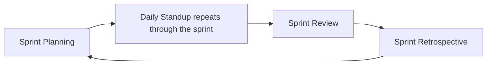

# Lecture 2 — Scrum: Roles, Sprint, Ceremonies

> **Duration:** ~2 hours. **Outcome:** You can name Scrum's three roles and what each owns, explain the sprint as a fixed, protected container, run all four ceremonies with real intent, and diagnose the exact moment each ceremony turns into theater.

Scrum is the most widely adopted Agile framework, and also the most widely *misapplied* — because it's easy to copy the artifacts (a board, a two-week box on the calendar, a fifteen-minute meeting called "standup") without understanding what any of them are actually for. This lecture goes through Scrum's three roles, its sprint container, and its four ceremonies, and for each one names the failure mode you will see on real teams — including, possibly, your own.

## 1. The three roles

Scrum defines exactly three roles inside the team. Note what's *not* on this list: "project manager" is not a formal Scrum role. Section 5 addresses that directly, because it's the question every PM taking this course eventually asks.

| Role | Owns | At Northlight |
|---|---|---|
| **Product Owner** | The backlog's content and order — *what* gets built and in what sequence | Elena Cruz |
| **Scrum Master** | The team's adherence to Scrum itself — facilitates ceremonies, removes process-level impediments, shields the team from disruption | *(see §5 — Atlas blends this into the PM role)* |
| **Development Team** | *How* the work gets built, and the commitment to what fits in a sprint | Marcus's four engineers (with Marcus as tech lead) |

**Product Owner** is a single person (not a committee) with real authority to prioritize — if two stakeholders disagree about what matters most, the PO makes the call so the team isn't waiting on consensus that never arrives. Elena's job during a sprint is largely about the *next* sprint: talking to customers, refining upcoming backlog items, and making sure the team never runs out of well-understood work to pull from.

**Scrum Master** is not a manager of people and not the person who decides what gets built. Their entire job is protecting the *process*: making sure ceremonies happen and work as intended, coaching the team on Scrum practice, and — critically — removing impediments that are about **how the team works together** (a ceremony running long and pointless, unclear Definition of Done, a teammate who won't stop interrupting standup with a design debate that belongs elsewhere).

**Development team** is deliberately not broken into sub-titles like "frontend engineer" or "backend engineer" in Scrum's own vocabulary — the team as a whole is accountable for the sprint's outcome, and work is *pulled*, not assigned top-down by a lead. In practice most real teams do have specialized skills (Atlas's four engineers aren't interchangeable), but the team commits to the sprint goal together, not as four separately-assigned task lists.

## 2. The sprint — a fixed, protected container

A **sprint** is a fixed-length time-box — commonly one or two weeks, never more than four — during which the team builds a set of backlog items they've committed to, and produces a working, potentially shippable increment by the end. Atlas runs **two-week sprints**, chosen in Week 1 because it balances enough time to finish meaningfully-sized stories against short enough that a wrong bet costs at most two weeks, not two months.

Two properties make a sprint a *container* rather than just "a period of time on a calendar":

1. **Fixed length, not fixed scope.** The date never moves mid-sprint. If reality disagrees with the plan (a story turns out bigger than estimated), scope inside the sprint adjusts — not the sprint boundary. This is the opposite of predictive delivery's instinct to protect scope and let the date slip.
2. **Protected from mid-sprint scope injection.** Once a sprint starts, new work doesn't get added to it just because someone thinks of something — new ideas go into the *backlog* for a **future** sprint, not into the current one. Atlas's sprint 2 (from the seed table) is already in flight with 10 committed items; if Priya asks for the "who's viewing this dashboard right now" feature from Lecture 1's example mid-sprint, it goes into the backlog for sprint 3's planning, not bolted onto sprint 2. Protecting the sprint boundary is what lets "we committed to this sprint" mean something — without it, a sprint is just a label on an ever-shifting pile of work, which is the sprint-in-name-only anti-pattern this week's Challenge 1 diagnoses.

There is one narrow exception worth naming: if something makes the sprint's original goal irrelevant entirely (a critical production outage, a customer emergency), the Product Owner can cancel the sprint — this is rare and disruptive by design, not a routine escape hatch.

## 3. The four ceremonies

Each ceremony has one job. Read the "what it's FOR" line before the "how" — the how is useless without the why.

### a) Sprint planning

**What it's for:** the team looks at the top of the prioritized backlog, decides together what fits in the coming sprint given their real capacity, and leaves with a shared, specific **sprint goal** — not just a pile of tickets, but a sentence describing what the sprint is trying to achieve.

**How it runs (Atlas, sprint 2):** Elena brings the backlog in priority order (query it — `ORDER BY priority_rank`). The team discusses each candidate story from the top down: is it well understood enough to build? Roughly how big (Week 4 covers estimation in depth)? Does it fit alongside what's already committed, given the team's known capacity? They stop pulling in more work once they're at capacity, and the sprint's goal gets written down: *"Ship threaded comments end-to-end, including notifications, so pilot customers can actually discuss a dashboard together."* Every item pulled into the sprint should serve that goal — if a story doesn't serve it, that's a sign it belongs in a later sprint, not this one.

**Failure mode — planning as rubber stamp:** the Scrum Master reads out a list Elena already decided alone, the dev team nods without really assessing capacity, and no sprint goal ever gets written — just a pile of tickets with a start and end date. The tell: ask the team two weeks later "what was this sprint trying to achieve?" If nobody can answer in one sentence, planning was theater.

### b) Daily standup (daily scrum)

**What it's for:** a short, frequent sync that surfaces blockers **fast**, so they get resolved in hours, not days — not a status report to a manager. Classically framed as three questions: what did I do since we last met, what will I do before we meet again, and what's in my way?

**How it runs (Atlas):** fifteen minutes, same time every day, the whole dev team plus Marcus. Dana says she's blocked on the comment-resolution story (#12 in the seed table) because she's not sure whether resolving a thread should notify the original commenter — that's a two-minute product question, not a design debate, so it gets a quick answer from Elena right after standup, not consumed inside the fifteen minutes. The point isn't the update itself — Marcus could read the board for that — it's that **hearing "I'm blocked" out loud, daily, in front of the team**, is what gets blockers unstuck fast instead of festering for three days because nobody happened to ask.

**Failure mode — standup as status theater:** each person reports to the Scrum Master or the PM one at a time, nobody's really listening to the others, blockers get mentioned but nobody follows up after the meeting, and it quietly becomes a fifteen-minute status meeting the team resents. The tell: if standup consistently runs long because it turns into a design discussion, or consistently produces zero follow-up on stated blockers, it has decayed into ritual. Lecture 1's Value 1 (people and interactions over process) is exactly what a status-theater standup has lost.

### c) Sprint review

**What it's for:** the team **demos working software** to stakeholders — Priya, Elena, sometimes a real customer — and gets real feedback on what actually got built, adjusting the backlog based on what's learned. This is Value 2 from Lecture 1 (working software over documentation) made into a ceremony.

**How it runs (Atlas, end of sprint 2):** the team shows the actual comment-threading feature running against a real workspace — not slides, not a design mock, the thing itself. Priya asks whether the "who's currently viewing" question from Lecture 1's example could be added; Elena notes it as a candidate for a future sprint's backlog, to be prioritized against everything else, not promised on the spot. The review produces two things: stakeholders see real progress (building trust — recall Week 1's point about status honesty), and the backlog gets updated based on what was learned.

**Failure mode — review as demo theater.** The team shows a polished, cherry-picked slice while skipping anything unfinished or rough, stakeholders clap without giving real feedback, and nothing about the backlog changes as a result. The tell: if a review never once changes backlog priority or surfaces a real piece of feedback, it's a performance, not feedback loop.

### d) Sprint retrospective

**What it's for:** the team looks at **how it worked together** during the sprint — not what got built, but how the building went — and commits to specific, testable changes for next sprint. This is the "reflect and adjust" principle theme from Lecture 1, and it's the ceremony most often skipped or hollowed out under time pressure, which is exactly backwards: it's usually the highest-leverage 45 minutes of the sprint.

**How it runs (Atlas):** a structured format (Exercise 3 this week walks one in depth) surfaces what went well, what didn't, and — critically — turns "what didn't" into **specific action items with an owner and a way to check whether it happened.** If the team notices comment-notification work (#13) sat blocked for three days because nobody flagged it clearly at standup, a good retro doesn't stop at "communication could be better" — it produces something like "Dana will explicitly say 'blocked' out loud at standup instead of mentioning it in passing, starting sprint 3," which is checkable.

**Failure mode — retro with no actions.** The team vents for 45 minutes, everyone agrees "yeah, that was a rough sprint," and the exact same friction shows up again next sprint because nothing concrete was decided. The tell — and it's the single easiest Scrum failure to diagnose from the outside — is checking last sprint's retro notes against this sprint's actual behavior. If nothing changed, the retro didn't work, regardless of how good the conversation felt in the room.

## 4. The four ceremonies, side by side

| Ceremony | Frequency | Who | Produces |
|---|---|---|---|
| Sprint planning | Once per sprint | Whole team + PO | A committed sprint backlog + a written sprint goal |
| Daily standup | Daily | Dev team (+ Scrum Master facilitating) | Surfaced blockers, fast follow-up |
| Sprint review | Once per sprint (end) | Whole team + stakeholders | Stakeholder feedback + an updated backlog |
| Sprint retrospective | Once per sprint (end) | Whole team only | Specific, owned action items for next sprint |

Notice the shape: planning and review both touch the **backlog** (what to build), while standup and retro both touch **how the team is working** (day-to-day and sprint-to-sprint respectively). Every ceremony that decays into theater does so the same way — it keeps the meeting and loses the output row in this table.

*The sprint cycle: planning starts it, daily standups repeat throughout, review and retrospective close it before the next sprint begins.*

## 5. Where does the PM fit? (There's no "PM" role in Scrum.)

This is worth addressing head-on, because this entire course is training project managers and Scrum, read strictly, has no PM title. In practice, on real teams, this resolves one of a few ways:

- **Small teams (Atlas's shape)** often have the PM take on the **Scrum Master** responsibilities — facilitating ceremonies, protecting the sprint, removing process impediments — *in addition to* the broader Week-1 PM responsibilities (status to Priya, risk management, cross-team coordination) that sit outside Scrum's own scope entirely. This is common and workable, with one real tension to manage: a Scrum Master's job includes occasionally pushing back on a sponsor or a PO for the team's benefit ("no, we can't add scope mid-sprint"), and a PM who also reports upward to that same sponsor can feel pressure to avoid that friction. Naming the tension out loud is most of managing it.
- **Larger orgs** frequently have a dedicated Scrum Master per team, separate from a program or delivery manager who plays a more traditional cross-team PM role above the individual Scrum teams.
- Some organizations use **"PM" and "Scrum Master" as synonyms** in practice, even if that blurs Scrum's original intent — not wrong, just worth being precise about which responsibilities you're actually holding at a given moment, since sponsor-facing status work and process facilitation are genuinely different jobs even when one person does both.

**For Atlas:** you, the PM, facilitate the ceremonies (Scrum Master hat) *and* carry the Week-1 responsibilities of status to Priya and cross-project risk (PM hat). Knowing which hat you're wearing in a given conversation — "am I protecting the team's process right now, or am I representing the sponsor's interest right now?" — is a real skill, and it's one you'll practice directly in this week's exercises and Challenge 1.

## 6. Check yourself

- Name the three Scrum roles and, for each, one decision that role owns exclusively.
- Why is a sprint's *length* fixed while its *scope* flexes, rather than the other way around?
- For each of the four ceremonies, state its purpose in one sentence and its failure-mode "tell" in one sentence.
- A retro produces "we should communicate better" as its only outcome. What's missing, and how would you fix the sentence?
- Explain, in your own words, the tension a PM playing Scrum Master faces when the sponsor wants something added mid-sprint.

If those are automatic, Lecture 3 covers Kanban — a different way of organizing the same underlying values, built around continuous flow instead of the sprint container.

## Further reading

- **Scrum.org — "The Scrum Guide" (official, free):** <https://scrumguides.org/scrum-guide.html>
- **Atlassian — "What is a Scrum Master?":** <https://www.atlassian.com/agile/scrum/scrum-master>
- **Scrum.org — "The Sprint Retrospective":** <https://www.scrum.org/resources/what-is-a-sprint-retrospective>
