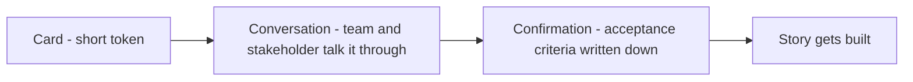
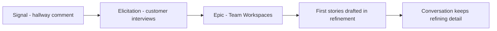

# Lecture 1 — From Requirements to User Stories

> **Duration:** ~2 hours. **Outcome:** You can elicit a real need from a stakeholder, tell the difference between a requirements spec and a user story, write a story in role–goal–benefit form that carries real intent, and explain why the card is a token for a conversation, not the whole agreement.

Week 1 gave you the charter for Project Atlas: scope, constraints, success criteria. Week 2 (Agile, Scrum & Kanban) gave you the machinery — sprints, board, ceremonies — that turns work into shipped increments. This week connects the two: **how does a fuzzy stakeholder ask become the concrete, ready-to-build items that flow through that machinery?** That's the backlog, and it starts with requirements.

## 1. The spec-vs-conversation trap

Traditional (predictive/waterfall) delivery tries to solve the "what do we build" problem once, up front, with a **requirements specification** — a long document that attempts to describe every feature, screen, and business rule before a single line of code is written. The theory: if the spec is complete enough, execution is just "build what it says."

The theory fails in practice for a specific, recurring reason: **written requirements are always incomplete, and the stakeholder doesn't know they're incomplete until they see something built.** Elena, Northlight's product owner for Atlas, can describe "shared dashboard view" in a paragraph. She cannot, in that paragraph, anticipate every question that comes up once Marcus's team starts building it: What happens when two people edit a shared filter at the same time? Does a removed teammate lose access instantly or at end of session? Can a workspace have zero members? A 40-page spec written in week 1 either misses these (and the team guesses, often wrong) or tries to answer everything up front (and burns weeks writing prose nobody will read carefully, about a hundred edge cases before anyone's confirmed the *core* idea is even right).

Agile's answer isn't "skip requirements" — it's "sequence them differently." Instead of **spec now, build later, discover gaps during execution**, Agile does **write a small placeholder now, have the real conversation right before building, confirm what "done" means when it's demoed.** This is the point of the format you'll use all week: the **user story**.

## 2. What a user story actually is: the Three Cs

Ron Jeffries, one of Extreme Programming's originators, described a user story as having three parts, and this is the single most important idea in this lecture:

| C | What it is | When it happens |
|---|---|---|
| **Card** | A short, physical (or digital) token — one or two sentences — that represents the *promise of a conversation* | Written during backlog refinement |
| **Conversation** | The actual back-and-forth between the team and the stakeholder that fills in the real detail | Ongoing — refinement, planning, and during the sprint |
| **Confirmation** | The acceptance criteria that let everyone agree the conversation's outcome was actually built | Written once the conversation has happened (Lecture 3) |

**The card is not the requirement. The card is a reminder to have a conversation.** This is the single biggest misunderstanding new teams have about user stories — they treat the card's one sentence as the entire spec, write vague cards, and then get frustrated when engineers build "the wrong thing." The card was never supposed to carry that much weight. Detail lives in the conversation and gets locked down in acceptance criteria, not crammed into the title.

This is also why a backlog of well-written stories doesn't replace requirements — it **schedules** them. Instead of resolving every requirement in week 1 (before anyone has built anything, when you know the least), you resolve each requirement in the conversation that happens just before it's built (when you know the most: the team has shipped adjacent pieces, the stakeholder has seen a real UI, and questions are concrete instead of hypothetical).


*The Three Cs carry a story from a short card to a built, verified feature.*

## 3. The role–goal–benefit template

The most common story format, popularized by Mike Cohn, is:

```
As a <role>,
I want <goal/capability>,
so that <benefit/reason>.
```

Applied to Atlas:

> As a **Northlight account admin**,
> I want **to create a new team workspace and name it**,
> so that **my team has a dedicated place to collaborate that's separate from other teams' data**.

Every part of this template is load-bearing, and each one is commonly skipped by teams in a hurry:

- **`<role>`** forces you to say *who*. "As a user" is almost always too vague to be useful — Atlas has at least three distinct roles (account admin, workspace member, and a read-only viewer role Elena mentioned in passing) and they don't want the same things. A story written for the wrong role gets built for the wrong audience.
- **`<goal>`** is the capability — what they can now *do* that they couldn't before. Keep it to one capability. "I want to create a workspace and invite people and set permissions" is three stories wearing a trenchcoat (more on this in Lecture 2).
- **`<benefit>`** is the *why*, and it's the part teams skip most often — and the part that matters most. "So that my team has a dedicated place to collaborate" tells the engineer building it what's actually being optimized for. If two designs are both technically valid, the benefit is the tiebreaker. A story with no stated benefit is a request with no rationale — and a team member who doesn't understand *why* a request exists cannot make good judgment calls about the dozens of small decisions every story requires during implementation.

**A story with a hollow or circular benefit is a smell.** "As an admin, I want to create a workspace, so that I can create a workspace" tells you nothing. If you can't state a real reason, that's a signal the story isn't well understood yet — go have the conversation before writing the card.

## 4. Eliciting the need in the first place

Before you can write a story, someone has to surface the underlying need — and that's a distinct skill from writing the card. At Northlight, the raw input for Team Workspaces started as Priya (the sponsor) saying, in a hallway conversation, "our enterprise customers keep asking if their teams can collaborate inside Insights instead of emailing screenshots around." That sentence is not a requirement. It's a signal. Elena's job — and yours, as PM, supporting her — is to turn signal into something buildable. Common elicitation techniques, in rough order of how Atlas actually used them:

- **Stakeholder interviews** — Elena sat down with three enterprise customers (the ones Priya was worried about losing) and asked open questions: "Walk me through what you're doing today when you want to share a view with your team." She learned two of the three were already emailing screenshots weekly, and one had built a manual workaround using a shared spreadsheet of links — useful, concrete detail no hallway comment would have surfaced.
- **Workshops / story-mapping sessions** — Elena, Marcus, and the PM spent 90 minutes mapping the end-to-end journey a team would take (create workspace → invite people → set permissions → share views → comment), sticky notes on a wall (or a Miro board), before writing a single story. This produces the *epics* Lecture 2 slices into stories.
- **Observation** — watching an actual customer use Insights today reveals friction they won't think to mention because it's become invisible to them (Elena noticed a customer manually re-exporting the same dashboard every Monday — a workflow they'd stopped consciously noticing was painful).
- **Prototypes and mockups** — a rough clickable mockup of "shared workspace" got in front of two customers before any backend was built; one immediately said "wait, can other people edit this, or just view it?" — a question that reshaped the permissions model before a single story was written.
- **Existing data** — support tickets, usage analytics, and sales-loss reasons ("lost this renewal partly because of no team collaboration feature") are requirements hiding in plain sight; nobody has to be interviewed to find them.

**A rule of thumb:** if you can't point to a specific conversation, ticket, or observed behavior behind a story, you're probably guessing — and guessed requirements are the most expensive kind, because nobody discovers the guess was wrong until the thing is built and demoed.

## 5. Common anti-patterns

Watch for these — they show up constantly in real backlogs, including early drafts of Atlas's:

- **The technical story wearing a user-story costume.** *"As a developer, I want to refactor the auth module, so that the code is cleaner."* This may be legitimate work, but it isn't a user story — there's no end user benefiting. Technical work belongs on the backlog too (as a tagged tech-debt or enabler item), just don't dress it up in role–goal–benefit language it doesn't earn. Be honest about what kind of work it is.
- **The compound story.** *"As an admin, I want to create, rename, archive, and delete workspaces."* Four capabilities, one card. Split it (Lecture 2).
- **The solution disguised as a need.** *"As an admin, I want a dropdown menu with three options."* That's a UI decision, not a goal. The goal underneath might be "I want to control who can see this workspace" — write *that*, and let the conversation (with a designer) decide whether a dropdown, radio buttons, or something else best serves it. Stating the solution in the story robs the team of the chance to find a better one.
- **The vague role.** *"As a user..."* — almost always papering over the fact that nobody has actually decided which role this is for yet. Push for specificity.
- **No stated benefit** (section 3) — or worse, a fabricated one bolted on after the fact because "so that" is expected. If the benefit is thin, that's information — go find the real one.

## 6. Northlight in practice: from hallway comment to first stories

Here's the actual path Priya's comment took at Northlight:

1. **Signal:** Priya, in conversation: "enterprise customers want team collaboration instead of emailing screenshots."
2. **Elicitation:** Elena interviews three enterprise accounts; learns they specifically want (a) a shared space per team, (b) control over who's in it, (c) a way to discuss a dashboard without leaving the product.
3. **Epic:** Elena writes one epic-level card: *"Team Workspaces — enterprise teams can create a shared space, control membership, and discuss dashboards together."* Too big to build directly — that's expected of an epic (Lecture 2 slices it).
4. **First stories, drafted in a refinement conversation with Marcus and the PM:**
   - *As an account admin, I want to create a new team workspace and name it, so that my team has a dedicated place to collaborate.*
   - *As an account admin, I want to invite a teammate to a workspace by email, so that they can access it without me sharing my login.*
   - *As a workspace member, I want to view the dashboards shared into my workspace, so that I can see what my team is tracking without asking someone to export a screenshot.*
   - *As a workspace member, I want to leave a comment on a shared dashboard, so that my team can discuss it without leaving Insights.*
5. **Conversation continues** in refinement — the "second reader" role Elena mentioned surfaces here, becomes its own story once someone asks "wait, does everyone need full access?"


*How Priya's hallway comment turned into buildable stories on the backlog.*

Notice what didn't happen: nobody wrote a 12-page spec for Team Workspaces before writing story 1. The epic captured the shared understanding of the *shape* of the work; the stories captured buildable slices of it; the conversation is still ongoing and will keep refining detail right up until each story is built.

## 7. Check yourself

- In your own words, what's the difference between a requirement and a user story — and why does that difference matter for *when* detail gets resolved?
- Explain the Three Cs. Which C is most often skipped by teams in a hurry, and what goes wrong when it is?
- Rewrite this into proper role–goal–benefit form: *"Add a dropdown to filter workspaces."* What's missing, and what would you ask before you could write a good benefit?
- Name two elicitation techniques Elena used for Team Workspaces, and what each one uncovered that a hallway comment wouldn't have.
- Why is "As a user, I want a cleaner codebase" a poor user story even if the underlying work is worth doing?

If those are automatic, Lecture 2 takes the epic-level cards from section 6 and slices them into the thin, independently shippable stories a sprint can actually finish.

## Further reading

- **Ron Jeffries — "Essential XP: Card, Conversation, Confirmation":** <https://ronjeffries.com/xprog/articles/expcardconversationconfirmation/>
- **Mike Cohn — "User Stories Applied" (overview and template):** <https://www.mountaingoatsoftware.com/agile/user-stories>
- **Atlassian — "Epics, stories, themes, and initiatives":** <https://www.atlassian.com/agile/project-management/epics-stories-themes>
