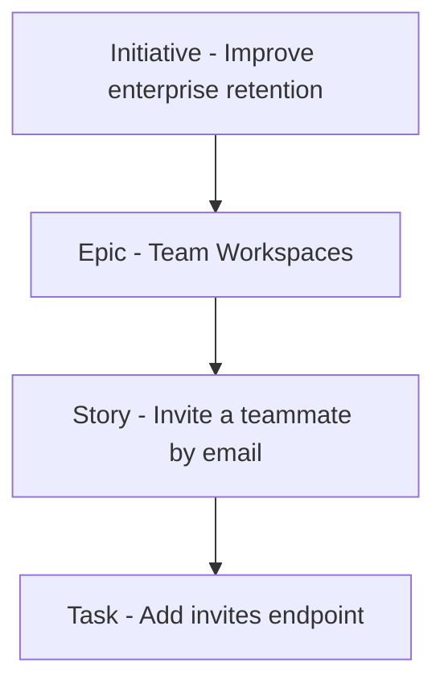
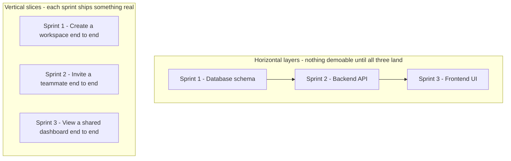

# Lecture 2 — Slicing Epics with INVEST

> **Duration:** ~2 hours. **Outcome:** You can apply the INVEST checklist to test whether a story is ready to be worked, explain why vertical slicing beats horizontal layering, and split a real epic into thin, independently valuable, independently demoable stories.

Lecture 1 ended with an epic — *"Team Workspaces — enterprise teams can create a shared space, control membership, and discuss dashboards together"* — and a handful of stories pulled out of it. This lecture gives you the two tools that make that pulling-apart systematic instead of ad hoc: **INVEST**, a checklist for whether a story is actually ready, and **vertical slicing**, the technique for cutting big work into small work without losing end-to-end value.

## 1. The backlog hierarchy: initiative → epic → story → task

Before slicing, place the vocabulary:

| Level | Rough size | Example (Atlas) | Fits in one sprint? |
|---|---|---|---|
| **Initiative/theme** | Quarter+ | "Improve enterprise retention" | No — spans multiple epics |
| **Epic** | Multiple sprints | "Team Workspaces" | No — that's the point of an epic |
| **Story** | Days | "Invite a teammate to a workspace by email" | Yes — that's the definition of story-sized |
| **Task** | Hours | "Add `POST /workspaces/:id/invites` endpoint" | Sub-item of a story, usually not backlog-tracked as its own card |

*The backlog hierarchy narrows from a quarter-long initiative down to an hours-long task.*

A backlog is mostly stories, with epics as organizing folders above them and occasional standalone small items (bugs, spikes, chores). The skill this lecture teaches is turning an epic into the stories underneath it — and testing each story against INVEST before it's allowed onto a sprint.

## 2. INVEST: the readiness checklist

Bill Wake's INVEST acronym is the industry-standard test for "is this story actually ready to be pulled into a sprint," or still needs more slicing/conversation first:

| Letter | Means | Question to ask | Atlas example that fails it |
|---|---|---|---|
| **I — Independent** | Can be built and delivered without waiting on another unfinished story | Could this ship on its own, in any reasonable order? | *"Set workspace permissions"* depends on *"create a workspace"* existing first — fine (sequencing), but if it *also* silently depends on an unwritten "invite teammate" story with no acknowledged order, that's a hidden coupling worth flagging |
| **N — Negotiable** | Not a rigid contract — details can still be discussed before/during the sprint | Does the card leave room for a real conversation, or does it dictate the solution? | *"Add a modal with exactly these five fields"* — no room left to negotiate the actual design |
| **V — Valuable** | Delivers value to a real user or the business — not just an internal step | Who benefits, and can you say how? | *"Create the `workspaces` database table"* — real work, but zero value on its own until something uses it (see horizontal trap, section 3) |
| **E — Estimable** | The team knows enough to size it, even roughly | Could you put a rough size on this today? | *"Make workspaces fast"* — too vague to size; "fast" isn't defined |
| **S — Small** | Fits comfortably in a sprint, ideally a fraction of one | Could 1–2 people finish this in a few days? | *"Build the entire permissions system"* — an epic wearing a story's clothes |
| **T — Testable** | There's a clear way to verify it's done | Could you write acceptance criteria for this right now? | *"Improve the invite experience"* — improve compared to what, verified how? |

**INVEST isn't a one-time gate — it's a lens you apply every time a story comes up in refinement**, right up until it's pulled into a sprint. A story that was fine two refinements ago can fail INVEST today because the team learned something new (a dependency surfaced, the design changed). That's normal — send it back for another pass, don't force it into a sprint just because it's already written.

## 3. Vertical slicing vs. the horizontal-layer trap

This is the single most common way teams get INVEST wrong, and it deserves its own section because the instinct that causes it feels *reasonable*.

**The trap:** faced with "Team Workspaces," an engineer's natural instinct is to slice by **technical layer** — because that's how the system is actually built:

- Story: "Build the database schema for workspaces"
- Story: "Build the backend API for workspaces"
- Story: "Build the frontend UI for workspaces"

This looks organized. It is actually a disaster for an Agile team, for one specific reason: **none of these three stories, alone, is demoable or valuable.** After sprint 1 (schema), there's nothing to show Elena or Priya — just a database table nobody can see. After sprint 2 (backend), still nothing visible — just an API nobody's called from anywhere real. Only after *all three* land, in sprint 3, does anything work end-to-end. That means:

- **No feedback until sprint 3.** If the schema design was wrong (say, workspace membership needed to support more than one role and nobody realized until UI work started), you find out in sprint 3, after two sprints of work are already built on the wrong foundation.
- **No partial value if the project gets cut short.** If Atlas loses a sprint to the third-party API risk from Week 1's case study, "schema + backend, no UI" ships *nothing* usable — three sprints of work, zero customer-visible value.
- **Every sprint's demo is empty or fake.** Sprint reviews (Week 2) lose their entire purpose if there's nothing real to show.

**The fix — vertical (or "thin") slicing:** cut the epic so that *each* story cuts through every layer — data, backend, UI — for one small piece of functionality, end to end:

- Story: "Account admin can create a workspace with just a name" (schema + API + minimal UI, all three layers, one thin feature)
- Story: "Account admin can invite a teammate by email" (thin slice, all three layers)
- Story: "Workspace member can view a dashboard shared into their workspace" (thin slice, all three layers)

Each of these is small, but each is a **complete, demoable, potentially-shippable increment.** After story 1, Elena can log in and actually create a workspace — ugly UI maybe, but real, working, feedback-generating software. That's the entire point of Agile delivery, and it's impossible with horizontal slices.

*Horizontal layering delays feedback to the last sprint; vertical slicing delivers real value every sprint.*

## 4. Slicing patterns — concrete ways to cut an epic

When an epic is too big (fails INVEST's "Small"), here are the patterns that reliably produce thin vertical slices, applied to Atlas's "Team Workspaces" epic:

- **By workflow step.** The epic is really a sequence: create workspace → invite people → set permissions → share dashboard → comment. Each step is its own story, buildable and demoable independently, even though later steps depend on earlier ones existing.
  > *"Create a workspace"* → *"Invite a teammate"* → *"View a shared dashboard"* → *"Comment on a dashboard"*

- **By business rule variation.** One core capability, but different rules for different cases — ship the common case first, split the edge cases into their own stories.
  > *"Invite a teammate who already has a Northlight account"* (common case, ship first) vs. *"Invite a teammate who doesn't have a Northlight account yet"* (edge case — needs an account-creation flow, genuinely more work, don't let it block the common case)

- **By data variation / CRUD operation.** "Manage workspaces" quietly bundles create, read, update, archive, delete. Split by operation — and question whether every operation is even needed yet (does Atlas need "delete a workspace" in the first release, or can that wait?).
  > *"Create a workspace"* / *"Rename a workspace"* / *"Archive a workspace"* — three stories, and maybe "delete" doesn't make the first release backlog at all.

- **By interface / platform variation.** If Atlas needs to work on desktop first and mobile later, that's two stories, not one — don't silently assume "the UI story" covers both.
  > *"View a shared dashboard on desktop"* vs. *"View a shared dashboard on mobile"* (can be prioritized separately — desktop first, since that's where Elena's interviewed customers actually work)

- **By role.** Different roles need different (if related) capabilities from what looks like one feature.
  > *"Account admin sets who can view a workspace"* vs. *"Workspace member requests access to a workspace"* — related, but genuinely different stories with different actors and different acceptance criteria.

- **Defer the hard part, ship the simple part first, spike the unknown.** If "real-time presence indicators" (who's currently viewing a dashboard) is technically risky and not core to the charter's success criteria (recall Week 1: it got cut under the sharing-API risk), don't let it block "view a shared dashboard" — split it into its own low-priority story, or a time-boxed **spike** (a story whose deliverable is *knowledge*, not shipped code — "investigate whether our WebSocket infra supports presence at our scale") rather than committing to build it blind.

## 5. Worked example: slicing "Permissions for Team Workspaces"

Take one piece of the Atlas epic that's still too big: *"Account admin controls who can access a workspace and what they can do."* Run it through the patterns above:

**Before (fails INVEST — not Small, barely Testable, bundles multiple roles and rules):**
> As an account admin, I want to manage workspace permissions, so that only the right people can see and edit our data.

**After — sliced by workflow step + role + business rule variation:**

1. *As an account admin, I want to invite a teammate to a workspace with view-only access, so that I control who sees our team's data by default.*
2. *As an account admin, I want to promote a workspace member from view-only to editor, so that trusted teammates can update shared dashboards without me doing it for them.*
3. *As an account admin, I want to remove a teammate from a workspace, so that access is revoked the moment someone leaves the team or project.*
4. *As a workspace member with editor access, I want to see which of my changes are visible to view-only members immediately, so that I don't accidentally think a change is private when it isn't.* *(This one may reveal, in conversation, that it isn't really a new capability but an acceptance-criterion of story 2 — a useful thing to discover before it's built as a separate, redundant story.)*
5. *As an account admin, I want to see a list of everyone with access to a workspace and their permission level, so that I can audit access without asking each person individually.*

Each of the five is independently valuable (an admin gets real capability from any one of them alone), independently demoable, and small enough to size with confidence — INVEST, applied. Notice story 4 got caught and folded in during the exercise itself — that's the process working, not a mistake. Catching a redundant or miscategorized story *before* it's built is exactly what a good slicing conversation is for.

## 6. When NOT to slice further

Slicing can go too far. A story that's been sliced past the point of independent value stops being useful — e.g., splitting "invite a teammate by email" into "validate the email format" and "send the invite email" isn't two valuable stories, it's one story's implementation detail masquerading as two backlog items. The test: **would a stakeholder recognize this as something they asked for and care about seeing demoed?** If the answer is no, it's a task, not a story — let it live inside the story's implementation, not as its own backlog card.

## 7. Check yourself

- Define INVEST from memory, one clause per letter, and give an Atlas example (not from this lecture) that would fail each one.
- Explain, using Atlas's schema/backend/UI example, exactly what goes wrong with horizontal slicing — specifically, what happens if the schema design is wrong.
- Name three slicing patterns and apply each to a feature of your own choosing (not Atlas) in one sentence each.
- Why did story 4 in section 5 get folded into story 2 instead of staying separate — what test did it fail?
- What's the difference between a story that's been sliced well and one that's been over-sliced into tasks? What question do you ask to tell them apart?

If those are automatic, Lecture 3 finishes the loop: writing acceptance criteria precise enough that "done" isn't a debate, and prioritizing the now-sliced backlog so the team works on the right thing first.

## Further reading

- **Bill Wake — "INVEST in Good Stories, and SMART Tasks" (the original post):** <https://xp123.com/articles/invest-in-good-stories-and-smart-tasks/>
- **Alistair Cockburn / Henrik Kniberg — "How to split a user story" (patterns):** <https://www.crisp.se/gratis-material-och-guider/story-splitting>
- **Mike Cohn — "Advantages of Vertical User Story Slicing":** <https://www.mountaingoatsoftware.com/blog/advantages-of-splitting-user-stories-vertically>
