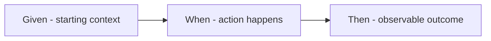
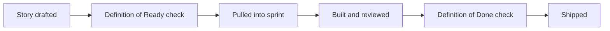

# Lecture 3 — Acceptance Criteria & Prioritization

> **Duration:** ~2 hours. **Outcome:** You can write Given/When/Then acceptance criteria that make "done" unambiguous, distinguish Definition of Ready from Definition of Done, and prioritize a backlog using a defensible method (MoSCoW, value/effort, or WSJF) instead of gut feel or whoever asked most recently.

Lecture 1 gave you well-formed stories. Lecture 2 sliced them thin and testable. This lecture closes the loop with the third C — **Confirmation** — and answers the question every backlog eventually faces: with more sliced, ready stories than the team can build this sprint, **which ones go first, and why?**

## 1. Why "done" needs a precise definition per story

Recall from Week 1: skipped initiation is where projects quietly die because nobody agreed what "done" meant. The same failure happens at the story level, just smaller and more frequent — and because it happens dozens of times per sprint instead of once per project, it's actually the more common way trust erodes between a PM/PO and an engineering team.

Take the Atlas story: *"As an account admin, I want to invite a teammate to a workspace with view-only access, so that I control who sees our team's data by default."* An engineer builds it. Elena reviews it in the sprint demo and says "wait, what happens if I invite someone who's already a member?" Nobody thought about it — the engineer picked a behavior (silently do nothing), Elena expected different behavior (show an error), and now it's a bug, or worse, a debate about whose fault it is. **This is completely preventable, and acceptance criteria are how you prevent it — by having the conversation about edge cases before the story is built, not after.**

## 2. Given/When/Then: acceptance criteria that don't argue with themselves

The most widely used format for acceptance criteria comes from Behavior-Driven Development (BDD) and is often called **Gherkin syntax**:

```
Given <a starting context/state>,
When <an action happens>,
Then <an expected, observable outcome>.
```


*The three-part shape every acceptance criteria scenario follows.*

Applied to the invite story from section 1:

```
Scenario: Admin invites a new teammate
Given I am an account admin viewing a workspace I own,
And "jordan@acme.com" is not yet a member of this workspace,
When I enter "jordan@acme.com" and select "View-only" access, and confirm,
Then jordan@acme.com receives an invite email,
And the workspace member list shows jordan@acme.com as "Pending" with View-only access.

Scenario: Admin tries to invite someone already in the workspace
Given I am an account admin viewing a workspace I own,
And "jordan@acme.com" is already an active member of this workspace,
When I enter "jordan@acme.com" and confirm,
Then I see an inline error: "jordan@acme.com is already a member of this workspace",
And no duplicate invite is sent.

Scenario: Admin invites someone with an invalid email
Given I am an account admin viewing a workspace I own,
When I enter "not-an-email" and confirm,
Then I see an inline error: "Enter a valid email address",
And no invite is sent.
```

Notice what happened: **writing the edge-case scenarios forced the "what happens if already a member" conversation to happen before the sprint, not during the demo.** That's the entire value of acceptance criteria — they're a forcing function for the conversation Lecture 1's "Three Cs" promised, and they turn "I think this is done" into "here's exactly how we'll verify it's done," which both the PM and the engineer can check against independently.

**Rules that keep Given/When/Then useful instead of bureaucratic:**

- **Write the happy path first, then ask "what could go wrong or differ?"** for each edge case — invalid input, empty state, duplicate, permission denied, no network, etc. Not every story needs five scenarios; a simple story might need two, a permissions-sensitive one might need five or six.
- **"Then" must be observable**, not internal. "Then the invite is processed correctly" is not testable — *processed how, checked where?* "Then jordan@acme.com receives an invite email" is testable — someone (or some test) can check an inbox.
- **Keep each scenario about one behavior.** If a "Then" needs three unrelated "And"s about different concerns, it's probably two scenarios.
- **Acceptance criteria are negotiated in the conversation, written down once agreed — not handed down unilaterally by the PM.** If the engineer thinks a scenario is being over-specified (dictating implementation, not behavior) or under-specified (missing a case they know will come up), that's exactly the conversation Lecture 1 said the story card was a placeholder for.

## 3. Definition of Ready vs. Definition of Done

Two related but distinct checklists a team should agree on and post somewhere everyone sees it:

| | **Definition of Ready (DoR)** | **Definition of Done (DoD)** |
|---|---|---|
| **Applies to** | A story, before it's pulled into a sprint | A story, before it's considered finished |
| **Answers** | "Are we allowed to start this?" | "Are we allowed to call this shipped?" |
| **Typical checklist** | Passes INVEST; acceptance criteria drafted; dependencies identified; design/API questions resolved enough to estimate | Code reviewed; tests passing; acceptance criteria all verified; deployed (or deployable); documentation updated if needed |
| **Who owns it** | PM/PO, with the team's input, before planning | The whole team, checked at the sprint review |
| **Failure mode if skipped** | Team starts building on a foundation of guesses (the horizontal-layer disaster from Lecture 2, in miniature) | "Done" quietly means different things to different people; scope creep re-enters through the back door |


*A story crosses the Definition of Ready gate to enter a sprint, then the Definition of Done gate to exit it.*

Atlas's team agreed on this DoD early in Week 2: code reviewed by one other engineer, automated tests passing, all acceptance-criteria scenarios manually verified against a staging environment, and — specifically because of the Week 1 retrospective lesson about the sharing-API risk — any third-party integration explicitly smoke-tested against the real sandbox, not just mocked. That last clause exists *because of a specific past failure*, which is exactly how a good DoD evolves: not written once from a template and frozen, but tightened when the team learns something the hard way.

## 4. Prioritization: three defensible methods

Once a backlog is full of ready, sliced, acceptance-criteria'd stories, someone has to decide the order. "Whoever's loudest" or "whatever's newest" are not methods — they're how a backlog quietly betrays the charter's actual priorities. Here are three real ones, in increasing order of rigor:

### MoSCoW

Sort every item into one of four buckets:

| Bucket | Meaning | Atlas example |
|---|---|---|
| **Must have** | The release is not viable without it — tied directly to charter success criteria | "Create a workspace," "invite a teammate," "view a shared dashboard" — Atlas's charter success criteria (Week 1) is unmeetable without these |
| **Should have** | Important, painful to cut, but the release *can* ship without it | "Comment on a dashboard" — valuable, but the charter's success metric (renewals + adoption %) doesn't strictly require it on day one |
| **Could have** | Nice to have if time allows, first to cut under pressure | "Custom workspace icons," "@mention a teammate in a comment" |
| **Won't have (this time)** | Explicitly deferred, written down so it doesn't quietly resurface as scope creep | "Real-time presence indicators" — Week 1's case study already showed this one getting formally cut |

MoSCoW is fast and easy for stakeholders to reason about, but it's coarse — it doesn't help you order the 15 "Must have" stories against each other, only which bucket they're in.

### Value / effort matrix

Plot each story on two axes — **business value** (how much it matters, often scored 1–5 or T-shirt sized by the PM/PO with stakeholder input) and **effort** (how much work, scored by the team). Four quadrants fall out:

```
High value, low effort   →  Do first (quick wins)
High value, high effort  →  Do, but plan for it (major initiatives)
Low value, low effort    →  Do if there's slack (fill-ins)
Low value, high effort   →  Question why this is even on the backlog
```

This is more granular than MoSCoW and forces an explicit, comparable number instead of a bucket — but the value score is still subjective, and effort is a rough proxy for cost until real estimation happens (Week 4).

### WSJF — Weighted Shortest Job First

Borrowed from SAFe (Scaled Agile Framework) and Lean/Kanban economics, WSJF ranks by **cost of delay ÷ job size** — the intuition being: prioritize whatever creates the most value per unit of time it occupies the team, not just whatever has the highest raw value.

```
WSJF = Cost of Delay / Job Size

Cost of Delay = User/Business Value + Time Criticality + Risk Reduction/Opportunity Enablement
```

Each of the three Cost-of-Delay components and Job Size are usually scored on a relative scale (Fibonacci-like: 1, 2, 3, 5, 8, 13) by the team, not precise numbers — the point is *relative* ranking, not false precision.

**Worked example — three Atlas stories competing for the next sprint slot:**

| Story | Business value | Time criticality | Risk reduction | Cost of Delay (sum) | Job size | WSJF (CoD ÷ size) |
|---|--:|--:|--:|--:|--:|--:|
| Invite a teammate by email | 8 | 5 | 3 | 16 | 3 | **5.33** |
| Comment on a dashboard | 5 | 2 | 1 | 8 | 5 | 1.6 |
| Real-time presence indicator (spike) | 3 | 1 | 8 | 12 | 8 | 1.5 |

"Invite a teammate" wins clearly — high value, time-critical (nothing else in the epic is useful without it), and cheap relative to its payoff. The presence-indicator spike scores reasonably on risk reduction (it *would* retire a real unknown) but its job size is large enough to tank its WSJF — exactly the kind of call a gut-feel prioritization would get wrong by fixating on "but it's risky, shouldn't we look into it first?" without weighing the cost.

**When to use which:** MoSCoW for a fast stakeholder conversation early on (Atlas's charter-level scope negotiation in Week 1 was effectively MoSCoW). Value/effort for a mid-sized backlog needing a first ranking pass. WSJF when you have several teams or epics competing for the same limited capacity and need a rigorous, defensible tiebreaker — which is exactly Challenge 2 this week.

## 5. Keeping the backlog groomed and ready

Prioritization isn't a one-time event — a backlog that isn't regularly **groomed** (also called **refined**) rots: stories go stale as the product changes around them, priorities shift as the business learns things, and by the time sprint planning happens, half the "ready" stories aren't actually ready anymore. A healthy cadence, which Atlas's team runs:

- **Weekly refinement session** (30–60 min): the PM/PO walks the top of the backlog with the team, applies INVEST, drafts/updates acceptance criteria, and re-checks priority against anything new (a support ticket, a competitor move, a risk that materialized).
- **The top ~1–2 sprints' worth of the backlog should always be Ready** (passes DoR) — everything below that can be rougher (epics, one-line placeholders) since it'll get refined before it's needed.
- **Re-prioritize deliberately, not by accident.** If Priya asks for something urgent mid-sprint, that's a conversation about trade-offs against the current priority order (Challenge 2 this week is exactly this scenario) — not a silent reshuffle nobody agreed to.

## 6. Check yourself

- Write a Given/When/Then scenario, from scratch, for a story of your choosing (not from Atlas), including at least one edge case.
- Explain the difference between Definition of Ready and Definition of Done in one sentence each, and say which one gates *entering* a sprint vs. *exiting* it.
- Sort five made-up backlog items into MoSCoW buckets and justify each placement in one sentence.
- Compute WSJF for two stories with your own made-up scores for value, time criticality, risk reduction, and job size — which wins, and does that match your gut instinct? If not, why might WSJF be right and your gut wrong (or vice versa)?
- Why does a backlog need regular grooming even after every story in it was written carefully the first time?

That completes Week 3's lecture arc: elicit real needs (Lecture 1), slice them into thin, valuable, testable stories (Lecture 2), and lock down what "done" means while ordering the work defensibly (Lecture 3). The exercises and mini-project this week put all three into one continuous rep: brief → backlog → ready, prioritized, and defended.

## Further reading

- **Cucumber (official) — "Gherkin Reference":** <https://cucumber.io/docs/gherkin/reference/>
- **Scrum.org — "Definition of Ready vs. Definition of Done":** <https://www.scrum.org/resources/blog/definition-ready-vs-definition-done>
- **Scaled Agile Framework — "WSJF" (official SAFe reference):** <https://scaledagileframework.com/wsjf/>
- **Atlassian — "MoSCoW prioritization":** <https://www.atlassian.com/agile/project-management/moscow-method>
