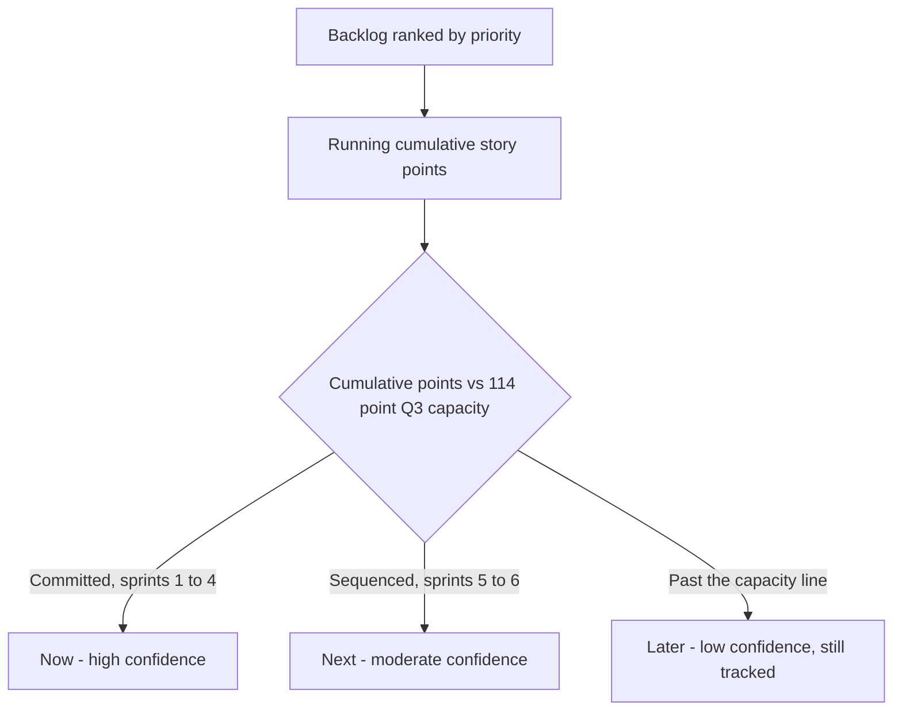

# Lecture 1 — Outcome-Based Roadmaps: Now/Next/Later

> **Duration:** ~2 hours. **Outcome:** You can build a now/next/later roadmap from a raw backlog, explain the difference between a roadmap, a plan, and a promise, and answer "when will X ship?" honestly without either lying or refusing to answer.

Project Atlas — Team Workspaces — is three weeks from launch. Priya, Northlight's VP of Product, is happy about that, but she's stopped asking about Atlas in her weekly sync with the PM and started asking a bigger question: **"What is the team building after Atlas, and can I show the board a roadmap for the rest of the quarter?"** That question is not a project question. It's a roadmap question, and it sits one altitude above everything Weeks 1–4 taught you. A charter (Week 1) commits one team to one outcome. A roadmap has to say something honest about *several* outcomes, competing for the same finite team, over a quarter — without pretending to know things nobody can know yet.

This week you build that roadmap and the release plan underneath it, for a Q3 backlog covering five initiatives beyond Atlas. Same cast: Priya (VP Product, sponsor), Elena (Product Owner), Marcus (tech lead), and you.

## 1. What a roadmap is not

Before building one, kill three bad mental models:

- **A roadmap is not a Gantt chart with a date stamped on every box.** A Gantt chart says "we know, with confidence, exactly when each piece of work starts and ends." Nobody has that confidence twelve weeks out on unstarted work — pretending otherwise doesn't make the plan more true, it just makes the eventual miss look like a broken promise instead of normal uncertainty.
- **A roadmap is not the backlog with a calendar taped to it.** The backlog (Week 3) is an ordered list of stories at the *execution* altitude — granular, changes weekly, owned by the team doing the work. A roadmap is a *communication* artifact at a much higher altitude, meant for people who will never read the backlog and shouldn't have to.
- **A roadmap is not a promise.** A promise is a commitment you're accountable for keeping exactly as stated. A roadmap — done right — is closer to a weather forecast: high confidence for tomorrow, reasonable confidence for next week, directionally useful for next month. Treating the whole roadmap as equally promised is how PMs end up defending decisions nobody actually made with that much certainty.

## 2. Three altitudes: roadmap, plan, promise

These three words get used interchangeably in casual conversation and that sloppiness is exactly what erodes trust. Keep them separate:

| Artifact | Altitude | Confidence | Audience | Example |
|---|---|---|---|---|
| **Roadmap** | Strategic — *what* and *why*, roughly *when* | Directional; explicitly lower for items further out | Executives, sponsors, customers, the whole company | "Enterprise Trust ships this quarter." |
| **Plan** | Tactical — *how* and *in what order*, with real dates for the near term | High for the current release, moderate beyond it | The delivery team, the PM, close stakeholders | "Advanced Permissions & Roles ships end of Sprint 2 (Aug 30); SOC 2 audit logging by Sept 13." |
| **Promise / commitment** | Operational — a specific, dated deliverable someone is accountable for | As high as you can make it, or you shouldn't be making it | Whoever is depending on that exact date | "The SOC 2 auditor's fieldwork window opens September 14 — audit logging must be live and stable by September 13. No exceptions." |

A healthy PM keeps these visibly distinct in every conversation. When Priya asks "will Dark Mode ship this quarter," the honest answer distinguishes which of the three she's really asking about — and Lecture 1 §6 gives you the language for that conversation directly.

## 3. Feature roadmaps vs. outcome-based roadmaps

The single biggest quality difference between a roadmap that survives a quarter and one that gets quietly abandoned by week 6 is whether it's written as **features** or as **outcomes**.

**Feature-framed (fragile):**

> Q3: Ship the Data Export API. Ship Advanced Permissions & Roles. Ship SOC 2 audit logging.

This looks precise. It isn't — it's precise about the *wrong* thing. It commits to a specific technical solution before anyone has validated that solution is the right one, and it gives Marcus's team zero room to discover a better, cheaper way to hit the actual goal once they're inside the problem.

**Outcome-framed (resilient):**

> Q3, theme "Enterprise Trust": **Unblock $640K in combined ARR across 3 enterprise renewals currently stuck in security review**, via granular roles and a clean SOC 2 report.

Notice what changed. The outcome is the thing Priya actually cares about and the thing the roadmap is accountable for. "Advanced Permissions & Roles" and "SOC 2 audit logging" are Marcus's and Elena's *current best guess* at how to deliver that outcome — and if, three weeks in, they discover a cheaper path (say, a simpler role model that still satisfies the auditor), the roadmap hasn't broken. The outcome is still true. Only the *plan* underneath it changed, and plans are supposed to change (Lecture 3 goes deep on this).

Every roadmap item this week is written as: **theme → outcome → current best-guess initiative(s)**. Never skip straight to the initiative.

## 4. The now/next/later structure

Now/next/later solves the "stop pretending you know Q4" problem by making confidence explicit as *structure*, not just as caveats buried in a footnote nobody reads.

| Bucket | What it means | Typical confidence | What's inside it |
|---|---|---|---|
| **Now** | Committed, in the current release, sequenced against real sprint capacity | High (~85–95%) | Specific initiatives, a real release window, dependencies resolved |
| **Next** | Sequenced and intended for this quarter, order is fairly firm, exact sprint is not | Moderate (~50–70%) | Named initiatives, a rough "later this quarter" window, may still shift a release if Now overruns |
| **Later** | Directionally true — it matters, it's not forgotten, no date attached | Low (~20–40%), and that's fine | Themes or initiatives worth watching, explicitly *not* scheduled |

The columns are not a synonym for "priority high/medium/low." An item can be extremely high priority and still sit in **Later** honestly — because the *team doesn't have capacity for it this quarter*, not because nobody wants it. Confusing "not scheduled" with "not important" is a common and avoidable roadmap-reading mistake; §6 gives you the phrase that prevents it.


*How priority order and the 114-point capacity line sort the backlog into Now, Next, and Later.*

## 5. Building Northlight's Q3 roadmap

Here's the raw Q3 backlog Elena and Marcus handed you — seven initiatives, each already sized in story points and ranked by priority (Lecture 2 explains exactly how the points and the ranking were produced; for this lecture, take them as given):

| # | Initiative | Theme | Points | Priority |
|--:|---|---|--:|--:|
| 1 | Team Workspaces — launch hardening | Team Workspaces | 8 | 1 |
| 2 | Advanced Permissions & Roles | Enterprise Trust | 30 | 2 |
| 3 | SOC 2 — audit logging & access reviews | Enterprise Trust | 20 | 3 |
| 4 | Data Export API (v1) | Platform & Integrations | 26 | 4 |
| 5 | Onboarding revamp — guided setup | Self-Serve Growth | 24 | 5 |
| 6 | Real-time presence indicators | Team Workspaces | 14 | 6 |
| 7 | Dark mode / theming | UI Polish | 8 | 7 |

Marcus's team has **114 points of usable capacity** for the quarter (Lecture 2, §3 shows exactly how that number is derived from their velocity history). Running the cumulative total down the priority-ranked list: items 1–5 land at a cumulative 108 points — inside the 114-point budget with 6 points of healthy buffer. Item 6 pushes the cumulative total to 122, past capacity. Item 7 pushes it further. **That capacity line, not a subjective feel, is what actually separates Now/Next from Later.**

Translating that into an outcome-based now/next/later roadmap:

```markdown
## Now (Sprints 1–4, committed)

**Theme: Team Workspaces**
Outcome: Close the workspace-adoption success criteria from Atlas's charter without
regressing quality at launch.
- Launch hardening & permissions cleanup

**Theme: Enterprise Trust**
Outcome: Unblock $640K in combined ARR across 3 enterprise renewals stuck in security
review, via granular roles and a clean SOC 2 report.
- Advanced Permissions & Roles
- SOC 2 audit logging & access reviews (hard external date — auditor fieldwork opens Sept 14)

## Next (Sprints 5–6, sequenced, exact scope may still shift)

**Theme: Platform & Integrations**
Outcome: Unblock the 2 partner integrations Sales has stalled on for a quarter.
- Data Export API (v1) — CSV export ships; JSON export may slip into Q4 depending on
  remaining capacity.

**Theme: Self-Serve Growth**
Outcome: Cut self-serve time-to-first-value from 9 days to under 3.
- Onboarding revamp — guided setup

## Later (directional, not scheduled this quarter)

**Theme: Team Workspaces** — Real-time presence indicators. Deferred from Atlas at launch
(Week 1); revisit once workspace adoption data tells us whether it's worth the build.

**Theme: UI Polish** — Dark mode. Real, recurring request; not capacity-competitive against
enterprise-revenue-tied work this quarter.
```

Notice everything in "Later" still has an owner, a reason, and a theme — it's parked, not deleted. That distinction is what keeps a roadmap trustworthy instead of feeling like a graveyard where ideas silently disappear.

## 6. Answering "when will X ship?" honestly

This is the conversation every PM has badly at least once before learning to have it well. Priya asks: *"When's Dark Mode shipping?"* Three bad answers, and the good one:

- **Bad — false precision:** "Sprint 9, probably." (You have no real basis for that date. When it's wrong, it reads as a broken promise even though you never should have made it.)
- **Bad — evasive:** "We'll see." (Technically honest, communicates nothing, and reads as either incompetence or indifference.)
- **Bad — silent demotion:** Just not mentioning it, hoping nobody notices it fell off. (Erodes trust the moment someone *does* notice — and someone always does.)
- **Good — honest altitude-matching:** "It's on the roadmap in Later — real, tracked, not forgotten. It didn't make Now or Next because Enterprise Trust and Team Workspaces are ahead of it in priority and capacity this quarter. Once we're through those, it's a strong Next-bucket candidate. I can flag you the moment it moves up."

That answer does three things every good roadmap answer does: names the bucket, states the *reason* (not "we don't have time," but the specific tradeoff), and gives a concrete signal for when the asker will hear more. It costs you nothing to say and it's the difference between a stakeholder who trusts your next roadmap and one who stops believing anything on it.

## 7. Common failure modes

- **Dated roadmap syndrome.** The moment a date appears next to a Later-bucket item, it silently becomes a promise in the stakeholder's head, whatever caveat you attached. If you're not confident enough to be held to a date, don't put a date next to the item — full stop.
- **Feature-factory roadmap.** A roadmap that's just a list of shipped things with no stated outcome invites "why are we building this?" at the worst possible time — mid-execution, when the answer should have been settled at roadmap review.
- **Everything-is-Now roadmap.** If every initiative sits in Now, the roadmap isn't communicating priority, it's communicating denial about capacity. A Now bucket with 9 initiatives against 114 points of real capacity is not optimism, it's a roadmap that's already lying.
- **Never-revisited Later bucket.** Later items that sit untouched for three quarters straight erode trust just as much as broken promises — eventually stakeholders correctly conclude "Later" is where things go to die, and stop believing you when you use the word.

## 8. Check yourself

- In your own words, what's the difference between a roadmap, a plan, and a promise? Give a one-sentence example of each, using Northlight's Q3 backlog.
- Rewrite "Ship the Data Export API" as an outcome statement, the way §3 rewrote "Advanced Permissions & Roles."
- Why does an item belonging in "Later" not mean it's unimportant? What actually determines the bucket?
- A teammate says "just don't put anything in Later, it makes the roadmap look weak." What's wrong with that advice, using this lecture's vocabulary?
- Draft your own honest answer to "when's Dark Mode shipping?" without looking at §6 first, then compare.

Lecture 2 turns this same backlog into an actual release plan — the concrete sprint-by-sprint sequencing that Now and Next depend on being true.

## Further reading

- **ProductPlan — "What Is a Now-Next-Later Roadmap?":** <https://www.productplan.com/glossary/now-next-later-roadmap/>
- **Atlassian — "How to build a killer product roadmap":** <https://www.atlassian.com/agile/product-management/product-roadmaps>
- **Silicon Valley Product Group (Marty Cagan) — "Good Product Team / Bad Product Team":** <https://www.svpg.com/good-product-team-bad-product-team/>
