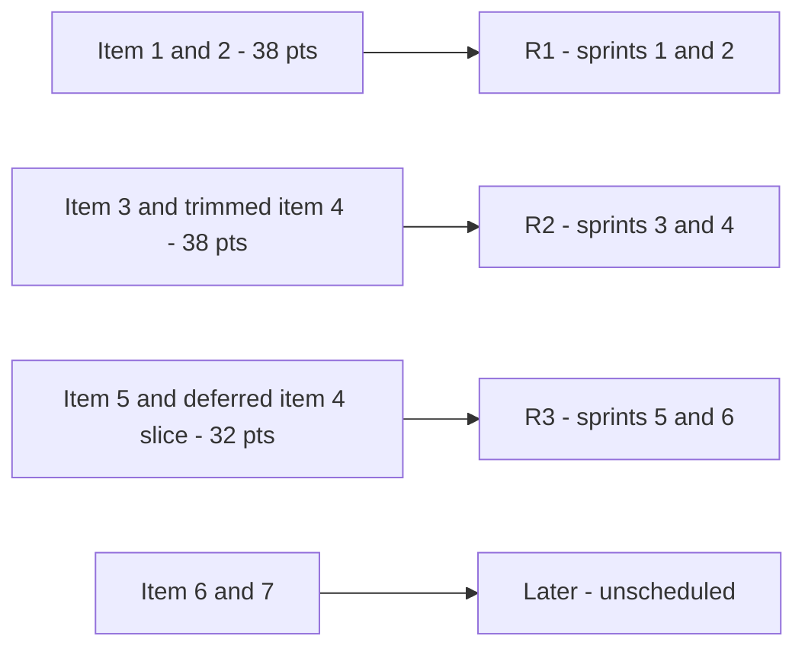
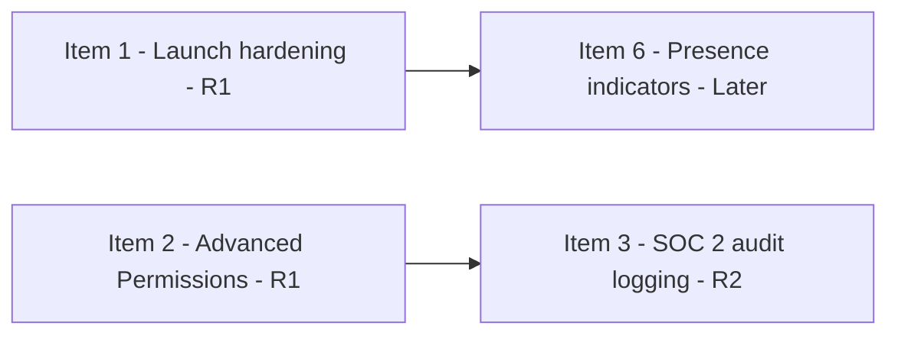

# Lecture 2 — Release Planning & Sequencing

> **Duration:** ~2.5 hours. **Outcome:** You can turn a prioritized, sized backlog into a capacity-aware, dependency-correct release plan using SQL, explain fixed-scope vs. fixed-date releases, and defend why you sequenced work in a particular order — not just what order.

A roadmap (Lecture 1) tells Priya and the board *what* and roughly *when*, at a confidence level appropriate to how far out it is. A release plan tells Marcus's team *exactly* what ships in which release, in what order, against real sprint capacity, respecting real dependencies. Roadmap and release plan must agree — if they don't, one of them is lying — but they are not the same document, and they are not built the same way. This lecture builds the release plan underneath the Now/Next roadmap from Lecture 1, using SQL to do it precisely instead of eyeballing a spreadsheet.

**Why SQL and not a spreadsheet:** a release plan is a query against structured facts — items, points, priority, dependencies, capacity — not a document you format by hand. A spreadsheet lets you *type* a release number next to a row; it can't *verify* that the sequencing respects dependency order or capacity limits as the backlog changes. A few lines of SQL can, every time, instantly. That correctness property is worth more than a spreadsheet's familiarity, and it's why this course treats backlog and capacity data as a database problem, not a spreadsheet problem, from here forward.

## 1. Anatomy of a release

A release is not "two weeks of work." It's a specific, named bundle of backlog items that:

- **Delivers a coherent outcome** someone can use or evaluate (not an arbitrary slice — "half of Advanced Permissions" isn't a release, it's an interruption).
- **Has a target window** — a date range, ideally tied to sprint boundaries.
- **Respects dependencies** — nothing ships before what it depends on.
- **Fits inside real capacity** — the team's actual, historically-grounded throughput, not an aspirational number.

## 2. Set up the backlog and capacity tables

Everything below runs unchanged on PostgreSQL 16 and SQLite 3.35+.

```sql
CREATE TABLE roadmap_items (
    item_id        INTEGER PRIMARY KEY,
    title          TEXT    NOT NULL,
    theme          TEXT    NOT NULL,
    outcome        TEXT    NOT NULL,
    story_points   INTEGER NOT NULL,
    priority_rank  INTEGER NOT NULL,      -- 1 = highest priority
    depends_on     INTEGER REFERENCES roadmap_items(item_id),
    hard_date      DATE                   -- NULL unless externally fixed
);

INSERT INTO roadmap_items VALUES
(1,'Team Workspaces — launch hardening','Team Workspaces',
   'Close Atlas''s workspace-adoption success criteria without regressing quality at launch',
   8, 1, NULL, NULL),
(2,'Advanced Permissions & Roles','Enterprise Trust',
   'Unblock $640K in combined ARR across 3 enterprise renewals stuck in security review',
   30, 2, NULL, NULL),
(3,'SOC 2 — audit logging & access reviews','Enterprise Trust',
   'Pass the SOC 2 Type II audit gating the same 3 enterprise renewals',
   20, 3, 2, '2026-09-13'),
(4,'Data Export API (v1)','Platform & Integrations',
   'Unblock the 2 partner integrations Sales has stalled on for a quarter',
   26, 4, NULL, NULL),
(5,'Onboarding revamp — guided setup','Self-Serve Growth',
   'Cut self-serve time-to-first-value from 9 days to under 3',
   24, 5, NULL, NULL),
(6,'Real-time presence indicators','Team Workspaces',
   'Revisit collaboration depth once workspace adoption data exists',
   14, 6, 1, NULL),
(7,'Dark mode / theming','UI Polish',
   'Reduce the top 2 recurring low-severity support requests',
   8, 7, NULL, NULL);

CREATE TABLE sprints (
    sprint_id         INTEGER PRIMARY KEY,
    sprint_num        INTEGER NOT NULL,
    start_date        DATE NOT NULL,
    end_date          DATE NOT NULL,
    planned_capacity  INTEGER NOT NULL   -- story points, after buffer
);

INSERT INTO sprints VALUES
(1,1,'2026-08-03','2026-08-16',19),
(2,2,'2026-08-17','2026-08-30',19),
(3,3,'2026-08-31','2026-09-13',19),
(4,4,'2026-09-14','2026-09-27',19),
(5,5,'2026-09-28','2026-10-11',19),
(6,6,'2026-10-12','2026-10-25',19);
```

## 3. Where the capacity number comes from

`planned_capacity = 19` per sprint isn't a guess. Marcus's team's last four two-week sprints landed **19, 24, 21, 24** story points — average **22**. A release plan built on raw average velocity is fragile: it assumes zero support load, zero on-call interruptions, zero PTO, every single sprint. Reserve a buffer:

```sql
SELECT
    ROUND(AVG(points), 1)               AS avg_velocity,
    ROUND(AVG(points) * 0.85, 0)        AS planning_velocity   -- 15% buffer
FROM (VALUES (19),(24),(21),(24)) AS recent_sprints(points);
```

```
avg_velocity | planning_velocity
--------------+-------------------
        22.0 |               19
```

**22 × 0.85 ≈ 18.7, rounded to 19.** That 15% reserve isn't pessimism — it's what historically gets eaten by production support, on-call, and the PTO the team always takes but never plans around. Skip the buffer and your release plan is quietly promising 100% of a capacity the team has never actually delivered four sprints running. Over six sprints: **19 × 6 = 114 points of usable Q3 capacity.**

## 4. Sequencing with a running-sum query

The core release-planning query is a cumulative sum over the priority-ranked backlog, using a window function:

```sql
SELECT
    item_id,
    title,
    story_points,
    priority_rank,
    SUM(story_points) OVER (
        ORDER BY priority_rank
        ROWS BETWEEN UNBOUNDED PRECEDING AND CURRENT ROW
    ) AS cumulative_points
FROM roadmap_items
ORDER BY priority_rank;
```

```
 item_id |                title                 | story_points | priority_rank | cumulative_points
---------+---------------------------------------+---------------+----------------+--------------------
       1 | Team Workspaces — launch hardening    |             8 |              1 |                  8
       2 | Advanced Permissions & Roles           |            30 |              2 |                 38
       3 | SOC 2 — audit logging & access reviews |            20 |              3 |                 58
       4 | Data Export API (v1)                   |            26 |              4 |                 84
       5 | Onboarding revamp — guided setup       |            24 |              5 |                108
       6 | Real-time presence indicators          |            14 |              6 |                122
       7 | Dark mode / theming                    |             8 |              7 |                130
```

Against **114 points of capacity**, items 1–5 land at a cumulative 108 (6 points of buffer to spare). Item 6 pushes the running total to 122 — past the line. **That's the query that produced Lecture 1's Now/Next/Later split.** It's not a feeling about priority; it's a fact about capacity intersecting a priority order that Elena and Marcus already agreed on.

## 5. Grouping into named releases

Two-sprint releases (38 points each) give three releases across the quarter:

```sql
SELECT
    item_id,
    title,
    story_points,
    priority_rank,
    SUM(story_points) OVER (ORDER BY priority_rank
        ROWS BETWEEN UNBOUNDED PRECEDING AND CURRENT ROW) AS cumulative_points,
    CASE
        WHEN SUM(story_points) OVER (ORDER BY priority_rank
             ROWS BETWEEN UNBOUNDED PRECEDING AND CURRENT ROW) <= 38  THEN 'R1'
        WHEN SUM(story_points) OVER (ORDER BY priority_rank
             ROWS BETWEEN UNBOUNDED PRECEDING AND CURRENT ROW) <= 76  THEN 'R2'
        WHEN SUM(story_points) OVER (ORDER BY priority_rank
             ROWS BETWEEN UNBOUNDED PRECEDING AND CURRENT ROW) <= 114 THEN 'R3'
        ELSE 'unscheduled (Later)'
    END AS release
FROM roadmap_items
ORDER BY priority_rank;
```

Result: **R1** = items 1+2 (38 pts, sprints 1–2) · **R2** = items 3+4, trimmed (see §6, sprints 3–4) · **R3** = item 5 + the deferred slice of item 4 (sprints 5–6) · items 6–7 fall to **Later**, unscheduled this quarter.


*How the priority-ranked backlog splits into three two-sprint releases plus a Later bucket.*

## 6. Fixed-scope vs. fixed-date releases

Every release is one of two shapes, and mixing them up in your head is where release plans go wrong:

| Type | What's fixed | What flexes | Northlight example |
|---|---|---|---|
| **Fixed-scope** | The scope ships as defined | The exact date, by a sprint or two, if needed | **R1** — Atlas hardening + Advanced Permissions ship when they ship; nobody outside the team is watching a specific date. |
| **Fixed-date** | The date is immovable (external commitment) | The scope — cut ruthlessly to protect the date | **R2** — the SOC 2 auditor's fieldwork window opens **September 14**. Audit logging must be live and stable by **September 13**. That date does not move because Northlight is behind schedule. |

R2's math forces the fixed-date discipline in practice. Item 3 (SOC 2, 20 pts) plus the *full* item 4 (Data Export API, 26 pts) is 46 points against R2's 38-point budget — 8 points over, and item 3 has a hard external date that cannot slip. The only lever left is scope on item 4:

```sql
-- Full Data Export API v1 = CSV export (12) + JSON export (8) + API key mgmt (6) = 26 pts.
-- Trimmed to protect the SOC 2 date: ship CSV export + API key mgmt now (18 pts),
-- defer JSON export (8 pts) into R3.
SELECT 'Data Export API — trimmed for R2' AS release_scope, 12 + 6 AS points
UNION ALL
SELECT 'Data Export API — JSON export deferred to R3', 8;
```

R2 becomes SOC 2 (20) + Data Export trimmed (18) = **38, exact.** JSON export (8 pts) moves into R3 alongside Onboarding (24 pts) = 32, six points under R3's 38-point budget. **This is what protecting a fixed date actually looks like: not heroics, not unpaid overtime — a visible, deliberate scope cut, decided in advance, the same discipline Week 1's triple-constraint lecture taught for a single project, now applied at release grain.**

## 7. Dependency sequencing and the integrity check

Item 3 (SOC 2) has `depends_on = 2` (Advanced Permissions) because the auditor needs role-level audit logs — you can't log access by role before roles exist. Item 6 (presence indicators) depends on item 1 (core workspaces) for the same structural reason. A release plan that assigns a dependent item to an *earlier* release than its dependency is broken, silently, until someone notices in execution — far too late. Catch it with a query, not a careful read:


*Dependency edges point from prerequisite to dependent; the integrity check fails if a dependent's release comes before its prerequisite's.*

```sql
SELECT
    child.title      AS item,
    child_release.release  AS item_release,
    parent.title      AS depends_on_item,
    parent_release.release AS dependency_release
FROM roadmap_items child
JOIN roadmap_items parent       ON child.depends_on = parent.item_id
JOIN release_assignments child_release  ON child_release.item_id = child.item_id
JOIN release_assignments parent_release ON parent_release.item_id = parent.item_id
WHERE child_release.release < parent_release.release;   -- violation: ships before its dependency
```

(`release_assignments` here is the R1/R2/R3/Later result from §5, materialized as a table or view — assume `R1 < R2 < R3 < Later` under whatever ordering you define.) An empty result set is the whole point: it's proof, not a hope, that nothing in the plan ships before what it needs.

## 8. Sequencing for early value, not just lowest cost

Priority rank in §4 wasn't arbitrary — Elena and Marcus set it deliberately, and it's worth naming *why*, because "lowest points first" and "highest value first" are not the same sequencing rule and picking the wrong one is a common mistake:

- **Advanced Permissions before Data Export**, even though both matter, because Permissions unblocks *revenue already at risk* (renewals actively stalled), while Data Export unblocks *revenue not yet stalled* (partnerships still in progress). Same team cost either order; very different cost of delay.
- **SOC 2 immediately after Permissions**, not later, because it has a real external date and a real dependency — sequencing it any later than necessary needlessly compresses the margin for error against September 13.
- **Onboarding revamp before Dark Mode**, despite Dark Mode's smaller size (a "quick win" instinct), because Onboarding's outcome (self-serve time-to-value) compounds every week it ships later, while Dark Mode's outcome (fewer low-severity tickets) does not.

The rule: **sequence by cost of delay relative to size, not by size alone.** A cheap item with a low cost of delay (Dark Mode) correctly waits behind an expensive item with a high cost of delay (Permissions), even though "ship the cheap one first" feels more efficient on paper.

## 9. Check yourself

- Why does `planning_velocity` use 0.85 × average instead of raw average velocity? What specifically would go wrong if you skipped the buffer?
- Walk through, in your own words, why R2 is a fixed-date release and R1 is a fixed-scope release — and what a PM does differently in each case.
- Explain the dependency-integrity query in §7 in plain English: what row would appear in its output, and what would that row mean?
- Northlight's priority order put Advanced Permissions ahead of Data Export API despite both being sized 30 and 26 respectively. Defend that ordering using "cost of delay," not just points.
- If R2's budget were 46 points instead of 38, would you still trim Data Export API? Why or why not?

Lecture 3 covers what happens when this plan meets reality and something slips — which, on a real project, it eventually will.

## Further reading

- **PostgreSQL docs — Window Functions:** <https://www.postgresql.org/docs/current/tutorial-window.html>
- **Basecamp / 37signals — "Shape Up: Fixed time, variable scope":** <https://basecamp.com/shapeup/0.3-chapter-02>
- **Atlassian — "Release planning in Agile":** <https://www.atlassian.com/agile/product-management/release-planning>
