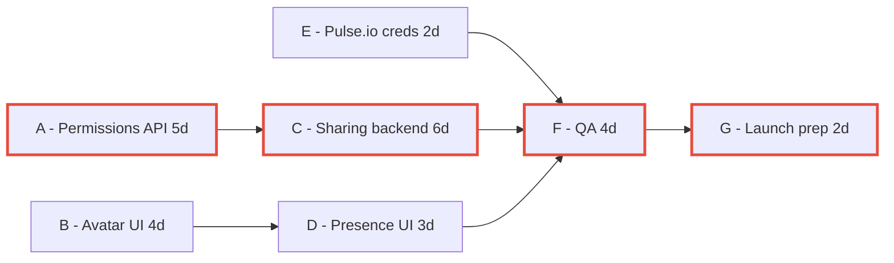

# Lecture 3 — Critical Path & Slack

> **Duration:** ~2 hours. **Outcome:** You can compute the critical path of a small schedule by hand and in Python, explain float/slack in one plain-English sentence, and say specifically which tasks deserve a schedule buffer and which don't.

Here is the single most useful sentence a PM can say in a status meeting: **"That task can slip two days without affecting our launch date; this other one can't slip at all."** Being able to say that — correctly, not as a guess — requires knowing your project's **critical path**. Without it, every task feels equally urgent, every "we're a day behind" sounds equally alarming, and buffers get spread evenly across the schedule instead of where they actually protect the date.

## 1. The idea in one paragraph

A project's schedule is a network of tasks, some of which must happen before others (Lecture 2's dependencies). The **critical path** is the longest chain of dependent tasks from start to finish — "longest" in *duration*, not in number of tasks. It's called critical because **every task on it has zero slack**: if any one of them slips by a day, the whole project's finish date slips by a day. Every task *not* on the critical path has some amount of **slack** (also called **float**) — room to slip without moving the finish date, up to a point.

This matters because it inverts a common, wrong intuition: **the longest individual task is not necessarily the most urgent one to protect.** A 6-day task with 9 days of slack can slip by a week and cost you nothing. A 2-day task with zero slack, if it slips by even a single day, delays the launch. Knowing which is which is the entire value of this lecture.

## 2. Atlas's remaining schedule

Atlas's sharing-and-presence work, from where Lecture 2 left it, breaks into seven remaining tasks. Durations are in working days; predecessors are the tasks that must finish before a task can start.

| Task | Description | Duration | Predecessors |
|---|---|:-:|---|
| A | Platform delivers permissions API | 5d | — |
| B | Design Systems delivers avatar-stack component | 4d | — |
| C | Build sharing backend logic | 6d | A |
| D | Build presence UI | 3d | B |
| E | Integrate Pulse.io production credentials | 2d | — |
| F | QA sharing + presence end-to-end | 4d | C, D, E |
| G | Launch prep + release notes | 2d | F |

Two things worth noticing before any math: **A, B, and E have no predecessors** — they can all start on day 0, in parallel, because they don't depend on each other or on anything already done. And **F depends on three different tasks (C, D, E)** — it can't start until *all three* are finished, not just the first one. That single fact — F waits for the *slowest* of its three inputs — is the mechanic that produces a critical path.

## 3. The forward pass: earliest start, earliest finish

Walk the tasks in dependency order (predecessors before successors) and compute:

- **Earliest Start (ES)** = the latest Earliest Finish among all this task's predecessors (0 if it has none).
- **Earliest Finish (EF)** = ES + duration.

| Task | Predecessors | ES | Duration | EF |
|---|---|:-:|:-:|:-:|
| A | — | 0 | 5 | 5 |
| B | — | 0 | 4 | 4 |
| E | — | 0 | 2 | 2 |
| C | A | **5** (A's EF) | 6 | 11 |
| D | B | **4** (B's EF) | 3 | 7 |
| F | C, D, E | **11** (max of C=11, D=7, E=2) | 4 | 15 |
| G | F | 15 | 2 | **17** |

**The project's total duration is the maximum EF across all tasks with no successors — here, G's EF = 17 working days.** Notice F's ES is 11, not 7 or 2 — it's driven by whichever predecessor finishes *last* (C, at day 11), because F genuinely cannot start until every one of its inputs is ready. This is the single most common mistake newcomers make computing a forward pass by hand: taking the average, or the first predecessor, instead of the **maximum**.

## 4. The backward pass: latest start, latest finish

Now walk the tasks in *reverse* dependency order (successors before predecessors), starting from the project's total duration (17), and compute:

- **Latest Finish (LF)** = the earliest Latest Start among all this task's successors (equal to the project duration, 17, if it has no successors).
- **Latest Start (LS)** = LF − duration.

| Task | Successors | LF | Duration | LS |
|---|---|:-:|:-:|:-:|
| G | — | 17 | 2 | 15 |
| F | G | **15** (G's LS) | 4 | 11 |
| C | F | **11** (F's LS) | 6 | 5 |
| D | F | **11** (F's LS) | 3 | 8 |
| E | F | **11** (F's LS) | 2 | 9 |
| A | C | 5 (C's LS) | 5 | 0 |
| B | D | 8 (D's LS) | 4 | 4 |

## 5. Slack (float) and the critical path

**Slack = LS − ES** (equivalently, LF − EF — they always agree). A task with slack = 0 is on the critical path.

| Task | ES | LS | Slack | Critical? |
|---|:-:|:-:|:-:|:-:|
| A | 0 | 0 | **0** | **Yes** |
| B | 0 | 4 | 4 | No |
| C | 5 | 5 | **0** | **Yes** |
| D | 4 | 8 | 4 | No |
| E | 0 | 9 | 9 | No |
| F | 11 | 11 | **0** | **Yes** |
| G | 15 | 15 | **0** | **Yes** |

**The critical path is A → C → F → G**, totaling 5 + 6 + 4 + 2 = **17 days**, matching the project's total duration exactly — that's always true and a good sanity check on your arithmetic. Every task on it has zero slack: if Platform's permissions API (A) slips by even one day, or QA (F) runs one day long, Atlas's launch date moves by one day, full stop, with no absorption anywhere in between.


*The critical path runs A to C to F to G in red; B, D, and E have slack to absorb delay without moving the launch date.*

Compare that to task **E** (Pulse.io integration) sitting on **9 days of slack** — this is the risk you scored at 12 in Lecture 1, and it turns out it can slip by *nine working days* without touching the launch date at all, because F needs C's output (day 11) far more urgently than it needs E's (which could finish any time up to day 11). This is a genuinely important, non-obvious result: **the risk that felt scariest in Lecture 1 sits on the path with the most room to absorb it.** That doesn't mean ignore it — a risk that eats all 9 days of slack still becomes critical — but it does mean it's not today's fire.

**B and D**, by contrast, have only 4 days of slack each, and they're *coupled*: they share the same slack, because they both feed into F through the same downstream constraint. If Design Systems (B) slips 3 days, D can still absorb it and F is unaffected — but if B slips 5 days, the whole B → D → F chain now runs longer than the previous critical path, and **the critical path itself changes** to run through B and D instead of A and C. This is why critical path is not something you compute once at kickoff and file away — it needs to be **recomputed** every time a task's actual duration changes materially, because the "most urgent" tasks can shift underneath you.

## 6. Computing it in Python

Hand computation is essential for building intuition — you should never blindly trust a script's output on something this consequential without being able to sanity-check it. But for anything beyond ~10 tasks, do it in Python. Here's the same schedule computed with plain Python (no external graph library needed for a plan this size):

```python
import pandas as pd

tasks = {
    "A": {"duration": 5, "preds": []},
    "B": {"duration": 4, "preds": []},
    "E": {"duration": 2, "preds": []},
    "C": {"duration": 6, "preds": ["A"]},
    "D": {"duration": 3, "preds": ["B"]},
    "F": {"duration": 4, "preds": ["C", "D", "E"]},
    "G": {"duration": 2, "preds": ["F"]},
}

def topological_order(tasks):
    """Simple Kahn's-algorithm style sort: predecessors always come before successors."""
    remaining = dict(tasks)
    ordered = []
    while remaining:
        ready = [t for t, info in remaining.items()
                 if all(p in ordered for p in info["preds"])]
        if not ready:
            raise ValueError("Cycle detected in dependencies")
        ordered.extend(sorted(ready))   # sorted() just makes ties deterministic
        for t in ready:
            del remaining[t]
    return ordered

order = topological_order(tasks)

# Forward pass: earliest start / earliest finish
for t in order:
    preds = tasks[t]["preds"]
    es = max((tasks[p]["ef"] for p in preds), default=0)
    tasks[t]["es"] = es
    tasks[t]["ef"] = es + tasks[t]["duration"]

project_duration = max(tasks[t]["ef"] for t in order)

# Backward pass: latest finish / latest start (walk in reverse topological order)
successors = {t: [] for t in tasks}
for t, info in tasks.items():
    for p in info["preds"]:
        successors[p].append(t)

for t in reversed(order):
    succs = successors[t]
    lf = min((tasks[s]["ls"] for s in succs), default=project_duration)
    tasks[t]["lf"] = lf
    tasks[t]["ls"] = lf - tasks[t]["duration"]

# Slack + critical path
df = pd.DataFrame([
    {"task": t, "duration": tasks[t]["duration"], "es": tasks[t]["es"],
     "ef": tasks[t]["ef"], "ls": tasks[t]["ls"], "lf": tasks[t]["lf"],
     "slack": tasks[t]["ls"] - tasks[t]["es"]}
    for t in order
])
df["critical"] = df["slack"] == 0

print(f"Project duration: {project_duration} days\n")
print(df.to_string(index=False))
print("\nCritical path:", " -> ".join(df[df.critical]["task"]))
```

Running this prints the exact table from §5, plus `Critical path: A -> C -> F -> G`. Keep this script — Exercise 3 asks you to adapt it to a different, slightly larger schedule, and the mini-project reuses it directly against your own project's task list.

## 7. Where buffers actually belong

Once you know the critical path, buffering strategy stops being a guess:

- **Put schedule buffer on or right before critical-path tasks**, especially ones carrying real risk. Task C (sharing backend logic) is on the critical path *and* depends on Platform's permissions API (A), which is Lecture 1's second-highest-scored risk. A one- or two-day buffer between A finishing and C starting is time well spent — it directly protects the launch date against exactly the risk most likely to hit it.
- **Don't buffer non-critical tasks by default** — they already have slack built in. Adding buffer to task E (9 days of slack already) is wasted schedule; it makes the plan look longer without protecting anything, because E was never going to be the thing that made you late.
- **Watch tasks with small-but-nonzero slack** (B and D, at 4 days) — they're not critical *today*, but a modest slip converts them into the critical path, as §5 showed. These deserve monitoring, not necessarily buffer, so you catch the moment they become critical instead of finding out from the calendar.
- **Re-run the critical path whenever a task's real duration changes materially** — after Platform commits to a real date for A, after Pulse.io's actual integration effort for E becomes clearer, after any sprint where an estimate proves wrong. A critical path computed once at kickoff and never revisited is a critical path you can no longer trust.

## 8. Check yourself

- In your own words, what does it mean for a task to have "zero slack"? Why is that the definition of "critical," not just "important"?
- Why does F's earliest start use the *maximum* of its predecessors' finish times, not the average or the first one?
- Explain why task E, despite carrying Lecture 1's highest risk score among Atlas's remaining risks, sits on 9 days of slack — and why that's still not a reason to ignore it.
- If Design Systems' avatar-stack component (task B) actually takes 8 days instead of 4, recompute: does the critical path change? What's the new project duration?
- Name one place in Atlas's schedule where a 2-day buffer would meaningfully protect the launch date, and one place where adding a buffer would be wasted effort. Justify both using slack.

If those are automatic, you're ready for this week's exercises, challenges, and the mini-project — building Atlas's (or your own project's) live risk register, dependency map, and critical path as one connected deliverable.

## Further reading

- **PMI — "Critical Path Method":** <https://www.pmi.org/learning/library/critical-path-method-scheduling-technique-8025>
- **Project Management Institute — "Critical Chain vs. Critical Path":** <https://www.pmi.org/learning/library/critical-chain-project-management-buffer-8003>
- **Wikipedia — "Critical path method"** (clear worked-example reference): <https://en.wikipedia.org/wiki/Critical_path_method>
