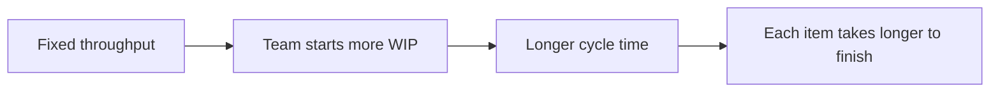

# Lecture 1 — The Core Flow Metrics

> **Duration:** ~2 hours. **Outcome:** You can define velocity, throughput, cycle time, lead time, and WIP precisely, state Little's Law and use it to sanity-check a team's numbers, and explain — for each metric — the one thing it hides.

Every team that ships software generates a paper trail: when a piece of work was created, when someone started it, when it moved, when it was blocked, when it shipped. Buried in that paper trail is the honest answer to "how are we doing?" This lecture defines the five numbers you pull out of it and — just as important — what each one *doesn't* tell you. Get the definitions wrong and every query in the next two lectures computes the wrong thing correctly.

## 1. Why "it feels slow" isn't an answer

Every PM eventually sits across from a sponsor who says some version of: *"it feels like the team is slower than three sprints ago."* That feeling might be right. It might also be recency bias, one loud incident, or a single visible slip that doesn't represent the whole picture. The only way to tell the difference is to compute the same metric, the same way, across every sprint, and look at the trend rather than the vibe.

That's the whole premise of this week: Atlas has seven sprints of real history sitting in `atlas_pm`. By the end of Lecture 3 you'll know, with numbers, whether Priya Chen's "it feels slower" is correct — and if it is, *why*.

## 2. Velocity — what a team commits to and finishes, per sprint

**Velocity** is the sum of **story points** for issues a team completed within a given sprint, counted against the sprint the points were credited to.

```
velocity(sprint) = SUM(story_points) WHERE sprint = X AND status = 'Done'
```

Velocity is a **sprint-based** metric — it only exists if your team works in sprints and estimates in points. It's useful for exactly one thing: **sprint planning**. If Atlas's last three sprints averaged 15 points, planning a 25-point Sprint 8 is not optimism, it's a plan built to fail. Velocity is a *capacity* signal for the team that produced it — nothing more.

What velocity hides:

- **Points aren't comparable across teams**, and often aren't stable within one team either — a "5" six months ago and a "5" today may not mean the same amount of work. Comparing Team A's velocity to Team B's is close to meaningless.
- **Velocity says nothing about quality.** A team can hit its number every sprint while quietly accumulating bugs, tech debt, and untested edge cases that show up as *next* sprint's work.
- **It's trivially gameable.** Inflate estimates, split stories to pad the count, or mark something "Done" before it's actually done, and velocity goes up while nothing real changed. This is why velocity should never leave the team — it's a planning tool for the people who generated it, not a scorecard for a sponsor.
- **It rewards committing to less.** A team that sandbags its estimates looks "faster" every sprint without doing more work. If velocity becomes a target, this is the very first behavior it produces.

## 3. Throughput — what a team actually finishes, per unit of time

**Throughput** is the **count of items completed** (not their point size) per unit of time — usually per week.

```
throughput(week) = COUNT(issues) WHERE resolved_at falls in that week
```

Throughput fixes velocity's biggest weakness: it doesn't depend on estimates at all. You don't need story points, you don't need sprints, you don't even need to trust anyone's sizing — you just count finished things. This makes throughput comparable *within* a team over time in a way raw velocity often isn't, and it works even for teams that don't estimate (pure Kanban flow, most bug-fix teams, most support queues).

What throughput hides:

- **It treats a one-line config fix and a three-week epic as the same "1."** A team's throughput can look stable while it's quietly swapping big, valuable work for small, easy work to keep the count up.
- **It says nothing about *what* got done** — throughput of 5 tells you nothing about whether those 5 things mattered.
- **Batch-splitting inflates it.** Same trick as velocity, different lever: chop one piece of work into five smaller tickets and throughput quintuples for the same actual output.

Use throughput as a forecasting input (Monte-Carlo-style "how many sprints until this backlog is done," which pulls a random sample of historical throughput weeks) — it's excellent for that. Don't use it alone as a productivity scorecard.

## 4. Cycle time vs. lead time — the distinction that trips almost everyone up

These two get confused constantly, and the confusion produces genuinely different, contradictory numbers. Learn the boundary once and it never comes back to bite you.

- **Lead time** = the clock the *customer* (or the business) experiences: from the moment the request exists (`created_at`) to the moment it's delivered (`resolved_at`). It includes every day the ticket sat untouched in a backlog.
- **Cycle time** = the clock the *team actively working on it* experiences: from the moment someone starts (first entering `In Progress`) to the moment it's delivered (`Done`). It excludes backlog wait time — but, correctly measured, it **includes** time the ticket spent `Blocked`, because blocked time is still time the team was accountable for, even if no one was typing.

```
lead_time(issue)  = resolved_at  - created_at
cycle_time(issue) = resolved_at  - first_in_progress_at
```

Why the distinction matters in practice: a backlog can grow for months with zero effect on cycle time (nobody's touched those tickets yet), while cycle time degrading is a direct signal about the *team's* flow, independent of how big the backlog is. If Priya asks "how long does a request take," she usually means lead time. If Marcus asks "why did this ticket take so long once we picked it up," he means cycle time. Answering the wrong one for the question asked is a classic, avoidable miscommunication.


*Lead time spans Created to Done; cycle time spans First In Progress to Done, and correctly includes the Blocked stage.*

**A specific Atlas gotcha, coming in Lecture 2:** several Sprint 4–7 issues spent real days sitting in `Blocked` — waiting on the flaky third-party sandbox, or on the Platform team. Cycle time as defined above **includes** that blocked time (it's still elapsed time between start and finish), which is exactly why it's the metric that will expose the two risks Week 6's risk register flagged as "watching closely." An average that excluded blocked time would hide the exact thing you need to see.

## 5. WIP — work in progress

**WIP** is the count of items that have been **started but not finished** at a given moment — status is something like `In Progress`, `In Review`, or `Blocked`, but not `To Do`/`Backlog` (not started) and not `Done` (finished).

```
WIP(as of date) = COUNT(issues) WHERE started AND NOT finished, evaluated at that date
```

WIP is the one metric on this list that is a **snapshot**, not a rate — it's a single number true *right now*, not "per week" or "per sprint." It matters because WIP is the dial that most directly controls cycle time: the more things a team has open at once, the longer each individual thing takes, because attention gets sliced thinner and context-switching costs compound. This is not a vague claim — it's the mechanism behind Little's Law, next.

What WIP hides: a WIP count alone doesn't tell you *why* things are open — three items genuinely 90% done look identical in a WIP count to three items that have been stuck for three weeks. You need `age` (how long each item has been open) alongside WIP to tell those apart — Lecture 3 computes exactly that.

## 6. Little's Law — the equation that ties them together

**Little's Law**, borrowed from queueing theory, states a relationship that holds for *any* stable system processing a queue of work:

```
WIP = Throughput × Cycle Time
```

Rearranged, this is often more useful as a forecasting tool:

```
Cycle Time = WIP / Throughput
```

Read that second form carefully: **for a fixed throughput, more WIP directly causes longer cycle time.** This is the single most actionable idea in flow management. If a team wants faster cycle time and throughput hasn't changed, the lever isn't "try harder" — it's **carry less WIP at once**. This is the entire intellectual case for Kanban WIP limits, and for a Scrum team asking "should we really start five things in parallel this sprint."


*The practical lever: with throughput flat, carrying more work in progress at once directly lengthens cycle time.*

A worked example, independent of Atlas, to get the arithmetic under your fingers: a support team resolves 5 tickets/week (throughput) and carries an average of 8 open tickets at any moment (WIP). Little's Law predicts an average cycle time of `8 / 5 = 1.6 weeks`. If someone on that team is surprised tickets "take so long," this equation is the answer — not "the team needs to work harder," but "the team is carrying too much WIP for its throughput."

The law holds **on average, in a system at steady state** — it's not a promise that hits exactly every week for every real, noisy dataset (Atlas's data will wobble around it, not sit on it precisely). That wobble is itself informative: a team whose WIP/throughput/cycle-time numbers stop roughly agreeing with Little's Law is a team whose flow just changed shape — worth investigating *why*, which is exactly Challenge 2 this week.

## 7. Burndown and burnup — the sprint-level picture

A **burndown chart** plots remaining work (points or count) against time within a sprint — it should trend toward zero by the sprint's end. A **burnup chart** plots two lines instead of one: work *completed* and total work *in scope*, both trending up — the gap between the lines is what's left, and a rising scope line makes mid-sprint scope creep visible in a way a burndown alone hides completely (a burndown that "isn't dropping" could mean nothing got done, *or* it could mean things got done exactly as fast as new scope got added — you can't tell which from a burndown alone).

Lecture 2 computes both directly from `issues` and `issue_status_history` in SQL, day by day, for Atlas's Sprint 7 — no chart-drawing here, just the underlying numbers, which is the part that's actually a database query.

## 8. Signals, not targets — the rule that governs this entire week

Every metric above shares the same trap: **the moment you turn a flow metric into an individual or team performance target, someone will hit the target without improving the thing it was measuring.** This isn't cynicism about people — it's Goodhart's Law, and it's completely predictable once you see the specific gaming move each metric invites (re-read sections 2–3 above; each one names its move). The fix isn't to stop measuring. It's to use these metrics the way a doctor uses vital signs: to notice something worth investigating, never as the thing you optimize directly. "Cycle time went from 8 days to 14 days over two sprints" is a prompt to go ask *why* — the answer might be a real process problem, or it might be exactly what Atlas is about to discover: two external dependencies that materialized right on schedule from the Week 6 risk register.

## 9. Check yourself

- In one sentence each, distinguish velocity from throughput.
- Which of the two — lead time or cycle time — includes backlog wait time? Which one is the better answer to "why did this specific ticket take so long once we started it"?
- Does cycle time, correctly measured, include time an issue spent `Blocked`? Why does that matter for Atlas specifically?
- Write Little's Law from memory, then rearrange it to solve for cycle time.
- A team's WIP count is high but stable. What additional piece of data do you need to know whether that's fine or a problem?
- Name one concrete way a team could inflate its throughput number without shipping more real value.
- Why does a rising scope line on a burnup chart matter, when a burndown chart alone wouldn't show it at all?
- What's the one governing rule for how these metrics should — and shouldn't — be used?

If those are automatic, Lecture 2 loads Atlas's actual export into SQL and computes every one of these numbers for real.

## Further reading

- **Little's Law — original 1961 result, explained plainly:** <https://en.wikipedia.org/wiki/Little%27s_law>
- **Troy Magennis — flow-metrics forecasting resources (free):** <https://www.focusedobjective.com/resources>
- **Daniel Vacanti, *Actionable Agile Metrics for Predictability* — publisher summary and sample chapters:** <https://actionableagile.com/books/>
