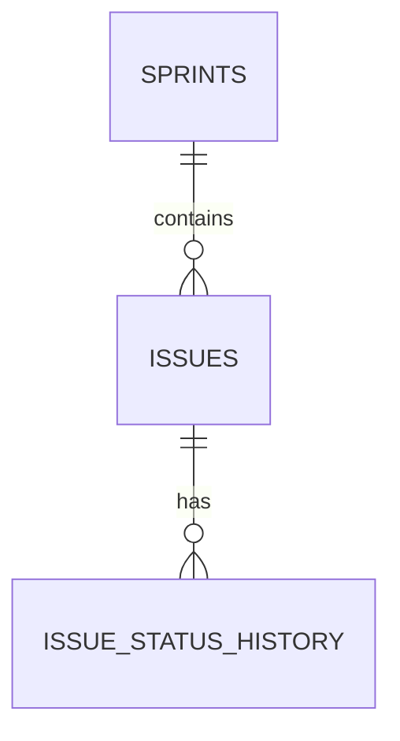
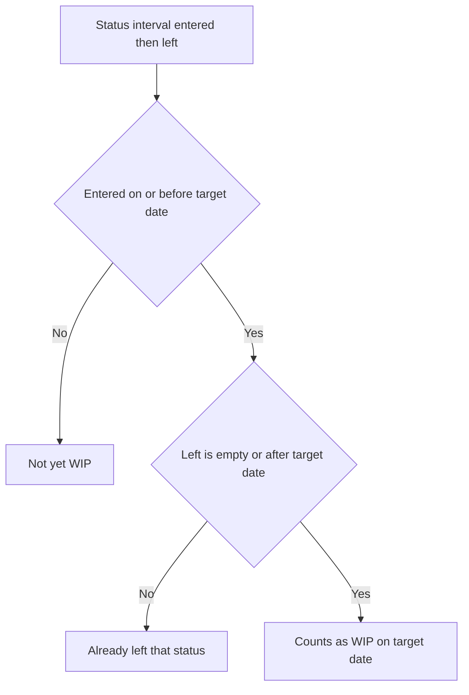

# Lecture 2 — Delivery Metrics in SQL

> **Duration:** ~2 hours. **Outcome:** You can model an issue export and its status history relationally, and compute velocity, throughput, WIP, and a day-by-day burndown/burnup directly in SQL using `GROUP BY` and window functions — from memory, on both PostgreSQL and SQLite.

Lecture 1 gave you the definitions. This lecture gives you the queries. Everything here runs against the `issues`, `issue_status_history`, and `sprints` tables you seeded in the [week README](../README.md) — 28 Atlas issues, 112 status-change rows, snapshot date **2026-04-06**. Run every query as you read.

## 1. Why this data lives in SQL, not a spreadsheet

Before the queries, the "why," because this is the course's data-tooling rule and it's worth a real argument, not a slogan.

An issue export is **relational data with a real history**: each issue belongs to exactly one sprint (a foreign key), and each issue has *many* status-change events over its life (a one-to-many relationship) — Atlas's 28 issues already produced 112 history rows in seven sprints. A spreadsheet has no native way to express "one issue has many status changes" without either duplicating the issue's fields onto every history row (ATLAS-119's summary, typed out six times) or maintaining the relationship by eye across two tabs with VLOOKUP and hoping no one inserts a row in the wrong place. A database expresses it in two lines of `CREATE TABLE` and enforces it with a foreign key — the relationship literally cannot go stale.

Three more concrete failure modes a spreadsheet invites here, each of which has actually happened on real teams:

- **Silent duplication.** Paste this week's Jira export on top of last week's tab and every issue that didn't change gets a second row — velocity and throughput both double-count it, and nothing errors.
- **No point-in-time query.** "What was WIP on the Monday of Sprint 5?" is a single `WHERE entered_at <= ... AND (left_at IS NULL OR left_at > ...)` in SQL. In a spreadsheet, you'd need to have manually saved a snapshot on that exact day — which nobody does, until they need it.
- **No enforced relationship.** Nothing stops someone from typing `Sprnit 4` in a spreadsheet cell. `sprint TEXT NOT NULL REFERENCES sprints(sprint_name)` makes that insert fail immediately, every time, forever.

None of this is a knock on spreadsheets in general — Excel is genuinely the right tool for a one-off ad-hoc table (that's C41). It is never the right tool for versioned, growing, relational history that gets re-queried every week. That's what a database is for.

## 2. The schema, read as a story

```sql
sprints (sprint_name, start_date, end_date, goal)
issues (issue_id, issue_key, issue_type, summary, story_points,
        sprint, assignee, priority, created_at, resolved_at, current_status)
issue_status_history (history_id, issue_id, status, entered_at, left_at)
```

`issues.resolved_at` and `issues.current_status` are **derived, denormalized convenience columns** — in a real Jira export you'd get both a flat CSV (`issues`, with a "Status" and a "Resolved" column) and a separate changelog export (`issue_status_history`). We keep both because some questions ("what's velocity?") only need the flat columns, and others ("how long was this blocked, and when?") need the full history. Knowing *which table to reach for* is half of writing a correct query fast.


*One sprint has many issues, and one issue has many status-change events over its life.*

## 3. Velocity — `GROUP BY`, the metric's whole implementation

```sql
SELECT sprint,
       SUM(story_points) AS velocity
FROM issues
WHERE current_status = 'Done'
GROUP BY sprint
ORDER BY sprint;
```

```
   sprint  | velocity
-----------+----------
 Sprint 1  |       13
 Sprint 2  |       18
 Sprint 3  |       21
 Sprint 4  |       15
 Sprint 5  |       17
 Sprint 6  |       13
 Sprint 7  |        8   -- Sprint 7 is still open; this is partial
```

That's the entire velocity computation — one `GROUP BY`, one `SUM`, one `WHERE`. The interesting part is what's *not* in the query: `SUM` silently skips `NULL` (Week 1 material — the unsized bugs contribute nothing, correctly), and Sprint 7's `8` is not comparable to the other six rows yet because the sprint isn't over. **Always caveat a partial sprint's velocity in anything you report** — Sprint 7 has 20 more points of committed work still open (`123`, `125` unsized, `126`, `127`, `128`), and reporting "8" without that context would understate the team's Sprint 7 output by more than half.

Look at the trend across the six *closed* sprints: `13, 18, 21, 15, 17, 13`. It rose for three sprints, then degraded. Lecture 1 told you not to chase a single number — now look at the shape.

## 4. Throughput — the same shape, a different grouping key

Velocity groups by sprint; throughput groups by a **calendar week**, and counts issues, not points:

```sql
-- PostgreSQL
SELECT date_trunc('week', resolved_at)::date AS week_of,
       COUNT(*) AS issues_done
FROM issues
WHERE resolved_at IS NOT NULL
GROUP BY week_of
ORDER BY week_of;
```

```sql
-- SQLite: strftime('%W', ...) gives an ISO-ish week number; group by the Monday instead for a real date
SELECT date(resolved_at, 'weekday 0', '-6 days') AS week_of,
       COUNT(*) AS issues_done
FROM issues
WHERE resolved_at IS NOT NULL
GROUP BY week_of
ORDER BY week_of;
```

Throughput doesn't care what sprint an issue was tagged to or how many points it was — it only asks "did it finish, and when." This is exactly why it survives even for teams that don't estimate at all: no `story_points` column required.

### A rolling average, with a window function

A single week's throughput is noisy — a 4-week rolling average smooths it. This is your first window function this course:

```sql
WITH weekly AS (
    SELECT date_trunc('week', resolved_at)::date AS week_of,
           COUNT(*) AS issues_done
    FROM issues
    WHERE resolved_at IS NOT NULL
    GROUP BY week_of
)
SELECT week_of,
       issues_done,
       AVG(issues_done) OVER (
           ORDER BY week_of
           ROWS BETWEEN 3 PRECEDING AND CURRENT ROW
       ) AS rolling_4wk_avg
FROM weekly
ORDER BY week_of;
```

Read `OVER (ORDER BY week_of ROWS BETWEEN 3 PRECEDING AND CURRENT ROW)` as: "for each row, look at this row and the three before it, in date order, and average `issues_done` across that window." This is the core idea behind every window function you'll use this week — a per-row calculation that can see *other rows* without collapsing them the way `GROUP BY` does. Both PostgreSQL and SQLite (3.25+) support this syntax identically.

## 5. WIP — a snapshot query, no `GROUP BY` needed at all

Current WIP is just a filtered count, because `current_status` already tells you where each issue sits *right now*:

```sql
SELECT COUNT(*) AS current_wip
FROM issues
WHERE current_status IN ('In Progress', 'In Review', 'Blocked');
```

That returns **3** as of the snapshot (`ATLAS-123` in progress, `ATLAS-125` in review, `ATLAS-126` blocked). Notice what's deliberately excluded: `To Do` (`ATLAS-127`) and `Backlog` (`ATLAS-128`) haven't been *started* yet, so they're not WIP by definition — and `Done` issues obviously aren't either.

### WIP *at a past date* — the query a spreadsheet genuinely cannot answer

This is where `issue_status_history` earns its keep. "What was WIP on the last day of Sprint 6 (2026-03-27)?" needs to know, for that exact date, which issues had *entered* an active status and hadn't yet *left* it:

```sql
SELECT COUNT(DISTINCT h.issue_id) AS wip_on_date
FROM issue_status_history h
WHERE h.status IN ('In Progress', 'In Review', 'Blocked')
  AND h.entered_at <= DATE '2026-03-27'
  AND (h.left_at IS NULL OR h.left_at > DATE '2026-03-27');
```

That predicate — `entered_at <= X AND (left_at IS NULL OR left_at > X)` — is the general pattern for "was this interval open at time X," and you'll use it constantly once you start working with any kind of status history, subscription period, or booking data. Memorize its shape.


*The interval-open-at-time-X check that every point-in-time WIP query relies on.*

## 6. Cycle time — joining `issues` to its own history

Cycle time needs the *first* time each issue entered `In Progress`. That's a `MIN(...) FILTER (...)`, joined back to `issues` for the resolution date:

```sql
SELECT i.issue_key,
       i.story_points,
       h.first_in_progress,
       i.resolved_at,
       (i.resolved_at - h.first_in_progress) AS cycle_time_days
FROM issues i
JOIN (
    SELECT issue_id,
           MIN(entered_at) FILTER (WHERE status = 'In Progress') AS first_in_progress
    FROM issue_status_history
    GROUP BY issue_id
) h ON h.issue_id = i.issue_id
WHERE i.current_status = 'Done'
ORDER BY cycle_time_days DESC;
```

`FILTER (WHERE ...)` restricts an aggregate to matching rows without a separate subquery per condition — both engines support it (SQLite since 3.30). Run it and the top row is `ATLAS-115` at 14 days (the sandbox circuit-breaker — 5 of those 14 days spent `Blocked` on the sandbox itself, which is almost too on-the-nose), followed by `ATLAS-112` and `ATLAS-119` at 11 days each (the feed-provider failover and the Platform-team webhook — one hit the flaky sandbox, the other hit the Platform-team dependency directly). That is not a coincidence, and Challenge 2 makes you prove it with a query rather than a hunch.

Note the date arithmetic: `resolved_at - first_in_progress` on two `DATE` columns returns a plain integer number of days in PostgreSQL. In SQLite, subtracting two `DATE`-affinity text columns doesn't do arithmetic — use `julianday(resolved_at) - julianday(first_in_progress)` instead, which returns a float you can wrap in `ROUND(...)` for whole days.

### How long was each issue actually blocked?

Same join pattern, different filter — sum the duration of every `Blocked` interval per issue:

```sql
-- PostgreSQL
SELECT i.issue_key,
       COALESCE(SUM(h.left_at - h.entered_at), 0) AS days_blocked
FROM issues i
LEFT JOIN issue_status_history h
    ON h.issue_id = i.issue_id AND h.status = 'Blocked'
GROUP BY i.issue_key
HAVING COALESCE(SUM(h.left_at - h.entered_at), 0) > 0
ORDER BY days_blocked DESC;
```

This returns five rows — `ATLAS-119` (7 days blocked, the Platform-team webhook), `ATLAS-115` (5 days, the sandbox itself going down mid-fix), and `ATLAS-112`, `ATLAS-120`, `ATLAS-122` (4 days each). Notice `ATLAS-126` — currently blocked as you read this — does **not** appear, even though it's sitting in `Blocked` right now. That's not a bug in the data, it's a bug waiting in *this query*: `h.left_at` is `NULL` for an interval that hasn't ended yet, so `left_at - entered_at` is `NULL` and `SUM` silently drops it. To capture an *ongoing* block, swap in `COALESCE(h.left_at, CURRENT_DATE) - h.entered_at` (Postgres) or `COALESCE(h.left_at, date('now'))` (SQLite) — otherwise every "currently blocked" issue quietly reports zero blocked time until the moment it unblocks. `HAVING` filters on the *aggregated* result (post-`GROUP BY`) — this is the one filter you cannot write as a plain `WHERE`, because `WHERE` runs before the grouping happens (recall the evaluation-order table from C33 Week 1).

## 7. Burndown — a running total, one row per calendar day

A burndown needs a row per day of the sprint, whether or not anything happened that day, with a *cumulative* count of points completed so far. Generating "one row per day" is the new piece:

```sql
-- PostgreSQL: generate_series makes a row per calendar day
WITH sprint_days AS (
    SELECT generate_series(s.start_date, s.end_date, interval '1 day')::date AS day
    FROM sprints s
    WHERE s.sprint_name = 'Sprint 7'
),
committed AS (
    SELECT SUM(story_points) AS total_points
    FROM issues
    WHERE sprint = 'Sprint 7' AND story_points IS NOT NULL
),
daily_done AS (
    SELECT resolved_at AS day, SUM(story_points) AS points_done
    FROM issues
    WHERE sprint = 'Sprint 7' AND resolved_at IS NOT NULL
    GROUP BY resolved_at
)
SELECT sd.day,
       c.total_points,
       SUM(COALESCE(dd.points_done, 0)) OVER (ORDER BY sd.day) AS cumulative_done,
       c.total_points - SUM(COALESCE(dd.points_done, 0)) OVER (ORDER BY sd.day) AS remaining
FROM sprint_days sd
CROSS JOIN committed c
LEFT JOIN daily_done dd ON dd.day = sd.day
ORDER BY sd.day;
```

```sql
-- SQLite has no generate_series by default: build the calendar with a recursive CTE instead
WITH RECURSIVE sprint_days(day) AS (
    SELECT date('2026-03-30')
    UNION ALL
    SELECT date(day, '+1 day') FROM sprint_days WHERE day < date('2026-04-10')
)
-- ... same committed / daily_done / final SELECT as above, unchanged
```

Run it through 2026-04-06 (the snapshot) and `remaining` sits at **20 of 28 points**, eight days into a twelve-day sprint. An *ideal* linear burndown would want roughly `28 × (1 − 8/12) ≈ 9.3` points remaining by now. Twenty is not close to 9.3. That single query — a `SUM(...) OVER (ORDER BY day)`, six lines of setup — is the moment Atlas's "it feels slower" claim stops being a feeling.

`SUM(...) OVER (ORDER BY sd.day)` with no explicit frame defaults to "every row from the start through the current row" — a running total. That default frame is exactly what a burndown/burnup needs, which is why it's the natural window function for this shape of question.

### Burnup in one more column

A burnup needs the *scope* line too — total committed points as they existed on each day, which grows if new work is added mid-sprint (recall: `ATLAS-115` and `ATLAS-122` were both added to their sprints mid-flight). Swap the single `committed` CTE for a running total of `created_at` (or "added to sprint," if your export tracks that separately) the same way `cumulative_done` is computed, and you have two running-total lines instead of one — completed and total scope — which is precisely a burnup chart's data, still nothing but two `SUM(...) OVER (...)` calls.

## 8. Check yourself

- Write the velocity query from memory. Which SQL clause is doing all the real work?
- Why does Sprint 7's velocity number need a caveat that Sprints 1–6 don't?
- What's the general pattern for "was this interval open at time X," and where did you use it in this lecture?
- Why does `HAVING` work for filtering "issues blocked more than 0 days" when a plain `WHERE` would not?
- What does `SUM(...) OVER (ORDER BY day)` compute by default, and why is that exactly what a burndown needs?
- Name the one column difference between a burndown query and a burnup query.
- On SQLite, what do you use in place of `date - date` arithmetic, and what type does it return?

## Further reading

- **PostgreSQL — Window Functions Tutorial:** <https://www.postgresql.org/docs/current/tutorial-window.html>
- **PostgreSQL — Window Function Calls (full reference):** <https://www.postgresql.org/docs/current/sql-expressions.html#SYNTAX-WINDOW-FUNCTIONS>
- **PostgreSQL — `generate_series`:** <https://www.postgresql.org/docs/current/functions-srf.html>
- **SQLite — Window Functions:** <https://www.sqlite.org/windowfunctions.html>
- **SQLite — Recursive Common Table Expressions (for the calendar-day trick):** <https://www.sqlite.org/lang_with.html>
