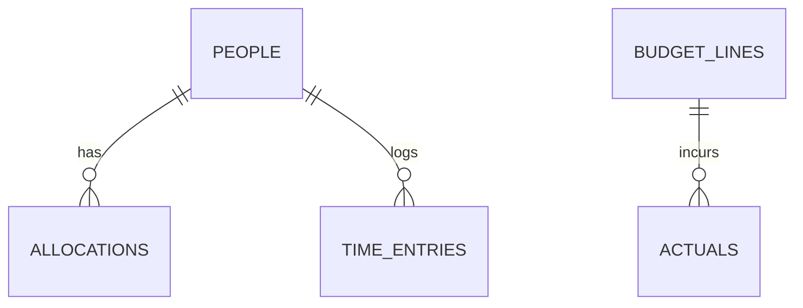
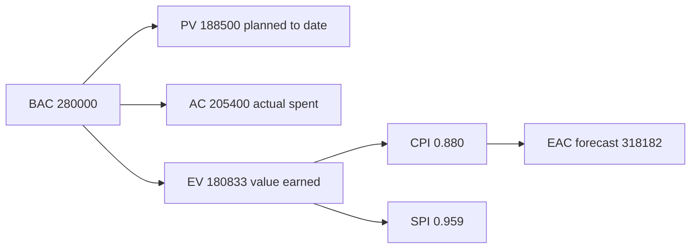

# Lecture 2 — Cost & Resourcing Modeled in SQL

> **Duration:** ~2 hours. **Outcome:** You can populate the full budget + actuals schema in PostgreSQL, write queries that compute burn, variance, and a running cumulative total by month, apply basic earned-value math (PV, EV, AC, CPI, SPI, EAC) as one query, and name three concrete, specific ways this same workflow fails in a spreadsheet.

Lecture 1 built Atlas's budget on paper: $280,000, broken into labor, tooling, vendor, and contingency. This lecture puts that exact budget into PostgreSQL and writes the queries a real PM runs weekly — not once, at kickoff, but every time someone needs the true number. By the end, "are we over budget, and by how much, and since when" is a `SELECT`, not a meeting.

## 1. Seeding the roster and the budget

You already created `people`, `budget_lines`, `actuals`, `time_entries`, and `allocations` in the [week setup](../README.md). Populate the roster and the budget plan first.


*The five tables this week's schema connects: people drive allocations and time entries, budget lines drive actuals.*

```sql
INSERT INTO people (person_id, name, role, org_unit, employment_type, hourly_rate, weekly_capacity_hours, active) VALUES
(1, 'Marcus Webb',  'Tech Lead',            'Engineering',   'employee',   145, 40, TRUE),
(2, 'Priya N.',      'Senior Engineer',      'Engineering',   'employee',   120, 40, TRUE),
(3, 'Sam O.',        'Engineer',             'Engineering',   'employee',    95, 40, TRUE),
(4, 'Dana K.',       'Engineer',             'Engineering',   'employee',    95, 40, TRUE),
(5, 'Wes T.',        'Engineer',             'Engineering',   'employee',    90, 40, TRUE),
(6, 'Yuki Tanaka',   'Frontend Contractor',  'Engineering',   'contractor', 110, 30, TRUE),
(7, 'Elena Cruz',    'Product Owner',        'Product',       'employee',   100, 40, TRUE),
(8, 'Sofia Reyes',   'Platform Team Lead',   'Platform Team', 'employee',   150, 40, TRUE),
(9, 'PM (You)',      'Project Manager',      'PM',            'employee',   110, 40, TRUE);
```

```sql
-- Atlas budget: labor and tooling and vendor planned monthly, contingency as one reserve
-- 'project' defaults to 'Atlas' but is written explicitly here since Exercise 1 adds a second project
INSERT INTO budget_lines (budget_line_id, project, category, description, planned_amount, period_start, period_end) VALUES
(1,  'Atlas', 'labor',       'Core delivery + PM/Product labor — Sep', 48000, '2025-09-01', '2025-09-30'),
(2,  'Atlas', 'labor',       'Core delivery + PM/Product labor — Oct', 58000, '2025-10-01', '2025-10-31'),
(3,  'Atlas', 'labor',       'Core delivery + PM/Product labor — Nov', 60000, '2025-11-01', '2025-11-30'),
(4,  'Atlas', 'labor',       'Core delivery + PM/Product labor — Dec', 54000, '2025-12-01', '2025-12-19'),
(5,  'Atlas', 'tooling',     'SaaS + infra — Sep',                      2000, '2025-09-01', '2025-09-30'),
(6,  'Atlas', 'tooling',     'SaaS + infra — Oct',                      2000, '2025-10-01', '2025-10-31'),
(7,  'Atlas', 'tooling',     'SaaS + infra — Nov',                      2000, '2025-11-01', '2025-11-30'),
(8,  'Atlas', 'tooling',     'SaaS + infra — Dec',                      2000, '2025-12-01', '2025-12-19'),
(9,  'Atlas', 'vendor',      'Real-time API vendor contract — Sep',     5500, '2025-09-01', '2025-09-30'),
(10, 'Atlas', 'vendor',      'Real-time API vendor contract — Oct',     5500, '2025-10-01', '2025-10-31'),
(11, 'Atlas', 'vendor',      'Real-time API vendor contract — Nov',     5500, '2025-11-01', '2025-11-30'),
(12, 'Atlas', 'vendor',      'Real-time API vendor contract — Dec',     5500, '2025-12-01', '2025-12-19'),
(13, 'Atlas', 'contingency', 'Contingency reserve (12% of base budget)', 30000, '2025-09-01', '2025-12-19');
```

Every query in this lecture filters implicitly to Atlas by only ever joining against these 13 rows — but note that in §3's and §6's queries below, a defensive `WHERE bl.project = 'Atlas'` is the honest version once a second project's budget lines exist in the same table (which they will, right after Exercise 1). Add it yourself as you go; it's omitted below only because Atlas is the only project seeded so far in this lecture.

Sanity check — should print `280000`:

```sql
SELECT SUM(planned_amount) AS bac FROM budget_lines;
```

Now the actuals for the three closed months (September through November):

```sql
INSERT INTO actuals (actual_id, budget_line_id, incurred_month, amount, description, source) VALUES
(1,  1,  '2025-09-01', 50200, 'Sep timesheets, all Atlas contributors',                              'timesheet'),
(2,  2,  '2025-10-01', 61500, 'Oct timesheets, all Atlas contributors',                               'timesheet'),
(3,  3,  '2025-11-01', 66800, 'Nov timesheets, all Atlas contributors',                                'timesheet'),
(4,  5,  '2025-09-01',  2000, 'Sep SaaS + infra subscriptions',                                        'subscription'),
(5,  6,  '2025-10-01',  2000, 'Oct SaaS + infra subscriptions',                                        'subscription'),
(6,  7,  '2025-11-01',  2100, 'Nov SaaS + infra subscriptions, added a monitoring tool mid-month',      'subscription'),
(7,  9,  '2025-09-01',  5500, 'Sep base monthly vendor support fee',                                   'invoice'),
(8,  10, '2025-10-01',  5500, 'Oct base monthly vendor support fee',                                    'invoice'),
(9,  11, '2025-11-01',  5500, 'Nov base monthly vendor support fee',                                    'invoice'),
(10, 11, '2025-11-01',  4300, 'Emergency sandbox-stability support hours (risk R-2 materializing)',     'invoice'),
(11, 13, '2025-11-01',  4300, 'Contingency drawn to cover Nov vendor overage (risk R-2)',               'expense');
```

Row 10 and row 11 are the same underlying event told twice, **on purpose**, and understanding why is the single most important modeling decision in this lecture — §5 explains it before you run a single aggregate query.

## 2. Burn — cumulative spend by category

The simplest useful query: total spend so far, per category.

```sql
SELECT
    bl.category,
    SUM(a.amount) AS actual_to_date
FROM actuals a
JOIN budget_lines bl ON bl.budget_line_id = a.budget_line_id
GROUP BY bl.category
ORDER BY actual_to_date DESC;
```

| category | actual_to_date |
|---|---:|
| labor | 178500 |
| vendor | 20800 |
| tooling | 6100 |
| contingency | 4300 |

Two things to notice. First, **`contingency` shows up here as its own row** — that's the reserve draw, not new spend (§5 explains why it isn't double-counted when you compute *total* project cost). Second, this single query already tells a story: labor is nearly 9x the next-largest category, exactly as Lecture 1 predicted, and it's the category worth watching hardest.

## 3. Variance — plan-to-date vs. actual-to-date

Burn alone doesn't tell you if you're in trouble — $178,500 of labor spend means nothing without knowing what was *planned* by this point. Variance joins the two. The plan-to-date figure sums every budget line whose period has already started as of your "as of" date — here, `DATE '2025-11-30'`, the November close:

```sql
-- Postgres and SQLite both support this form; DATE '2025-11-30' is our "as of" date
SELECT
    bl.category,
    SUM(bl.planned_amount) AS plan_to_date
FROM budget_lines bl
WHERE bl.period_start <= DATE '2025-11-30'
  AND bl.category <> 'contingency'          -- reserve isn't part of the time-phased spend plan
GROUP BY bl.category;
```

| category | plan_to_date |
|---|---:|
| labor | 166000 |
| tooling | 6000 |
| vendor | 16500 |

Now join that to actual-to-date and compute variance in one query:

```sql
WITH plan AS (
    SELECT category, SUM(planned_amount) AS plan_to_date
    FROM budget_lines
    WHERE period_start <= DATE '2025-11-30'
      AND category <> 'contingency'
    GROUP BY category
),
actual AS (
    SELECT bl.category, SUM(a.amount) AS actual_to_date
    FROM actuals a
    JOIN budget_lines bl ON bl.budget_line_id = a.budget_line_id
    WHERE bl.category <> 'contingency'
    GROUP BY bl.category
)
SELECT
    p.category,
    p.plan_to_date,
    a.actual_to_date,
    p.plan_to_date - a.actual_to_date                              AS variance,
    ROUND(100.0 * (a.actual_to_date - p.plan_to_date) / p.plan_to_date, 1) AS pct_over_plan
FROM plan p
JOIN actual a ON a.category = p.category
ORDER BY variance ASC;   -- most negative (worst overrun) first
```

| category | plan_to_date | actual_to_date | variance | pct_over_plan |
|---|---:|---:|---:|---:|
| vendor | 16500 | 20800 | -4300 | 26.1 |
| labor | 166000 | 178500 | -12500 | 7.5 |
| tooling | 6000 | 6100 | -100 | 1.7 |

Read this table the way a CFO would: vendor is the worst *percentage* overrun (26%) but the smallest *dollar* overrun; labor is a moderate percentage overrun (7.5%) but by far the largest dollar exposure ($12,500). Both facts matter and they point to different actions — vendor needs a root-cause conversation (it's one traceable event, R-2), labor needs a trend check (is 7.5% an anomaly or a pattern?), which is exactly what §4 checks next.

## 4. A running total — is the overrun getting worse?

A single "as of now" variance number hides whether you're looking at a one-time blip or a worsening trend. This is the one place this week uses a **window function** — specifically a running (cumulative) sum, computed with `SUM() OVER (ORDER BY ...)`:

```sql
SELECT
    a.incurred_month,
    bl.category,
    SUM(a.amount) AS month_actual,
    SUM(SUM(a.amount)) OVER (
        PARTITION BY bl.category
        ORDER BY a.incurred_month
    ) AS cumulative_actual
FROM actuals a
JOIN budget_lines bl ON bl.budget_line_id = a.budget_line_id
WHERE bl.category = 'labor'
GROUP BY a.incurred_month, bl.category
ORDER BY a.incurred_month;
```

| incurred_month | category | month_actual | cumulative_actual |
|---|---|---:|---:|
| 2025-09-01 | labor | 50200 | 50200 |
| 2025-10-01 | labor | 61500 | 111700 |
| 2025-11-01 | labor | 66800 | 178500 |

`SUM(SUM(a.amount)) OVER (PARTITION BY ... ORDER BY ...)` reads as: after grouping rows into one row per month (the inner `SUM`), compute a running total across those grouped rows, ordered by month, restarting for each category (the `PARTITION BY`). This is the standard SQL idiom for "cumulative total over time" and you'll reuse this exact shape constantly outside this course.

Now compare `month_actual` to that month's `planned_amount` directly (48,000 → 58,000 → 60,000 planned vs. 50,200 → 61,500 → 66,800 actual): the **gap widens every month** — $2,200 over in September, $3,500 over in October, $6,800 over in November. That's not a one-time blip; §6 gives that pattern its name (a worsening CPI) and Challenge 1 makes you forecast where it lands if it keeps going.

## 5. Why row 10 and row 11 aren't double-counted

Back to that pair of actuals rows from §1: a $4,300 emergency vendor invoice (row 10, against the `vendor` budget line) and a $4,300 contingency draw (row 11, against the `contingency` budget line) — same dollar amount, same event, two rows. This is deliberate, and getting it wrong is the single most common budgeting bug.

**The rule:** the vendor invoice is the actual cost — real money spent, on the real category it was spent in. The contingency row is a **management record of where that money came from**, not a second expense. When you compute total actual cost for forecasting (§6), you sum labor + tooling + vendor and **exclude contingency** — because contingency's dollars are already inside the vendor number. The contingency table exists to answer a different question: *"how much of our reserve is left?"* — not *"how much did we spend?"*

```sql
-- Total actual cost (AC) for the project so far — excludes contingency on purpose
SELECT SUM(a.amount) AS actual_cost
FROM actuals a
JOIN budget_lines bl ON bl.budget_line_id = a.budget_line_id
WHERE bl.category <> 'contingency';
-- 178500 + 6100 + 20800 = 205400
```

```sql
-- Contingency remaining
SELECT
    bl.planned_amount - COALESCE(SUM(a.amount), 0) AS contingency_remaining
FROM budget_lines bl
LEFT JOIN actuals a ON a.budget_line_id = bl.budget_line_id
WHERE bl.category = 'contingency'
GROUP BY bl.planned_amount;
-- 30000 - 4300 = 25700
```

If you'd summed *all four* categories including contingency for "actual cost," you'd get $209,700 — $4,300 too high, because you'd have counted the same $4,300 twice. This exact mistake is common enough in real budgeting that it's worth a permanent mental rule: **contingency actuals answer "reserve remaining," never "add this to total spend."**

## 6. Basic earned value — PV, EV, AC, CPI, SPI

Burn and variance tell you whether spend matches the *time-phased plan*. They don't tell you whether that spend actually bought proportional *progress* — a project can be exactly on budget and badly behind, or over budget and ahead. **Earned value management (EVM)** fixes that by adding one more number: how much of the planned scope is actually done, expressed in the same dollars as the budget.

Three inputs, one small CTE for the one number SQL can't compute from these tables alone (scope delivered comes from your Week 8-style delivery tracking — here, hard-coded as Atlas's known state: 155 of 240 total planned story points delivered as of the November close):

```sql
WITH scope AS (
    SELECT 155.0 AS points_delivered, 240.0 AS points_total
),
bac AS (
    SELECT SUM(planned_amount) AS bac FROM budget_lines
),
pv AS (
    SELECT SUM(planned_amount) AS pv
    FROM budget_lines
    WHERE period_start <= DATE '2025-11-30' AND category <> 'contingency'
),
ac AS (
    SELECT SUM(a.amount) AS ac
    FROM actuals a
    JOIN budget_lines bl ON bl.budget_line_id = a.budget_line_id
    WHERE bl.category <> 'contingency'
)
SELECT
    bac.bac                                                     AS bac,
    pv.pv                                                       AS pv,
    ac.ac                                                       AS ac,
    ROUND(bac.bac * scope.points_delivered / scope.points_total, 0) AS ev,
    ROUND((bac.bac * scope.points_delivered / scope.points_total) / ac.ac, 3) AS cpi,
    ROUND((bac.bac * scope.points_delivered / scope.points_total) / pv.pv, 3) AS spi
FROM scope, bac, pv, ac;
```

| bac | pv | ac | ev | cpi | spi |
|---:|---:|---:|---:|---:|---:|
| 280000 | 188500 | 205400 | 180833 | 0.880 | 0.959 |

Reading the four core EVM terms in plain language:

- **PV (planned value)** — what you *said* you'd have spent by now, at this exact point in the schedule: $188,500.
- **AC (actual cost)** — what you've *actually* spent by now: $205,400.
- **EV (earned value)** — what the work actually completed so far is *worth*, in budget dollars, regardless of what it cost to get there: 155/240 of the total scope × the $280,000 BAC = $180,833.
- **CPI (cost performance index) = EV / AC = 0.880.** Below 1.0 means every dollar spent bought less than a dollar of planned value — Atlas is getting about 88 cents of value per dollar spent. Above 1.0 would mean the opposite.
- **SPI (schedule performance index) = EV / PV = 0.959.** Below 1.0 means less value has been earned than the schedule called for by this point — Atlas is running a little behind, not a lot.

Both numbers under 1.0 is the real story: Atlas is **modestly behind schedule and meaningfully over cost per unit of work delivered** — not "the team is failing," but a specific, quantified signal that costs more than expected per point of real progress, worth investigating in the labor trend from §4 and forecasting properly in §7 and Challenge 1.

## 7. A first forecast — EAC by the CPI method

If CPI has been holding steady, the standard forecast for total project cost at completion (**EAC — estimate at completion**) is:

```
EAC = BAC / CPI
```

```sql
WITH cpi_calc AS (
    SELECT 0.880 AS cpi   -- from §6
)
SELECT
    280000                        AS bac,
    ROUND(280000 / cpi_calc.cpi)  AS eac,
    ROUND(280000 / cpi_calc.cpi) - 205400 AS etc,          -- estimate to complete
    280000 - ROUND(280000 / cpi_calc.cpi) AS vac            -- variance at completion
FROM cpi_calc;
```

| bac | eac | etc | vac |
|---:|---:|---:|---:|
| 280000 | 318182 | 112782 | -38182 |

Read in a sentence: **if Atlas keeps spending at its current cost-efficiency, the project will finish around $318,000 — about $38,000 (13.6%) over the original $280,000 budget.** This is a real forecast, built from real historical performance, not a guess — and it's meaningfully more pessimistic than a naive "we're 3 of 4 months in, so we're 75% done, budget's basically fine" read would suggest. Challenge 1 has you compute a second, simpler forecast method and reconcile why they disagree.


*How PV, AC, and EV feed CPI and SPI, and how CPI drives the EAC forecast.*

## 8. Why this lives in a database, not a spreadsheet — three specific failures

This isn't a style preference. Here are three concrete ways this exact workflow breaks in a spreadsheet, each one something this lecture's SQL just did correctly without you having to think about it:

**Failure 1 — no real edit history.** Two people update the Atlas budget tab the same afternoon — you record the emergency vendor invoice, your manager reconciles September's timesheets. Whoever saves last silently overwrites the other's change, with no record either edit happened. In SQL, `INSERT INTO actuals` is **append-only** — every row you added in §1 still exists, individually, with its own `source` and `description`, forever. Nobody's edit erases anybody else's; you can add `inserted_at`/`inserted_by` columns for a full audit trail with zero extra effort, something a spreadsheet needs a heavyweight add-on to fake.

**Failure 2 — no real referential integrity.** In a spreadsheet, a budget-tracking formula (`SUMIF`/`VLOOKUP` against a "category" column) silently returns `0` or `#N/A` if someone types `"Vender"` instead of `"vendor"` in one row — no error, no warning, just a quietly wrong total that looks fine until someone notices the numbers don't add up weeks later. In SQL, `actuals.budget_line_id INTEGER NOT NULL REFERENCES budget_lines(budget_line_id)` makes a bad reference **impossible to insert** — the database refuses the row at write time, not months later during an audit.

**Failure 3 — cross-cutting questions are fragile, not composable.** "Show me every category where we're over plan-to-date by more than 5%" is the six-line `WITH` query from §3 — reusable, and trivially adjustable (`HAVING pct_over_plan > 5` added to §3's query, one line). The spreadsheet equivalent is a `SUMPRODUCT` or nested `VLOOKUP` array formula spanning multiple tabs, that breaks the moment someone reorders a column, renames a tab, or inserts a row above the range it references — and Lecture 3's over-allocation question ("who's over 100% across every project, every month") is *exactly* this same failure mode, one level worse, because it spans people **and** projects **and** time simultaneously. A spreadsheet CFO trusts this quarter's over-plan report. A spreadsheet CFO should not trust that the same formula still works after next quarter's tab gets renamed.

## 9. Check yourself

- Why is labor's 7.5% overrun more concerning than vendor's 26% overrun, even though the percentage is smaller? What single number resolves the tension?
- Walk through, in your own words, why the $4,300 contingency draw isn't added a second time when computing total actual cost.
- What do PV, EV, and AC each answer, and why does none of the three alone tell you the full story?
- CPI = 0.88 and SPI = 0.96. Which one says "over budget" and which says "behind schedule"? Can a project have CPI > 1 and SPI < 1 at the same time — what would that combination mean?
- What does `SUM(SUM(a.amount)) OVER (PARTITION BY ... ORDER BY ...)` compute, and why is a running total more useful than a single as-of-today number for spotting a trend?
- Name the three spreadsheet failure modes from §8 in one phrase each, without looking back.

If those are automatic, Lecture 3 moves from cost to people — modeling capacity and allocation across a whole portfolio with pandas, and finding exactly who's over-committed before it becomes another missed dependency.

## Further reading

- **PostgreSQL — Window Functions:** <https://www.postgresql.org/docs/current/tutorial-window.html>
- **PMI — "Earned Value Management: A Global and Cross-Industry Perspective":** <https://www.pmi.org/learning/library/earned-value-management-systems-industry-analysis-6797>
- **PostgreSQL — `WITH` Queries (Common Table Expressions):** <https://www.postgresql.org/docs/current/queries-with.html>
