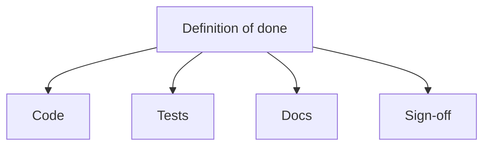
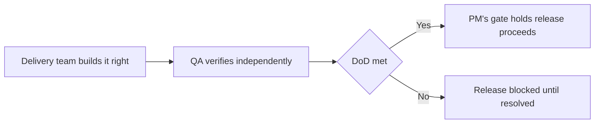

# Lecture 1 — Definition of Done & Quality Gates

> **Duration:** ~2 hours. **Outcome:** You can write a definition of done specific enough to actually block a release, tell a real quality gate apart from ceremony, and correctly place quality responsibility between the PM, the delivery team, and QA. You'll load Atlas's real GA definition of done into `atlas_pm` and query it for blockers.

Sprint 8 just ended. In Northlight's #atlas-eng Slack channel, Marcus Diallo posted: "Team Workspaces is basically done — just cleaning up a few things." Six people read that message. Three of them assumed "cleaning up" meant a few hours; two assumed a day; Yuki Tanaka, the QA Lead, assumed nothing at all, because "basically done" isn't a claim she can test. That one sentence is the entire reason this lecture exists. **"Done" has to mean the same specific thing to everyone reading it, or it means nothing.**

## 1. What a definition of done actually is

You met acceptance criteria in Week 3: conditions specific to **one story** ("a user can invite a teammate by email and see a pending-invite badge"). A **definition of done (DoD)** is different in scope and different in job. It's a fixed checklist that applies to **every** piece of work of a given kind — every story, every release, every sprint, depending on which DoD you're writing — regardless of what that piece of work is about.

| | Acceptance criteria | Definition of done |
|---|---|---|
| Scope | One specific story | Every story (or every release) of a kind |
| Written by | Whoever writes the story (PO, often with the team) | The team, once, and revisited rarely |
| Answers | "Does this story do the right thing?" | "Is this piece of work actually finished, regardless of what it does?" |
| Example | "Invite badge shows 'Pending' until accepted" | "Code is peer-reviewed and merged to main" |

A story can pass every one of its acceptance criteria and still not be *done* — if nobody wrote a test for it, if the API docs weren't updated, if it's sitting in a branch nobody reviewed. The DoD is the floor underneath acceptance criteria: acceptance criteria say *this specific thing is correct*; the DoD says *and it's actually finished being built, in every dimension that matters, not just the functional one*.

## 2. A DoD spans four categories — and each one is where things quietly slip

A weak DoD has one line: "code works." A real one spans (at minimum) four categories, because each one is where "basically done" quietly hides a gap:


*A real DoD spans four categories, each a place done quietly slips.*

### Code

- Peer-reviewed by at least one other engineer, with review comments resolved (not just acknowledged).
- Merged to the main branch — not sitting in a long-lived feature branch nobody else can see.
- Behind a feature flag if it touches a live surface, so it can ship dark and be enabled independently of the deploy.
- No new linter or type-checker warnings introduced.

### Tests

- Unit tests covering new logic, with a stated minimum (Atlas's team agreed on 80% line coverage for new code, not the whole codebase — a real number a reviewer can check, not "well tested").
- Integration tests green against a staging environment that resembles production closely enough to trust.
- For anything performance-sensitive — Atlas's webhook signature-verification path, hit on every real-time event — a load test at expected peak volume, not just a happy-path smoke test.

### Docs

- API or interface docs updated if the public surface changed.
- A runbook entry if this is new operational surface (Omar Farouk, the SRE, needs to know how to operate what he didn't build).
- Customer-facing release notes drafted, even in rough form — someone in Product or Support turns rough notes into a polished changelog, but engineering owns getting the facts right first.

### Sign-off

- Product Owner sign-off that the shipped behavior matches the accepted stories (Elena Cruz, for Atlas).
- QA sign-off that the test plan executed and nothing new broke (Yuki Tanaka).
- Any dependency-owning team's sign-off, if the work touches their surface — Sofia Reyes's Platform team owns the webhook infrastructure Atlas's signature verification depends on, so their sign-off is required, not optional, per Week 6's dependency map.
- **Security review**, specifically, because Atlas's Week 1 charter named it as an explicit constraint: anything touching customer webhooks or secrets needs a security pass before GA. A charter constraint from nine weeks ago is not decoration — it's still binding today.

## 3. Writing Atlas's actual GA definition of done

Here's the real DoD the Atlas team wrote for Team Workspaces' GA release, loaded straight into `dod_criteria`:

```sql
INSERT INTO dod_criteria (dod_id, release_name, category, criterion, required, owner, status, evidence, checked_at) VALUES
(1, 'atlas-ga-2026-04-29', 'code',     'All GA-scoped PRs peer-reviewed and merged to main',                          TRUE,  'Marcus Diallo', 'met',     'PR #412-#438 all merged, 2 reviewers min', '2026-04-24'),
(2, 'atlas-ga-2026-04-29', 'code',     'Team Workspaces behind a feature flag with staged rollout support',            TRUE,  'Marcus Diallo', 'met',     'flag: team_workspaces_ga, 10/50/100 stages configured', '2026-04-23'),
(3, 'atlas-ga-2026-04-29', 'code',     'Zero new linter/type errors on the release branch',                             TRUE,  'Wei Zhang',     'met',     'CI run #2291 clean', '2026-04-24'),
(4, 'atlas-ga-2026-04-29', 'tests',    'New code at or above 80% unit line coverage',                                   TRUE,  'Nadia Petrova', 'met',     'coverage report: 84%', '2026-04-24'),
(5, 'atlas-ga-2026-04-29', 'tests',    'Full integration suite green on staging',                                       TRUE,  'Yuki Tanaka',   'met',     'staging run #118, 0 failures', '2026-04-24'),
(6, 'atlas-ga-2026-04-29', 'tests',    'Load test: signature verification path at 3x expected peak volume',              TRUE,  'Chris Okoye',   'not_met', 'test run #1 failed at 2.1x — see ATLAS-131', '2026-04-24'),
(7, 'atlas-ga-2026-04-29', 'docs',     'API docs updated for the sharing + webhook signature endpoints',                 TRUE,  'Marcus Diallo', 'met',     'docs PR #61 merged', '2026-04-22'),
(8, 'atlas-ga-2026-04-29', 'docs',     'Runbook entry for on-call: signature failures, webhook timeouts, flag rollback',  TRUE,  'Omar Farouk',   'met',     'runbook.md §Team Workspaces added', '2026-04-25'),
(9, 'atlas-ga-2026-04-29', 'docs',     'Customer-facing release notes drafted',                                          TRUE,  'Fatima Noor',   'met',     'notes drafted, awaiting Jamie Okafor review', '2026-04-25'),
(10,'atlas-ga-2026-04-29', 'sign-off', 'Product Owner sign-off: shipped behavior matches accepted stories',               TRUE,  'Elena Cruz',    'met',     'reviewed against Sprint 5-8 story acceptance criteria', '2026-04-25'),
(11,'atlas-ga-2026-04-29', 'sign-off', 'QA sign-off: test plan executed, no new severity-1/2 regressions',                TRUE,  'Yuki Tanaka',   'not_met', '2 open defects, see ATLAS-131 / ATLAS-133', '2026-04-25'),
(12,'atlas-ga-2026-04-29', 'sign-off', 'Platform Team sign-off: webhook infrastructure dependency stable under GA load',  TRUE,  'Sofia Reyes',   'not_met', 'sandbox flakiness recurring under load, see ATLAS-131', '2026-04-25'),
(13,'atlas-ga-2026-04-29', 'sign-off', 'Security review passed (Week 1 charter constraint — customer webhooks + secrets)', TRUE,  'Marcus Diallo', 'met',     'security review #SR-2026-14 passed 2026-04-21', '2026-04-21');
```

Notice what this DoD is **not**: it isn't "everything the team can think of." It's 13 lines, each one a fact a specific named person can check true or false, each one required unless explicitly marked otherwise. Three of the thirteen are `not_met` as of April 25 — and that's the entire point of writing a DoD *before* the release date instead of discovering the gaps in a hallway conversation on launch morning.

Query the current blockers directly:

```sql
SELECT category, criterion, owner, evidence
FROM dod_criteria
WHERE release_name = 'atlas-ga-2026-04-29' AND required = TRUE AND status = 'not_met'
ORDER BY category;
```

Three rows come back — and notice they're not independent. The load test failed **because** the signature-verification path can't hold up under sustained load, which is **the same reason** QA can't sign off and Platform can't sign off. One root cause, three checklist lines. That's a pattern worth learning to spot: when several DoD lines fail together, look for whether they share a cause before treating them as three separate problems to solve in parallel.

## 4. Quality gates that add signal, not ceremony

A **quality gate** is a checkpoint where work cannot proceed until specific criteria are met — the DoD *enforced*, not just written down. Gates are valuable exactly to the extent that failing one tells you something true and useful. They become ceremony the moment people start treating them as a box to tick rather than a question to answer honestly.

**Signs a gate adds real signal:**

- It has failed at least once, for a real reason, in the team's recent history. A gate that has *never* failed is either genuinely unnecessary risk-wise, or nobody's being honest when they check it.
- The person checking it has the technical standing and the incentive to say no. Yuki Tanaka reports to Engineering leadership, not to Marcus — she can say "not met" about Marcus's own code without it costing her anything.
- Failing it changes what happens next in a concrete way (blocks a merge, blocks a deploy, blocks a GA date) — not just "gets logged somewhere."

**Signs a gate has become ceremony:**

- It's checked by the same person who did the work, with no independent perspective.
- Nobody can remember the last time it caught anything.
- It gets waived so routinely that "waived" and "met" have become functionally the same status.
- It measures an input ("was a test written") instead of an outcome ("does the test actually assert something meaningful") — Atlas's 80% coverage line is a real risk here: a team under date pressure can hit 84% coverage with tests that call the code and assert nothing. A coverage percentage is a necessary check, not a sufficient one; Yuki's actual sign-off (reading real test assertions, not just the coverage number) is what makes line 4 a real gate rather than a number to game.

The fix for a ceremony gate is never "add more gates." It's either **cut the dead gate** or **give the existing one real teeth** — an empowered, independent checker and a real consequence for failing.

## 5. Where quality responsibility actually sits

A common failure mode: the PM assumes QA "owns quality," so the PM doesn't think about it; QA assumes the team writes correct code, so QA only checks the obvious paths; the team assumes QA will catch what's wrong, so nobody reviews their own work critically. Quality falls through three sets of hands that each assumed someone else was holding it.

The correct split, and it's a split, not a handoff:

| Role | Owns |
|---|---|
| **Delivery team (engineers)** | Building it right the first time — code review, unit tests, not shipping known-broken code "for QA to catch." Quality starts here, not at a QA gate downstream. |
| **QA (Yuki Tanaka)** | Independent verification — integration testing, regression testing, signing off (or not) that the DoD's test and defect criteria are genuinely met. QA is a check on the team's own assessment, not a replacement for the team doing careful work. |
| **PM** | Owns that the *gate itself* runs — that the DoD exists, is checked before it matters (not discovered at the last minute), and that "not met" actually stops the release rather than getting quietly overridden. The PM does not personally judge code quality; the PM makes sure the people who can are asked, on time, and listened to. |


*Quality is a three-way split, not a handoff to QA at the end.*

The PM's specific job in this triangle is protecting the **gate**, not personally deciding whether the code is good. When Marcus says "basically done" in Slack, the PM's job isn't to independently assess the signature-verification code — it's to say "let's check that against the DoD with Yuki and Sofia before we say it's done," and to make sure that check actually happens with enough runway to act on what it finds.

## 6. Check yourself

- What's the difference in scope between acceptance criteria and a definition of done?
- Name the four categories a DoD should span, and one thing that quietly slips in each if it's missing.
- Why are lines 6, 11, and 12 of Atlas's DoD all `not_met` for the same underlying reason? What does that pattern suggest about how to fix it?
- Give one sign a quality gate has become ceremony, and the two ways to fix a ceremony gate.
- Whose job is it to decide the code is good enough? Whose job is it to make sure that question actually gets asked before the release ships?
- Why does "Marcus reports his own team's DoD status as met" carry less weight than "Yuki independently verifies it"?

If those are automatic, Lecture 2 builds the layer on top of the DoD — the release-level readiness checklist and the actual go/no-go decision.

## Further reading

- **Scrum.org — "Definition of Done":** <https://www.scrum.org/resources/what-definition-done>
- **Atlassian — "Definition of Done":** <https://www.atlassian.com/agile/project-management/definition-of-done>
- **Google SRE Book — "Service Level Objectives" (on gates tied to real signal):** <https://sre.google/sre-book/service-level-objectives/>
