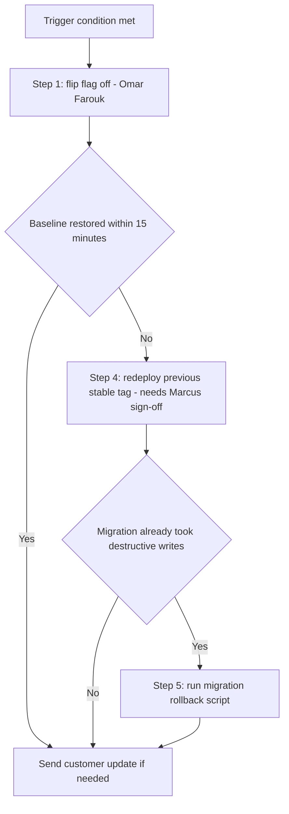
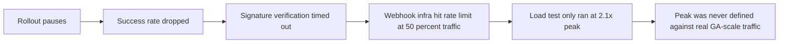

# Lecture 3 — Rollback Plans & Post-Release Review

> **Duration:** ~2 hours. **Outcome:** You can design a rollback plan before a release ever ships, with named triggers, concrete steps, a clear owner, and a verification step — and you can run a blameless post-release review that reconstructs a real timeline and turns findings into owned backlog action items instead of blame. You'll load Atlas's real rollback runbook and its actual GA release timeline.

Here's the sentence that separates teams that survive a bad release from teams that don't: **the rollback plan is written before the release, not invented during the incident.** By the time something is actively breaking in production, at 2am, with a customer on the phone, is the worst possible moment to be designing a plan for the first time. This lecture is about doing that design work in advance, and about what happens — win or lose — once the release is over.

## 1. Designing the backout plan before you need it

A rollback plan answers three questions, in advance, in writing:

1. **When do we pull the trigger?** — specific, observable **trigger conditions**, not "if it feels bad."
2. **What exactly do we do?** — an ordered sequence of concrete steps, each with an owner and a time estimate, specific enough that someone who didn't build the feature could follow it.
3. **How do we know it worked?** — a **verification** step after each rollback action, because a rollback that silently fails halfway is worse than no rollback at all.

**Trigger conditions must be observable, not felt.** "Ship it and watch closely" is not a trigger condition — it's a plan to notice a problem *after* it's already hurting customers, with no pre-agreed threshold for when watching turns into acting. Compare:

- Weak: "Roll back if things look bad."
- Strong: "Roll back if the signature-verification success rate drops below 95% for more than 5 consecutive minutes, **or** if any customer reports data loss, **or** if the error rate on the Team Workspaces endpoints exceeds 3× the pre-release baseline."

Specific thresholds do two things a feeling can't: they let *anyone* on the team recognize the trigger, not just the person who built the feature, and they remove the awkward, ego-laden question of "am I overreacting?" from the moment it matters least to be arguing about it.

**A rollback is fastest when it's decoupled from a deploy.** This is the entire reason Lecture 2's feature-flag rollout matters here, not just for staging exposure: flipping `team_workspaces_ga` off is a config change measured in seconds. Reverting a full deploy — rebuilding, redeploying, waiting for the pipeline — is measured in minutes to tens of minutes. Design for the fast lever whenever the risk profile allows it.

**Database changes need their own rollback story, separate from code.** A migration that only *adds* columns/tables ("expand") is trivially safe to roll code back against — the old code simply never uses the new column, and no data is lost. A migration that *removes or renames* something ("contract") is not safely reversible once new data has been written into the new shape. The discipline: **expand now, contract later** — ship the expand step, run the feature for a while, and only run the contract step in a later, separate release once you're confident you'll never need to roll back. Atlas's Week 10 migration (checklist item 5, Lecture 2) is additive-only for exactly this reason.

## 2. Atlas's real rollback plan

```sql
INSERT INTO rollback_steps (step_id, release_name, step_no, trigger_condition, action, owner, est_minutes, verification) VALUES
(1, 'atlas-ga-2026-04-29', 1, 'Signature-verification success rate < 95% for 5+ consecutive minutes, OR any customer-reported data loss, OR error rate > 3x baseline on Team Workspaces endpoints', 'Flip feature flag team_workspaces_ga to OFF for all cohorts', 'Omar Farouk', 2,  'Confirm flag dashboard shows 0% exposure; error rate returns to baseline within 5 minutes'),
(2, 'atlas-ga-2026-04-29', 2, 'Automatic, immediately after step 1',                                                  'Post rollback notice to #atlas-eng and #northlight-all with timestamp and trigger reason', 'Omar Farouk', 1,  'Message posted, on-call escalation acknowledged by Marcus Diallo'),
(3, 'atlas-ga-2026-04-29', 3, 'Automatic, immediately after step 1',                                                  'Page Marcus Diallo (Tech Lead) and Priya Chen (sponsor) via on-call rotation', 'Omar Farouk', 2,  'Both acknowledge page within 10 minutes per on-call SLA'),
(4, 'atlas-ga-2026-04-29', 4, 'If flag rollback alone does not restore baseline within 15 minutes',                    'Redeploy the previous stable release tag (v2026.04.10-sprint7) via the standard pipeline', 'Chris Okoye', 8,  'Deploy pipeline reports success; smoke test suite green against production'),
(5, 'atlas-ga-2026-04-29', 5, 'Only if step 4 was required AND the migration has already taken destructive writes',    'Run migration rollback script (tested 2026-04-25, see release_checklist item 6)', 'Wei Zhang',  5,  'Row counts and schema match pre-migration snapshot; no orphaned foreign keys'),
(6, 'atlas-ga-2026-04-29', 6, 'After baseline is confirmed restored (any of the above)',                               'Draft and send customer-facing status update if any customer-visible impact occurred', 'Jamie Okafor', 15, 'Update reviewed by Priya Chen before sending; sent within 1 hour of trigger');
```

Read this table as a **decision tree**, not a fixed sequence — step 1 (flag off) is almost always sufficient by itself, because it's fast and reversible with zero data risk. Steps 4–5 only fire if step 1 doesn't resolve things, which is exactly why they're slower and higher-stakes: you reach for the expensive lever only after the cheap one has been tried and measured.


*Atlas's rollback plan as a decision tree: reach for the expensive lever only after the cheap one fails.*

**Who has the authority to pull the trigger?** This has to be decided in advance, too — not improvised in the moment. At Atlas, **Omar Farouk, as on-call SRE, can execute step 1 (the flag flip) unilaterally** the instant a trigger condition is objectively met — no meeting, no permission slip, because step 1 is cheap, fast, and fully reversible. **Steps 4 and beyond require Marcus Diallo's sign-off**, because they carry real cost (deploy risk, migration risk) that justifies a second, informed opinion before pulling them. Writing this down in advance is what prevents the two worst failure modes: someone waiting for permission that's slow to arrive while damage compounds, or someone escalating a decision that didn't need to be escalated.

## 3. Running the release

On release day, the plan from Lecture 2 executes: the rollout starts at the flag's first stage (10%), monitored against the thresholds from §1, with a named owner (Omar Farouk) watching the dashboard in real time and a named decision-maker (Marcus Diallo) reachable to authorize wider stages or a rollback.

Every meaningful event gets logged as it happens — not reconstructed from memory afterward:

```sql
INSERT INTO release_events (event_id, release_name, event_time, event_type, description, actor) VALUES
(1, 'atlas-ga-2026-04-29', '2026-04-29 09:00:00', 'deploy',        'Feature flag team_workspaces_ga enabled at 10% cohort', 'Omar Farouk'),
(2, 'atlas-ga-2026-04-29', '2026-04-29 09:15:00', 'investigation', 'Signature-verification success rate steady at 99.4%, within threshold', 'Omar Farouk'),
(3, 'atlas-ga-2026-04-29', '2026-04-29 11:00:00', 'deploy',        'Rollout widened to 50% cohort per go/no-go conditional-go terms', 'Marcus Diallo'),
(4, 'atlas-ga-2026-04-29', '2026-04-29 13:30:00', 'investigation', 'Success rate holding at 99.1% over 4.5 hours; no trigger conditions met', 'Omar Farouk'),
(5, 'atlas-ga-2026-04-29', '2026-04-29 15:00:00', 'deploy',        'Rollout widened to 100%; GA complete', 'Marcus Diallo'),
(6, 'atlas-ga-2026-04-29', '2026-04-29 15:05:00', 'resolved',      'Release notes published; #northlight-all announcement posted', 'Priya Chen');
```

This log **is** the raw material for §4's post-release review, whether the release goes cleanly (as above) or not. Writing it down in real time, while memory is fresh and honest, is categorically more reliable than reconstructing "what happened" from Slack scrollback three days later once everyone's story has quietly smoothed itself into something a little more flattering.

## 4. The blameless post-release review

A **post-release review** (or postmortem) happens after every release with any real deviation from plan — not only failures. Its purpose is narrow and specific: **understand what actually happened, well enough to change something, without spending the meeting deciding who's at fault.**

**Blameless is a discipline, not a mood.** It means the review assumes every person made a reasonable decision given what they knew and were able to see *at that moment* — and the review's job is to find out what made that reasonable-seeming decision produce a bad outcome, not to find the person who "should have known better." This isn't softness; it's the only version of the process that gets honest information. A team that punishes the person who reports the mistake trains everyone to stop reporting mistakes, which is strictly worse for the next release.

**The structure:**

1. **Reconstruct the timeline** from the actual `release_events` log — facts, timestamps, no interpretation yet.
2. **Ask "why" repeatedly** (the "5 whys" technique) until you reach a systemic cause, not a person. Example: *Why did the rollout pause?* → success rate dropped. *Why did it drop?* → signature verification started timing out. *Why?* → the Platform team's webhook infra hit a rate limit under sustained 50% traffic. *Why wasn't that caught before GA?* → the load test only ran at 2.1x peak, and the real failure only appears past 2.5x. *Why was 2.1x accepted as sufficient?* → no one had explicitly defined "peak" against real GA-scale traffic, only against Sprint 7's smaller beta cohort. That last "why" is a real, fixable, systemic finding — a definition gap in how the team scoped its own load test — and it names no individual.


*The 5 whys chain walks from the symptom down to the real systemic finding.*
3. **Separate contributing factors from the root cause.** Rarely is there exactly one cause; usually several conditions had to align. Name all of them.
4. **Write specific, owned, dated action items** — never "be more careful next time." Each finding becomes a backlog item with a name and a due date, logged where the rest of the team's work lives (Week 3's backlog, Week 8's issue tracker), not left in a document nobody revisits.

```sql
INSERT INTO post_release_actions (action_id, release_name, action_item, owner, due_date, status) VALUES
(1, 'atlas-ga-2026-04-29', 'Redefine "peak load" for future load tests using real GA-scale traffic data, not beta-cohort estimates', 'Yuki Tanaka',   '2026-05-08', 'open'),
(2, 'atlas-ga-2026-04-29', 'Work with Platform team to raise or make configurable the webhook rate limit ahead of future high-traffic launches', 'Sofia Reyes', '2026-05-15', 'open'),
(3, 'atlas-ga-2026-04-29', 'Add an automated alert when load-test traffic multiplier falls below the release-checklist target, so gaps surface before GA week', 'Chris Okoye', '2026-05-08', 'open');
```

Note these are hypothetical follow-ups written as if the rollout *had* hit friction at the 50% stage — good practice for reviewing even a clean release: ask "what almost went wrong, and what would we change even though nothing broke?" A postmortem run only after failures teaches a team to only reflect when it's painful; the strongest teams review clean releases too, briefly, for exactly this reason.

## 5. Turning defects into backlog items — closing the loop

A post-release review that produces action items nobody tracks is theater with better vocabulary than a bad quality gate. The close-the-loop discipline:

- Every action item gets a **real owner** (a person, never a team name) and a **real due date**.
- Action items land in the **same backlog** the team already grooms and prioritizes (Week 3), not a separate "postmortem doc" graveyard.
- At the next sprint planning (Week 4), open post-release actions get **triaged like any other backlog item** — sized, prioritized against everything else, not silently deprioritized forever because the fire is out.
- Someone (usually the PM) tracks which action items are actually closing, and says so out loud if a pattern of postmortem findings never gets acted on — that pattern is itself worth escalating.

## 6. Check yourself

- Why must a rollback trigger condition be observable rather than felt? Give an example of each.
- Why does decoupling a feature flag from a deploy make rollback faster, and why does that speed matter?
- What's the "expand, contract" pattern for database migrations, and why does it make rollback safer?
- In Atlas's plan, why can Omar Farouk pull the trigger on step 1 alone, but not on step 4?
- What does "blameless" actually mean in a post-release review — what does it assume about the people involved, and what does it *not* excuse?
- Why is "be more careful next time" not an acceptable post-release action item? Rewrite it as one that would be.
- Why should a team run a (brief) post-release review even after a release that went cleanly?

Take the [quiz](../quiz.md) once these are automatic, then work the exercises — you'll write and load a real DoD, checklist, and rollback plan for a release of your own choosing.

## Further reading

- **Google SRE Book — "Postmortem Culture: Learning from Failure":** <https://sre.google/sre-book/postmortem-culture/>
- **Etsy — "Blameless PostMortems and a Just Culture":** <https://www.etsy.com/codeascraft/blameless-postmortems/>
- **Atlassian — "Incident postmortem":** <https://www.atlassian.com/incident-management/postmortem>
- **Martin Fowler — "Evolutionary Database Design" (the expand/contract pattern):** <https://martinfowler.com/articles/evodb.html>
