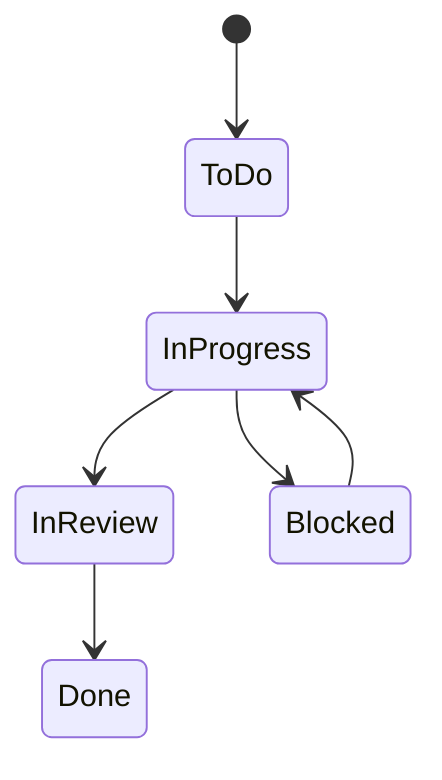

# Lecture 2 — Jira, Workflows & JQL

> **Duration:** ~2 hours. **Outcome:** You can read and configure a Jira board's workflow, write JQL queries that filter by status/priority/assignee/reporter/sprint/type, export the results cleanly, and translate every Jira concept you meet onto its GitHub Projects equivalent.

Sofia Reyes's Platform team has run on Jira since before Northlight had a GitHub org. Marcus doesn't need to become a Jira administrator this week — he needs to be **fluent enough to read PLAT's backlog himself** instead of pinging Sofia every time Atlas's SLA dashboard work needs a status check, and later this week, to help plan PLAT's migration off it. This lecture teaches Jira the way a visiting engineer learns a new codebase: enough of the map to navigate confidently, not the whole system.

## 1. The Jira object model

Jira's nouns map fairly directly onto Week 1–8 vocabulary, with different names:

| Jira term | What it is | Rough GitHub equivalent |
|---|---|---|
| **Project** | A named container of issues, with its own key prefix (`PLAT`) | A repository, loosely |
| **Issue** | One unit of work — the row you triage | Issue |
| **Issue type** | Story / Bug / Task / **Epic** / Sub-task | Issue, plus labels for type |
| **Epic** | A large body of work containing many Stories | A tracking issue with sub-issues/linked issues |
| **Board** | A visual view (Scrum or Kanban) over a project's issues | A Projects v2 view (Board layout) |
| **Workflow** | The set of statuses and the legal transitions between them | The Status single-select field's options |
| **Sprint** | A dated iteration, Scrum boards only | The Iteration field |
| **Story points** | A numeric estimate field | The `Size` field (if numeric) |

The one Jira concept with no clean GitHub Projects equivalent is the **Epic**: a first-class issue type that Stories link to via a parent field, rendered as its own swimlane or panel. GitHub's closest analog — sub-issues (issues nested under a parent issue, GA since 2024) — is structurally similar but is a repo-level relationship, not a project-level one, and it's newer and less universally adopted. That gap is one of the concrete things Challenge 1 asks you to resolve when you design PLAT's migration.

Every Jira issue key is `{PROJECT_KEY}-{NUMBER}` — `PLAT-505` is the 505th issue ever created in the `PLAT` project (numbers never reuse, even across deleted issues, same principle as GitHub's issue numbers never reusing within a repo).

## 2. Scrum boards vs. Kanban boards

Jira ships two board types, and picking the right one is a Week 2 decision (Agile, Scrum & Kanban) wearing Jira's clothes:

- **Scrum board** — organized around **sprints**. You plan a sprint (drag issues from the backlog into it), start it (locks the scope, starts the burndown), and complete it (unfinished issues roll to the next sprint or back to the backlog). PLAT runs Scrum, in two-week sprints (`PLAT Sprint 14`, `PLAT Sprint 15` in this week's seed) — deliberately timed to align with Atlas's own two-week cadence, which is *why* Sofia's Sprint 15 dates (2026-04-13 to 2026-04-24) line up with Atlas's Sprint 8.
- **Kanban board** — no sprints, a continuous flow of columns with (usually) WIP limits per column, same spirit as Week 8's flow metrics. No "start/complete sprint" ceremony — work just flows.

Both board types sit on top of the same underlying issue data; the board type changes what ceremonies and fields are meaningful (a Kanban board has no `sprint` field to query), not what an issue *is*.

## 3. Workflows — statuses and legal transitions

A Jira **workflow** is a directed graph: a set of **statuses** (To Do, In Progress, In Review, Blocked, Done — PLAT's, matching this week's `jira_issues.status` values) and a set of **transitions** — the specific status-to-status moves a workflow *allows*. Unlike GitHub Projects' Status field (any option can go to any option, nothing stops a card from jumping Todo → Done), a Jira workflow can **forbid** illegal moves: you might configure PLAT's workflow so an issue can't go straight from `To Do` to `Done` — it must pass through `In Progress` and `In Review` first, enforced by Jira itself, not by team discipline.

This is Jira's genuinely bigger idea over GitHub Projects' simpler single-select: **workflow as governance**, not just as a label. It's also the thing that makes migrating a mature Jira project's workflow into GitHub Projects lossy — GitHub has no native "forbid this transition" concept, only "list of options." Challenge 1 makes you decide what to do with that gap: encode it in a GitHub Action that enforces the same rule, or accept the loss and rely on team discipline instead. Both are legitimate answers, argued differently.


*PLAT's Jira workflow as a directed graph — only these transitions are legal; a direct To Do to Done jump is forbidden by the workflow itself.*

**Transitions** can carry side effects — a **post-function** — configured by a Jira admin: moving to `Done` might auto-set the `resolved` date (exactly why `jira_issues.resolved` is populated only for rows where `status = 'Done'` in this week's seed — it's not a coincidence, it's the workflow doing its job), or a `Blocked` transition might require a mandatory comment explaining why. Sofia's team requires a comment on every `Blocked` transition — which is how PLAT-509's block reason ("test flakes in shared sandbox") ends up documented and query-able, not lost in a Slack thread.

## 4. JQL — the `WHERE` clause of Jira

**JQL (Jira Query Language)** is Jira's structured search — type it into the search bar or a board's filter, and it behaves exactly like a `WHERE` clause with Jira-specific field names and operators. If you're fluent in SQL's `WHERE` (Week 1, and every week since), JQL is mostly vocabulary, not new concepts.

### Basic comparisons

```
project = PLAT AND status = "In Progress"
```

```
priority = Highest
```

```
assignee = "Sofia Reyes"
```

The equivalent SQL against this week's `jira_issues` table:

```sql
SELECT * FROM jira_issues WHERE project_key = 'PLAT' AND status = 'In Progress';
SELECT * FROM jira_issues WHERE priority = 'Highest';
SELECT * FROM jira_issues WHERE assignee = 'Sofia Reyes';
```

### `IN` and membership

```
status IN ("To Do", "Blocked")
priority NOT IN (Low, Medium)
```

```sql
SELECT * FROM jira_issues WHERE status IN ('To Do', 'Blocked');
SELECT * FROM jira_issues WHERE priority NOT IN ('Low', 'Medium');
```

### `AND` / `OR` and parentheses

Same precedence trap as SQL — JQL's `AND` binds tighter than `OR`, so wrap mixed conditions in parentheses exactly like you learned in Week 1:

```
(priority = Highest OR priority = High) AND status != Done
```

```sql
SELECT * FROM jira_issues
WHERE (priority = 'Highest' OR priority = 'High') AND status <> 'Done';
```

Run it: 3 rows (PLAT-505, PLAT-507, PLAT-509) — the still-open high-priority work, exactly the list Sofia reads in stand-up.

### Sprints and dates

```
sprint = "PLAT Sprint 15"
```

```
created >= -7d
```

`-7d` is JQL's relative-date shorthand — "7 days before now." SQL has no universal shorthand this compact, but the equivalent is straightforward with the engine's current-date function:

```sql
SELECT * FROM jira_issues WHERE sprint = 'PLAT Sprint 15';
SELECT * FROM jira_issues WHERE created >= CURRENT_DATE - INTERVAL '7 days';  -- Postgres
SELECT * FROM jira_issues WHERE created >= date('now', '-7 days');           -- SQLite
```

### Text search

```
summary ~ "webhook"
```

`~` is JQL's "contains" operator (its "does not contain" counterpart is `!~`) — the JQL analog of SQL's `LIKE '%webhook%'`:

```sql
SELECT * FROM jira_issues WHERE summary LIKE '%webhook%';
```

### Sorting

```
project = PLAT ORDER BY priority DESC, created ASC
```

```sql
SELECT * FROM jira_issues WHERE project_key = 'PLAT' ORDER BY priority DESC, created ASC;
```

One real gotcha: JQL's `ORDER BY priority DESC` sorts by Jira's *configured priority rank* (Highest > High > Medium > Low, an ordinal you set up once per instance), not alphabetically — SQL has no such built-in concept and will sort `'Highest' < 'Low' < 'Medium'` alphabetically by default. To reproduce Jira's ordinal ordering in SQL you need an explicit `CASE` expression:

```sql
SELECT *
FROM jira_issues
ORDER BY CASE priority
    WHEN 'Highest' THEN 1
    WHEN 'High'    THEN 2
    WHEN 'Medium'  THEN 3
    WHEN 'Low'     THEN 4
END, created ASC;
```

That `CASE` trick — mapping a text category onto an explicit sort rank — is worth remembering; it comes up any time a business ordering (priority, severity, tier) doesn't match alphabetical order.

## 5. A saved JQL filter is a board

A **saved filter** — a JQL query you name and save — can back a board directly (**Board settings → General → Filter query**). This is the single most important fact for reading someone else's Jira setup: to understand what a board actually shows, find its saved filter and read the JQL. PLAT's board filter is:

```
project = PLAT AND status != Done ORDER BY priority DESC, Rank ASC
```

Read literally: everything in the `PLAT` project that isn't Done, ranked by priority then by the team's manual drag-order (`Rank` — Jira's field for "where a human dragged this in the backlog," with no direct SQL equivalent since it's not derived from any column, just manually maintained order).

## 6. Exporting Jira data

Three ways, in order of how much you'll actually use them:

1. **CSV export from a search result** — run a JQL query, click **Export → Export CSV (current fields)**. Fast, fine for a one-off, but you're back to "a spreadsheet you'll eyeball once" if that's where it stays — load it into SQL immediately with `pandas.read_csv(...).to_sql(...)`, exactly like Week 8's issue-history load.
2. **REST API search** — `GET /rest/api/3/search?jql=...` returns JSON, scriptable, the right choice for a repeatable export:

    ```python
    import requests
    import pandas as pd
    from requests.auth import HTTPBasicAuth

    resp = requests.get(
        "https://northlight.atlassian.net/rest/api/3/search",
        params={"jql": "project = PLAT", "maxResults": 100},
        auth=HTTPBasicAuth("marcus@northlight.io", "<api-token>"),
    )
    issues = resp.json()["issues"]
    rows = [{
        "issue_key": i["key"],
        "status": i["fields"]["status"]["name"],
        "priority": i["fields"]["priority"]["name"],
        "assignee": (i["fields"]["assignee"] or {}).get("displayName"),
        "story_points": i["fields"].get("customfield_10016"),  # story points is a custom field ID, varies per instance
    } for i in issues]
    df = pd.DataFrame(rows)
    ```

    Notice `story_points` comes back as an opaque `customfield_10016` — Jira's REST API exposes most "special" fields (story points, sprint) as **numbered custom fields whose ID is instance-specific**, not a stable name. Finding the right number (`GET /rest/api/3/field`) is the single most annoying part of scripting against Jira, and worth budgeting time for the first time you do it.
3. **Bulk export (admin)** — a full-project XML/JSON backup, more than you need for analysis; it's for migrating or backing up an entire project, which is closer to what Challenge 1 actually needs.

Whichever path, the destination is the same as GitHub's: a SQL table (`jira_issues` in this week's seed), never a spreadsheet left as the system of record.

## 7. Check yourself

- Name the Jira concept with no clean one-to-one GitHub Projects equivalent, and say why.
- What's the difference between a Scrum board and a Kanban board in Jira, in terms of what field becomes meaningless?
- Write the JQL for "all Bugs in PLAT that are not Done, highest priority first." Then write its SQL equivalent against `jira_issues`.
- Why can't you sort Jira priorities correctly in SQL with a plain `ORDER BY priority`? What do you write instead?
- Where do you look to understand what issues a Jira board actually shows?
- Why does the REST API's `customfield_10016` style of field name make scripting against Jira more fragile than scripting against GitHub's GraphQL schema?

## Further reading

- **Atlassian — "Advanced search reference — JQL fields":** <https://support.atlassian.com/jira-software-cloud/docs/advanced-search-reference-jql-fields/>
- **Atlassian — "Configure workflows":** <https://support.atlassian.com/jira-cloud-administration/docs/configure-workflows/>
- **Atlassian — Jira Cloud REST API, `/search`:** <https://developer.atlassian.com/cloud/jira/platform/rest/v3/api-group-issue-search/>
- **Atlassian — "Scrum vs. Kanban":** <https://www.atlassian.com/agile/kanban/kanban-vs-scrum>
