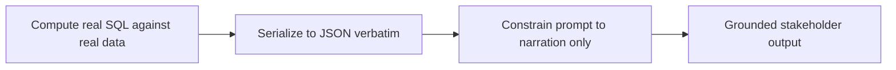

# Lecture 3 — AI Across the PM Loop

> **Duration:** ~2 hours. **Outcome:** You can use AI to draft backlog stories, slice epics, and generate a status/risk digest — with a prompting pattern that grounds every claim in data you retrieved first — and you can name, specifically, the failure modes that make ungrounded AI dangerous in a PM's hands.

Three weeks ago — before this course's timeline starts, but Marcus tells the story every time someone suggests a shortcut — Marcus asked an AI assistant to "summarize Atlas's status for the steering deck," pasted in a screenshot of the board, and forwarded the answer to Priya without reading it closely. The AI said Sprint 6 had shipped 14 story points. It hadn't — that number appeared nowhere in the screenshot; the model produced a plausible-sounding total because summarizing sprints usually involves a number like that, and it filled the gap. Priya cited it in a exec update. It was wrong, and Marcus found out from the meeting notes. That failure is this lecture's organizing example: not "don't use AI," but **never let AI state a number it didn't get from a query you ran.**

## 1. Where AI genuinely helps a PM

Before the guardrails, the honest case for AI in this loop — each of these is a real time save, not a novelty:

- **First-draft generation** — turning a rough feature brief into a candidate set of user stories (Exercise 3), a candidate risk register entry, or a first-pass communication plan. First drafts are the highest-friction part of writing; AI collapses "blank page" into "editing," which is a real and large time save.
- **Slicing and restructuring** — given one large, badly-scoped story, generating several candidate vertical slices to react to (Week 3's INVEST slicing, done faster with a first pass to critique instead of author from scratch).
- **Pattern-spotting across a large export** — "does anything in this 40-row export look unusual" is a task AI is well suited to as a *first pass*, precisely because a human skimming 40 rows misses things AI won't — provided the AI is looking at the real 40 rows, not describing what a typical 40-row export might contain.
- **Narrating numbers you already computed** — turning `{closed: 8, open: 8, blocked: 2}` into a paragraph a stakeholder wants to read. This is genuinely the safest use case, and it's the one this lecture builds toward, because the AI's job is reduced to *language*, not *arithmetic or memory*.
- **Translation and reformatting** — Week 11's exact pain: reformatting a Jira export's fields into GitHub Projects' fields, or restating the same status update in three lengths (one-liner, paragraph, full report) for three audiences.

## 2. Where AI fabricates or misleads — with specifics

"AI hallucinates" is too vague to act on. Here are the concrete shapes it takes in a PM's actual workflow, each with a why:

- **Filling gaps with plausible-sounding specifics.** Ask "what's our velocity trend" without giving it the velocity numbers, and it will generate a plausible trend — "steadily increasing," a specific percentage — because generating *something* that sounds like an answer is what a language model does when the actual answer isn't in its context. It is not lying on purpose; it has no access to "I don't know the real number" as a first-class state unless you build a check for it.
- **Silently averaging across the training distribution instead of your data.** Asked "how long does a P0 bug typically take to fix," without your data, it will answer with an industry-typical number that has nothing to do with Atlas's actual P0 history — and state it with the same confidence it would use for a number it actually computed from your rows.
- **Confusing counts under compound filters.** Large exports with several conditions ("P0 or P1, not Done, assigned to Marcus or Chris") are exactly where a model asked to eyeball a pasted table and count will get the count wrong — miscounting under conjunction/disjunction is a known, common failure, not a rare one. The fix is never "ask it more carefully" — it's "run `COUNT(*)` in SQL and give the model only the resulting number."
- **Treating "no data found" as "nothing to report" instead of flagging it.** If a query returns zero rows because of a bug in the query (wrong sprint name, a typo), an ungrounded AI narrating "no rows" will cheerfully write "no blockers this week" — technically consistent with the (broken) input, catastrophically wrong in substance. This is why Challenge 2's hallucination test deliberately breaks the grounding query and checks the output doesn't quietly happen to still look fine.
- **Drifting dates and durations.** Language models are unreliable at date arithmetic performed in their own head ("that was about 3 weeks ago") even when the two dates are right there in the prompt — this is an arithmetic-in-context failure, not a knowledge gap, and it means duration/staleness claims ("this has been Blocked for 9 days") must be pre-computed in SQL, never left for the model to subtract.

The one-sentence rule this lecture is built around: **an AI assistant is a fluent narrator of numbers you hand it, and an unreliable source of numbers you don't.** Use it only ever in the first role for anything that reaches a stakeholder.

## 3. The grounded-prompt pattern

The fix isn't a magic phrase in the prompt ("please don't hallucinate" does approximately nothing) — it's a **pipeline shape**. Three stages, always in this order:


*The grounded-prompt pipeline — AI only ever narrates numbers that already came out of a query.*

**Stage 1 — Compute.** Run real SQL/pandas against real data. Every number that will appear in the output must come from here.

```sql
SELECT
    iteration,
    COUNT(*) FILTER (WHERE status = 'Done')     AS done_count,
    COUNT(*) FILTER (WHERE status = 'Blocked')  AS blocked_count,
    COUNT(*) FILTER (WHERE status <> 'Done')    AS open_count,
    COUNT(*)                                     AS total_count
FROM board_items
WHERE iteration = 'Sprint 8'
GROUP BY iteration;
```

```
 iteration | done_count | blocked_count | open_count | total_count
-----------+------------+---------------+------------+-------------
 Sprint 8  |          3 |             2 |          10|          13
```

**Stage 2 — Serialize, don't paraphrase.** Turn the query result into a compact, unambiguous block — JSON or a markdown table — and put it in the prompt verbatim. Do not describe the numbers in prose yourself first; that's an extra hop where a typo can sneak in.

```json
{
  "sprint": "Sprint 8",
  "total_items": 13,
  "done": 3,
  "blocked": 2,
  "open": 10,
  "blocked_items": [
    {"title": "Platform-team SLA dashboard", "assignee": "Wei Zhang", "days_blocked": 7, "blocked_reason_label": "platform-dependency"},
    {"title": "Flaky sandbox integration test keeps failing intermittently", "assignee": "Chris Okoye", "days_blocked": 5, "blocked_reason_label": "ci"}
  ]
}
```

**Stage 3 — Constrain the prompt to narration only.** Tell the model explicitly what it may and may not do:

```
You are drafting a one-paragraph status update for a VP of Product. You are given
the JSON block below, which is the complete and only source of truth for this sprint.

Rules:
- Use ONLY numbers and facts present in the JSON. Do not estimate, round trends,
  or infer anything not explicitly in the data.
- If the JSON does not contain something the reader would want to know (e.g., a
  trend versus last sprint), say "not available in this data" rather than guessing.
- Every blocked item must be named individually with its assignee — do not
  summarize the blocked list as just a count.

JSON:
{...}
```

This is the exact pattern Challenge 2 has you implement as a reusable script, and it's the difference between an AI status digest a PM can defend in a meeting and the one that burned Marcus three weeks ago.

## 4. Drafting a backlog with AI — and grading it against INVEST

Week 3 taught INVEST (Independent, Negotiable, Valuable, Estimable, Small, Testable) as the bar a well-sliced story clears. AI-drafted stories are a genuinely good *first pass* against a feature brief — and a genuinely unreliable final pass, because a model optimizing for "sounds like a user story" will happily produce stories that are well-formatted and badly sliced (too big, several concerns bundled into one, no clear acceptance criteria a tester could act on).

A prompt that produces a usable first draft:

```
Given this feature brief, draft 5-8 candidate user stories in the format
"As a <role>, I want <capability>, so that <benefit>." For each, list
1-3 acceptance criteria as Given/When/Then. Flag any story you think is
too large to fit in a single 2-week sprint, and say why.

Feature brief:
Northlight wants Atlas's SLA dashboard (currently blocked on the Platform
team's webhook feed contract - see PLAT-505) to show a public-facing
uptime page once the feed is live: rolling 30-day uptime %, incident
history with root-cause summaries, and a subscribe-for-alerts email
capture. No auth required to view; incident detail requires an internal
login.
```

The AI's output is a **draft to edit, not a backlog to ship**. Exercise 3 has you run this exact prompt and then apply INVEST to every story it returns — expect to merge two that are really one, split one that's secretly three, and rewrite at least one acceptance criterion that reads well but doesn't actually specify a testable behavior. That editing pass is the PM's actual job; the AI did the typing.

## 5. Risk-flagging from data, honestly

A grounded risk digest follows the same three-stage pattern as the status digest, but the SQL does more work — it has to define "risky" as a query, not a feeling:

```sql
-- Items open more than 5 days with no status change - a proxy for "stalled"
SELECT title, assignee, status, updated_at,
       CURRENT_DATE - updated_at AS days_since_update
FROM board_items
WHERE status NOT IN ('Done')
  AND CURRENT_DATE - updated_at > 5
ORDER BY days_since_update DESC;
```

Handing an AI *this* result set to narrate ("2 items have gone quiet for over 5 days: ...") is grounded risk-flagging. Handing an AI the whole 16-row board and asking "what looks risky?" is not — it's asking the model to both invent a definition of risk and apply it, unverifiably, in the same breath. The fix is the same discipline as Stage 1 above: **the PM decides what "risky" means and writes it as a query; the AI only narrates the query's output.**

## 6. A verification habit, not a one-time check

Grounding the prompt reduces fabrication; it doesn't make verification optional. Before anything AI-drafted reaches a stakeholder:

1. **Spot-check one number against the source.** Pick one figure in the output, re-run its query by hand, confirm the match.
2. **Read every named item, not just the summary sentence.** If the digest names "2 blocked items," open the board and confirm those are the actual two, not a different two.
3. **Ask what's missing, not just what's wrong.** A grounded digest can still under-report — silently omitting an inconvenient row is a different failure than inventing one, equally worth catching.

This three-step habit is cheap — minutes, not hours — and it's the difference between "AI saved me an hour" and "AI cost me my credibility with the VP." Challenge 2 builds this verification step directly into the digest script so it isn't a step a tired PM can skip on a Friday.

## 7. Check yourself

- State, in one sentence, the rule this lecture is built around.
- Name two specific failure modes (not just "hallucination") an ungrounded AI status update is prone to, and why each happens.
- What are the three stages of the grounded-prompt pattern, in order? Why does order matter?
- Why is "please don't make anything up" in a prompt not a sufficient fix on its own?
- In the risk-flagging example, who decides what "risky" means — the PM or the AI? Why does that division matter?
- Name the three-step verification habit and when you'd apply it.

## Further reading

- **Anthropic — "Reducing hallucinations":** <https://docs.claude.com/en/docs/test-and-evaluate/strengthen-guardrails/reduce-hallucinations>
- **Anthropic — "Long context prompting tips" (grounding large inputs):** <https://docs.claude.com/en/docs/build-with-claude/prompt-engineering/long-context-tips>
- **Atlassian — "AI in project management: use cases and risks":** <https://www.atlassian.com/agile/project-management/ai-project-management>
- **Week 3 (this course) — Backlog, User Stories & Requirements** — the INVEST criteria this lecture assumes: [`../../week-03-backlog-user-stories-and-requirements/`](../../week-03-backlog-user-stories-and-requirements/)
