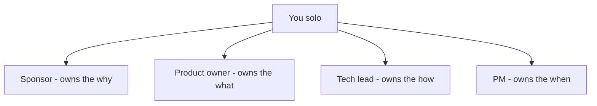
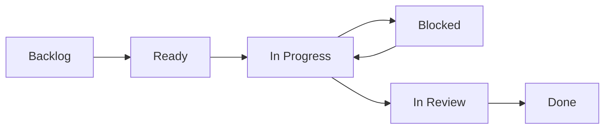

# Lecture 1 — Capstone Kickoff & Framing

> **Duration:** ~2.5 hours. **Outcome:** You have chosen a real, deliberately small project, written its charter, stood up its board, and set the success criteria and delivery approach you'll be measured against for the rest of the week.

Eleven weeks of this course taught you one move at a time against a case study you could read but never break. This week you make every one of those moves yourself, against something real, with no answer key. This lecture is the on-ramp: choosing something small enough to actually finish, chartering it properly, standing up the board, and setting the bar you'll hold yourself to on Saturday.

## 1. What the last eleven weeks handed you

Before you charter anything, look at what you're actually holding. Each week produced a specific, reusable move:

| Week | What it gave you | Where it shows up this week |
|-----:|-------------------|------------------------------|
| 1 | Project vs. product vs. ops; the charter; the triple constraint | §3–4 below — your capstone charter |
| 2 | Scrum ceremonies, Kanban flow, WIP limits | Lecture 2, §1 — how you run execution |
| 3 | INVEST stories, slicing, acceptance criteria | §5 below — your backlog |
| 4 | Relative estimation, capacity, commitment | §5 below — sizing what fits |
| 5 | Now/next/later roadmaps, release planning | §4 below — sequencing your scope |
| 6 | Risk registers, RAID, dependency mapping | Lecture 2, §2 — your live risk register |
| 7 | Stakeholder mapping, status reports, escalation | Lecture 2, §3 — your (small) stakeholder map |
| 8 | Velocity, throughput, cycle time, Little's Law in SQL/pandas | Lecture 2, §5 — your forecast |
| 9 | Budgeting and capacity modeled in SQL | Optional this week — see `resources.md` if your capstone has a real budget |
| 10 | Definition of done, release gates, rollback plans | Lecture 3, §1–2 |
| 11 | GitHub Projects / Jira tooling, AI-assisted PM workflows | §6 below — standing up the board |

Nothing this week is new *theory*. What's new is that every one of these moves now has to work on something you don't control the outcome of in advance — no case-study author guaranteed it'll go well.

## 2. Choosing a scoped project — the rule that matters most

The single most common way to fail this capstone is picking a project that can't actually ship this week. A charter for something you'll abandon on day 3 teaches you nothing about closure, release, or reporting — the back half of this course. **Scope ruthlessly small.** A rule of thumb: if you can't picture the literal, final `git push` that ships it by Saturday, it's too big — cut it until you can.

Concretely, aim for a project that:

- **Has a real, working output** by the end of the week — a script, a small CLI tool, a tiny API, a single well-defined feature added to something that already exists. Not a plan for a bigger thing. The thing itself.
- **Fits in roughly 15–20 hours of actual build time** across Tuesday–Friday (see the weekly schedule) — leaving Monday for chartering and Saturday for shipping, retro, and the report.
- **Has at least 8–15 backlog items** once sliced (Week 3) — small enough to finish, large enough to generate real flow data to forecast from (Lecture 2, §5 needs several days of throughput history; a 2-item backlog won't produce a meaningful forecast).
- **You can genuinely evaluate when it's done** — a definition of done you could write today, even roughly (Lecture 3 tightens it).

Pick **one**:

- **(A) Your own real idea**, ideally a smaller slice of the very project you chartered in Week 1's mini-project. If you have `c39-week-01/mini-project/charter.md`, re-read it now — does it still fit the sizing rule above? If not, don't force the whole thing into a week; **carve one real, shippable slice out of it** (e.g., not the whole "Study Buddy Matcher" app, but its matching algorithm as a standalone, testable CLI tool). Note which slice you're building and why in your charter's first line.
- **(B) One of these provided briefs**, each already scoped to a one-week solo build:
  1. **"Habit Ledger"** — a command-line habit tracker backed by SQLite: log a habit completion, see a streak, see a weekly summary. No UI beyond the terminal.
  2. **"Link Triage"** — a small script + SQLite store that ingests a list of URLs, checks each one's HTTP status, and reports which are dead — a tool you'd actually run against your own bookmarks.
  3. **"Standup Digest"** — a CLI tool that reads a plain-text file of daily standup notes and generates a one-paragraph weekly summary using simple text processing (no AI API required, though you may add one as a stretch goal).

Whichever you pick, this week's worked example — **Jordan Vance building TaskPing**, a command-line tool that watches a SQLite table of tasks and fires a desktop notification when one's due date arrives — shows every step below in miniature. TaskPing is deliberately close in size to the provided briefs; if you're building one of them, Jordan's decisions are close to a template you can follow directly.

## 3. Worked example — Jordan scopes TaskPing

Jordan has one evening free most days this week and picked option (B)-adjacent: TaskPing, inspired by "losing track of three separate reminder apps." The scoping conversation Jordan has with themselves, out loud, in a note:

> "The full idea is a background daemon with a system tray icon, snooze, recurring tasks, and a mobile companion app. That's not a week — that's a quarter. What's the smallest real slice? A CLI you run manually (`taskping check`) that reads tasks due today or overdue from a SQLite table and fires one native desktop notification per task. No daemon, no recurrence, no mobile app. If that ships and works, everything else is a *second* project."

That's the whole exercise in §2 above, done correctly: an idea that could have consumed a quarter, cut down to something with a real, checkable "done" by Saturday. Jordan writes that scoping decision into the charter's objective line directly — **cut scope belongs in the charter, not just in your head**, because a charter that hides the cut looks like scope creep the moment someone (even future-you) asks why the daemon isn't there.

## 4. Writing the capstone charter

Follow Week 1 Lecture 3's exact anatomy — you've done this once already; this time it has to survive contact with reality. In `charter.md`:

1. **Objective** — the real consequence, plus your scoping decision from §2/§3 stated explicitly (what you're building and what you deliberately aren't, this week).
2. **Success criteria** — at least 3, each passing the "would two reasonable people agree on this" test from Week 1. For a solo capstone, "reasonable people" can mean you and a peer reviewer (Lecture 2, §3 sets up who that is).
3. **Definition of done** — a first pass; Lecture 3 tightens this into your actual release gate, but write your honest current best guess now.
4. **Scope — in and out** — at least 5 in-scope items, at least 3 explicitly out-of-scope items (your §2 cuts belong here too, restated as scope boundaries).
5. **Constraints** — your real ones: the date (this week, specifically your target ship day), your actual available hours, any technical constraint (language, existing codebase you're extending, etc.).
6. **Decision authority** — even solo, name the hats: you as sponsor (own the "why"), you as product owner (own the "what," in priority order), you as tech lead (own the "how"), you as PM (own the "when, and what's in the way"). Naming them separately, even while one person wears all four, is what stops "I'll just decide as I go" from quietly becoming "I never actually decided."

Jordan's TaskPing objective line, as a model of the right length and specificity:

> "Ship a CLI tool, `taskping check`, that reads today's-or-overdue tasks from a SQLite table and fires one native desktop notification per task, by Saturday. This is deliberately the smallest real slice of a larger reminder-app idea — no daemon, no recurring tasks, no mobile app this week; those are out of scope by design, not by accident."


*Naming the four decision-authority hats separately, even though one person wears them all.*

## 5. Slicing the backlog and picking a delivery approach

With the charter's scope section as input, slice it into backlog items exactly as Week 3 taught: INVEST-shaped, each with acceptance criteria, sized with relative estimation (Week 4). For a project this size, err toward **Kanban flow** over fixed sprints (Week 2, §3) — a single week is too short for a meaningful sprint boundary, and Lecture 2's forecast (§5) wants daily throughput data, which flow naturally produces.

Jordan's sliced backlog for TaskPing (11 items, priority in MoSCoW from Week 3):

| Key | Title | Type | Priority |
|-----|-------|------|----------|
| TP-01 | Design the `tasks` table schema | chore | must |
| TP-02 | Seed 5 sample tasks for manual testing | chore | must |
| TP-03 | Load overdue-or-due-today tasks via SQL query | feature | must |
| TP-04 | Fire a native desktop notification per task (macOS) | feature | must |
| TP-05 | Handle zero-tasks-due case cleanly (no empty notification) | feature | must |
| TP-06 | `taskping add "title" --due YYYY-MM-DD` command | feature | must |
| TP-07 | `taskping list` command to see all open tasks | feature | should |
| TP-08 | Mark a task done: `taskping done <id>` | feature | should |
| TP-09 | Write a README with install + usage | chore | must |
| TP-10 | Handle malformed due-date input gracefully | bug-shaped | should |
| TP-11 | Cross-platform notification fallback (Linux via `notify-send`) | feature | could |

Notice TP-11 is explicitly a `could` — Jordan is not committing to it, and if the week runs short, it's the first thing cut, not a surprise casualty.

## 6. Standing up the board

Use GitHub Projects (or Jira — steps are equivalent) exactly as Week 11 set up. Concretely, right now:

1. Create a new project (GitHub: repo → Projects tab → New project → Board layout). Name it after your capstone, not "Capstone" generically — you'll want this findable later.
2. Add columns matching your `capstone_items.current_status` values: **Backlog → Ready → In Progress → Blocked → In Review → Done**. Matching the board to the database schema exactly means Exercise 2's SQL queries will read naturally off what you did on the board — no translation layer.
3. Add each backlog item as a card, and simultaneously insert it into `capstone_items`:

```sql
INSERT INTO capstone_items
    (item_id, item_key, title, item_type, priority, created_at, current_status)
VALUES
    (1, 'TP-01', 'Design the tasks table schema', 'chore', 'must', CURRENT_DATE, 'Backlog'),
    (2, 'TP-02', 'Seed 5 sample tasks for manual testing', 'chore', 'must', CURRENT_DATE, 'Backlog'),
    (3, 'TP-03', 'Load overdue-or-due-today tasks via SQL query', 'feature', 'must', CURRENT_DATE, 'Backlog');
    -- one row per backlog item; repeat for your own list
```

4. Set a WIP limit on **In Progress** — for a solo capstone, **1**. This isn't a formality; Week 2 taught exactly why a high WIP with one person behind it guarantees everything takes longer (Little's Law, Week 8) — and this week you'll have your own data proving it if you ignore the limit.


*The board columns cards move through, mirroring current_status in capstone_items.*

## 7. Setting the delivery approach

State it explicitly in `delivery-approach.md`, following Week 1 Lecture 3, §4: for a project this size and this well-understood, **Agile/Kanban flow** is almost always the right call — you'll learn things in hour 3 that change hour 12's plan, and a rigid predictive schedule would just get rewritten anyway. The one exception: if your capstone has a genuinely fixed external constraint (submitting to something with a hard deadline and a fixed required format), name that explicitly and consider a more predictive approach for that piece — Week 1 Lecture 3, §4 still applies.

## 8. Check yourself

- What is the one rule of thumb from §2 for whether a project idea is small enough for this capstone?
- In your own words, what did Jordan cut from the original TaskPing idea, and where in the charter does that cut have to be written down?
- Why does §5 recommend Kanban flow over fixed sprints for a one-week solo capstone specifically?
- What's the WIP limit Jordan should set on "In Progress," and why that number for a solo project?
- Name the four decision-authority hats from Week 1 that you name explicitly in your charter, even solo.

If your charter, backlog, and board all exist and match the `capstone_items` table you seeded, you're ready for Exercise 1 and for Lecture 2 — running the actual delivery.

## Further reading

- **GitHub Projects — getting started:** <https://docs.github.com/en/issues/planning-and-tracking-with-projects>
- **Atlassian — Jira boards and workflows:** <https://www.atlassian.com/agile/tutorials/kanban>
- **Week 1's charter lecture** (re-read before writing this week's): `../../week-01-pm-foundations-and-delivery-lifecycle/lecture-notes/03-charter-and-success-criteria.md`
