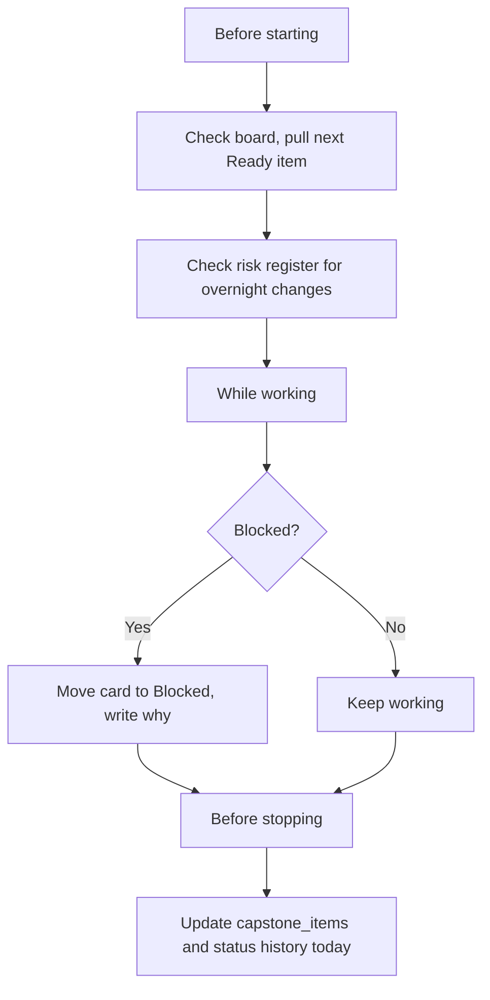
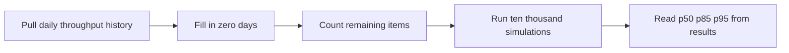

# Lecture 2 — Running the Delivery

> **Duration:** ~2.5 hours. **Outcome:** You are executing your capstone with a live risk register and stakeholder map, logging real flow data daily, and you can forecast your own ship date with a stated confidence level using a Monte Carlo simulation built in SQL and pandas.

Chartering and boarding a project (Lecture 1) is the easy, one-time part. Running it — day after day, with real blockers, real slippage, and real uncertainty about whether Saturday is realistic — is the actual job. This lecture covers the daily discipline that keeps a solo delivery honest, and teaches the one genuinely new technique this week: forecasting your ship date from your own history instead of guessing.

## 1. Executing: the daily rhythm

You don't need a daily standup meeting when you're the only attendee, but you do need the daily *discipline* a standup exists to create. Every day you work on your capstone, before you start and before you stop:

**Before starting (2 minutes):**
- Look at the board. What's `In Progress`? If it's empty, pull the next `must`-priority `Ready` item and move it — respecting your WIP limit of 1 from Lecture 1, §6.
- Check the risk register (§2 below). Did anything you flagged as "watching" materialize overnight (a dependency, a library update, an external API you rely on)?

**While working:**
- The instant something blocks you — a bug you can't immediately fix, a design question you can't immediately answer, a dependency that isn't behaving — move the card to `Blocked` and write *why*, in one sentence, right on the card. Don't silently keep the card in `In Progress` while you're actually stuck; that's the single most common way flow data gets corrupted (Week 8 warned about exactly this).

**Before stopping (5 minutes) — the part people skip and shouldn't:**
- Update `capstone_items` and `capstone_status_history` to match the board, *today*, not retroactively on Saturday. Lecture 2's forecast and Lecture 3's report both depend on this being current — a gap of even one day makes your flow data lie about when things actually finished.


*The daily discipline loop that keeps a solo delivery's flow data honest.*

```sql
-- when an item moves to Done, insert the closing history row and update the item
UPDATE capstone_status_history
SET left_at = CURRENT_DATE
WHERE item_id = 3 AND status = 'In Progress' AND left_at IS NULL;

INSERT INTO capstone_status_history (history_id, item_id, status, entered_at, left_at)
VALUES (7, 3, 'Done', CURRENT_DATE, NULL);

UPDATE capstone_items
SET current_status = 'Done', done_at = CURRENT_DATE
WHERE item_id = 3;
```

This is three statements every time a card moves — genuinely tedious by hand. Exercise 2 shows a short Python helper that does all three from one function call; use it once you understand what it's automating.

## 2. Keeping the risk register live

Week 6 taught you to build a risk register. The mistake almost everyone makes afterward is treating it as a Monday artifact instead of a living one. On a solo capstone, review it at least once a day, and log it in `capstone_risks` the moment you notice something, not at week's end from memory (memory reliably underweights small risks that turned out to matter and overweights dramatic ones that didn't).

Jordan's TaskPing risk register, logged as it develops through the week:

```sql
INSERT INTO capstone_risks
    (risk_id, description, category, probability, impact, owner, status, response, logged_at)
VALUES
    (1, 'macOS notification permissions may require a signed app bundle, which a bare Python script cannot provide',
     'Risk', 3, 4, 'Jordan', 'watching', 'mitigate — research terminal-notifier or osascript as an unsigned fallback', '2026-06-01'),
    (2, 'Personal calendar is unusually full Wed–Thu this week, cutting available build hours',
     'Risk', 4, 3, 'Jordan', 'open', 'mitigate — move TP-11 (Linux fallback) out of this week''s must-scope now, before it''s forced',
     '2026-06-01'),
    (3, 'SQLite due-date comparisons need consistent date formatting or "overdue" queries silently miss rows',
     'Assumption', 2, 4, 'Jordan', 'open', 'mitigate — write a dedicated test for date-boundary cases in TP-03', '2026-06-02');
```

Notice risk 1 materializing (or not) directly changes the plan: if `osascript` doesn't work reliably, Jordan needs to know by Wednesday, not discover it Friday night while trying to ship. **A risk logged Monday and never revisited is worse than no risk register at all** — it creates false confidence that something is "being tracked" when nobody's actually looked at it in five days.

Update a risk's `status` the moment its probability changes:

```sql
UPDATE capstone_risks
SET status = 'materialized', response = 'terminal-notifier works unsigned; switched TP-04 to use it'
WHERE risk_id = 1;
```

A risk register with every row still `status = 'open'` on Friday is a register nobody actually managed — it's a to-do list wearing a risk register's name.

## 3. A right-sized stakeholder map

Week 7's stakeholder map had eight named people because Atlas was an enterprise project. Your capstone almost certainly has two or three, and forcing more onto the page just to match the template is busywork, not rigor. In `capstone_stakeholders`, name the ones that are real:

```sql
INSERT INTO capstone_stakeholders (stakeholder_id, name, role, power, interest, notes)
VALUES
    (1, 'Jordan Vance', 'Builder / sponsor / PM (self)', 5, 5, 'All four Week-1 hats — decisions land here'),
    (2, 'Priya (peer reviewer)', 'Reviews the charter and final report', 2, 3, 'Course peer; gives the "would a reasonable person agree" check Week 1 needs'),
    (3, 'Future Jordan', 'Will maintain/extend TaskPing next month', 3, 4, 'Not a person you talk to today, but a real stakeholder in code quality and README clarity');
```

That third row is not a joke entry — Week 7's whole point was that a stakeholder is anyone with a real stake in the outcome, and "the person who has to live with this code in a month" is exactly that, even when it's you. If your capstone genuinely has zero other humans involved, naming that stakeholder explicitly is what keeps you from writing undocumented, unreadable code "because nobody else will see it" — someone will: you, later, having forgotten everything.

If a peer reviewer, a manager, or a real user *is* involved, give them a real one-paragraph status update at least once mid-week, following Week 7's status-report format — even a two-sentence Slack message beats silence until Saturday.

## 4. Logging flow data — why it has to be daily, not retroactive

Lecture 2's forecast (§5) and Lecture 3's report both need real daily throughput: how many items you actually finished *each day*. This only works if `capstone_items.done_at` and `capstone_status_history` are accurate to the day, which only happens if you update them the day the work happens (§1). Reconstructing this from memory on Saturday will produce a forecast built on fiction, and the whole point of this week is replacing "it feels slower" with a real number (Week 8, §1) — don't undermine your own data by being lazy about logging it.

## 5. Forecasting your ship date with Monte Carlo simulation

Week 8 taught you to compute velocity, throughput, and cycle time from history. It stopped short of using that history to predict the *future* — that's this section's job, and it's the one genuinely new technique in this course.

### 5a. Why an average is the wrong tool

The tempting shortcut: "I've finished 2.3 items/day on average, I have 6 items left, so I'll finish in 2.6 days." This is wrong in a specific, provable way: **averages hide variance, and variance is exactly what makes forecasting hard.** Some days you'll finish 4 items, some days 0 (a blocked day, a day you didn't touch the board at all). A single average number throws away the shape of that variation — and the shape is precisely what tells you whether Saturday is a safe bet or a coin flip.

### 5b. The technique: bootstrap resampling from your own history

**Monte Carlo forecasting** (the specific, standard flavor used in Agile flow forecasting, popularized by Troy Magennis and Daniel Vacanti) works like this: instead of computing one number and projecting it forward, you **simulate the future thousands of times**, each time by randomly drawing from your *actual* historical daily throughput — with replacement, meaning any day's result, including a zero-day, can be redrawn — until the simulated backlog hits zero. Each simulation gives you one candidate "days to finish." Do this ten thousand times and you get a **distribution** of finish times, from which you can honestly say things like "85% of simulated futures finish within 4 days."

This works because it doesn't assume anything about the *shape* of your variance — it just replays your own actual good days and bad days, in random order, many times. It respects the real lumpiness of solo work (a day where three small chores all land together, a day derailed by risk 1 materializing) instead of smoothing it into a single misleading average.


*The Monte Carlo forecasting pipeline, from raw history to a confidence range.*

### 5c. Step 1 — pull your daily throughput history in SQL

```sql
SELECT
    done_at AS day,
    COUNT(*) AS items_done
FROM capstone_items
WHERE done_at IS NOT NULL
GROUP BY done_at
ORDER BY day;
```

This only returns days with at least one item done — you need the **zero-days** too, or the simulation will never sample "I got nothing done today," which understates your risk. Fill the gaps in pandas:

```python
import pandas as pd
import numpy as np
import psycopg2  # or sqlite3

conn = psycopg2.connect("dbname=capstone_pm")   # or: sqlite3.connect("capstone_pm.db")

df = pd.read_sql(
    "SELECT done_at AS day, COUNT(*) AS items_done "
    "FROM capstone_items WHERE done_at IS NOT NULL GROUP BY done_at ORDER BY day;",
    conn,
)
df["day"] = pd.to_datetime(df["day"])

# reindex across every calendar day you've been working, filling missing days with 0
full_range = pd.date_range(df["day"].min(), df["day"].max(), freq="D")
throughput = df.set_index("day").reindex(full_range, fill_value=0)["items_done"]

print(throughput)
```

If you've logged four working days with 2, 0, 3, 1 items done, `throughput` is exactly that four-value series — small, but real, and it's what you have on Thursday morning.

### 5d. Step 2 — how many items are actually left

```sql
SELECT COUNT(*) AS remaining
FROM capstone_items
WHERE current_status != 'Done';
```

Pull this the same way `remaining_items = pd.read_sql(..., conn).iloc[0]["remaining"]`, or just read the number off your board.

### 5e. Step 3 — run the simulation

```python
rng = np.random.default_rng(seed=42)   # seeded for reproducibility while you're learning this
history = throughput.to_numpy()
remaining_items = 6                     # from §5d
n_simulations = 10_000
max_days_safety_valve = 60              # stop a runaway sim if history is all zeros

days_to_finish = []
for _ in range(n_simulations):
    completed = 0
    days = 0
    while completed < remaining_items and days < max_days_safety_valve:
        completed += rng.choice(history)   # one random day's worth of throughput, with replacement
        days += 1
    days_to_finish.append(days)

days_to_finish = np.array(days_to_finish)
p50, p85, p95 = np.percentile(days_to_finish, [50, 85, 95])

print(f"50% confidence: done within {p50:.0f} days")
print(f"85% confidence: done within {p85:.0f} days")
print(f"95% confidence: done within {p95:.0f} days")
```

Each of the 10,000 simulated "futures" replays your own history in a random order until the remaining backlog is cleared. The **p50** is your median case — a coin flip either way. The **p85** is the number you'd actually tell a stakeholder (Week 7): confident enough to commit to, honest enough to not be a fantasy. The **p95** is your "if I had to promise this to someone whose trust I can't afford to lose" number.

### 5f. Reading the forecast, and its honest limits

Report the range, not a single date — "85% confidence I ship by Friday, worst realistic case is Sunday" is a *better*, more honest answer than a single "Friday," and it directly practices the communication habit Week 7 built (surfacing uncertainty early beats a false-precision promise that breaks later).

Two real limits to say out loud, not hide:

- **The simulation only knows what already happened.** If risk 1 in §2 is still "watching" and hasn't materialized in your history yet, the forecast doesn't know it might. A forecast is a *statistical* answer, not a substitute for reading your own risk register (§2) — combine both, always.
- **You need enough history for the resampling to mean anything.** Three data points bootstrapped ten thousand times just replays those same three numbers in different orders — better than nothing, but treat a forecast built on fewer than ~5–6 days of real throughput as a rough signal, not a firm commitment. This is exactly why Lecture 1, §2 insisted on a backlog big enough to generate several real days of flow before you need to forecast — a two-item backlog gives the simulation almost nothing to work with.

## 6. Deciding what to do with the forecast

If Thursday's forecast (Exercise 2 runs this for real) says your 85th-percentile finish is Sunday, not Saturday, you have exactly the same three levers Week 1's triple constraint gave you, and exactly the same rule: **make the trade-off explicit, don't silently absorb it.**

- **Cut scope** — drop a `could` (or a weaker `should`) item, same as Jordan pre-committing to cut TP-11 if the calendar got tight (§2).
- **Extend the date** — if your only stakeholder is you, this is genuinely available; say so honestly in your report rather than pretending you hit the original date.
- **Increase throughput** — find more focused hours, remove a blocker permanently rather than working around it repeatedly. This is the least reliable lever and the one people reach for first out of optimism; be honest about whether it's realistic before counting on it.

Challenge 1 this week gives you a full mid-delivery slip scenario to practice exactly this decision under realistic pressure.

## 7. Check yourself

- Why does §1 say updating the board "before stopping" matters more than updating it "sometime this week"?
- What's the concrete difference between a risk register that's actually live and one that's a Monday artifact nobody revisits?
- Why is an average throughput number the wrong tool for forecasting, per §5a?
- In your own words, describe what one single Monte Carlo simulation run does, step by step.
- Why report a range (p50/p85/p95) instead of a single forecast date?
- Name the two honest limits of Monte Carlo forecasting from §5f.
- What are the three levers available if your forecast says you'll miss your target date?

## Further reading

- **Troy Magennis — Monte Carlo forecasting resources (free), the source this technique is drawn from:** <https://www.focusedobjective.com/resources>
- **Daniel Vacanti, *Actionable Agile Metrics for Predictability*:** <https://actionableagile.com/books/>
- **NumPy `Generator.choice` docs (used for the resampling step):** <https://numpy.org/doc/stable/reference/random/generated/numpy.random.Generator.choice.html>
