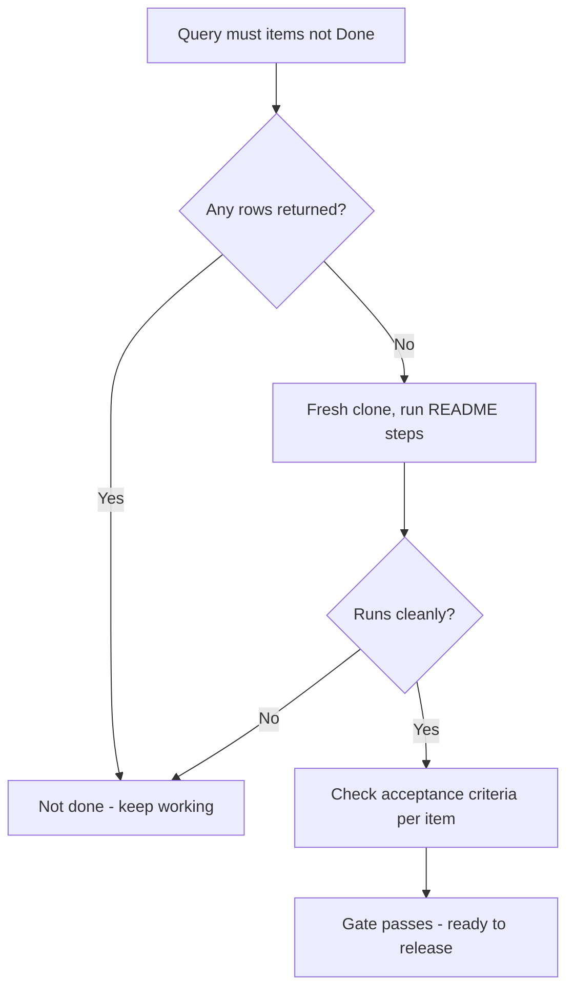
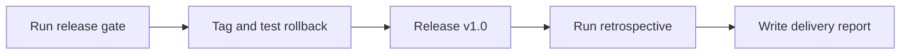

# Lecture 3 — Closing, Releasing & Reporting

> **Duration:** ~2 hours. **Outcome:** You can gate a release on an explicit definition of done, ship it with a tested rollback plan, run a closing retrospective that tells the truth, and write a final delivery report backed by your own data.

Everything through Lecture 2 was building and running. This lecture is the part most solo projects skip entirely — the deliberate, gated act of calling something *done*, shipping it safely, and closing the loop with an honest account of what happened. Skipping this is how side projects quietly die half-finished on a laptop; doing it properly is what makes this week a real capstone rather than just more building.

## 1. The release gate — turning "done" into a checkable fact

Week 10 introduced the definition of done (DoD) and the release gate. This section makes it concrete for your capstone specifically. A **release gate** is a checklist you cannot ship past until every item is checked — not a vibe, not "it works on my machine," a literal list you go through in order.

Your capstone's gate should cover, at minimum:

1. **Every `must`-priority backlog item is `Done`** in `capstone_items` — query it, don't eyeball the board:

```sql
SELECT item_key, title, current_status
FROM capstone_items
WHERE priority = 'must' AND current_status != 'Done';
```

If this returns any rows, you are not done, regardless of how it feels. This is the whole value of a SQL-backed gate over a mental checklist — it can't be fooled by a card that *looks* finished on the board but was never actually re-verified against the database.

2. **The tool runs from a clean checkout.** Clone your repo fresh into a scratch directory and run your own install/usage instructions from the README exactly as written — not from memory of how you set it up originally. This single step catches the most common release failure: a dependency or config file that exists on your machine but was never committed.

3. **Acceptance criteria pass for every `must` item**, checked against the criteria you wrote when slicing the backlog (Week 3) — not re-invented at release time to match whatever you actually built.

4. **The out-of-scope list from your charter is still accurate** — if you quietly built TP-11 (the Linux fallback Jordan marked `could`) because it turned out easy, that's fine, but say so; if you quietly *dropped* a `must` item and didn't update the charter, that's scope creep in reverse and needs to be visible, not hidden.


*The release gate as a checkable pass-or-fail sequence, not a feeling.*

Jordan's TaskPing gate, run Friday evening:

```
[x] TP-01 through TP-06, TP-09 all current_status = 'Done' (all 'must' items)
[x] Fresh clone + `pip install -e .` + `taskping add` + `taskping check` all work with no manual fixes
[x] Acceptance criteria for TP-04 (notification fires) verified on a clean macOS session, not just the dev machine
[ ] TP-10 (malformed date handling) still In Progress — was 'should', not 'must'; gate passes without it, charter's scope note updated to reflect it's slipping to a v1.1
```

That last line is the gate doing its job correctly: TP-10 didn't block release because it was never a `must`, and the charter gets updated to say so honestly rather than pretending the original plan held perfectly.

## 2. The rollback plan — write it before you need it

A rollback plan written *after* something breaks is not a plan, it's a panic. Week 10 covered this in general; here's the concrete, git-based version for a solo capstone:

1. **Tag the last known-good state before releasing:**

```bash
git tag -a v0.9-pre-release -m "Last verified state before v1.0 release gate"
git push origin v0.9-pre-release
```

2. **Write down, in `ROLLBACK.md`, the exact commands to revert** — not "I'd figure it out," the literal commands:

```bash
# If v1.0 is broken after release:
git checkout v0.9-pre-release
# or, to move main back without losing the broken attempt as history:
git revert <bad-commit-sha>..HEAD --no-commit
git commit -m "Revert v1.0: <specific reason>"
```

3. **Actually test it once**, on a throwaway branch, before you rely on it:

```bash
git checkout -b rollback-drill
git checkout v0.9-pre-release -- .
# confirm the tool still runs correctly from this state
git checkout main
git branch -D rollback-drill
```

This drill takes five minutes and is the difference between "I have a rollback plan" (a sentence) and "I have a rollback plan" (a thing you've watched work). Week 10 makes the same point about production systems at any scale — the habit is identical whether the blast radius is a company's checkout flow or your own CLI tool.

## 3. Running the release

With the gate passed (§1) and the rollback tested (§2), ship it:

```bash
git tag -a v1.0 -m "TaskPing v1.0 — capstone release"
git push origin v1.0
git push origin main
```

Update `capstone_items` and your board one final time — every `must` item to `Done`, and log the release itself as a fact you can point to later:

```sql
INSERT INTO capstone_risks (risk_id, description, category, probability, impact, owner, status, response, logged_at)
VALUES (4, 'v1.0 released', 'Issue', 1, 1, 'Jordan', 'closed', 'n/a — informational log entry marking the release date', CURRENT_DATE);
```

(Using the risk table as a lightweight release log is a small, deliberate reuse — you already have a table with a date column and a status field; there's no need to invent a fifth table for one row.)

## 4. The closing retrospective

Week 2 taught the retrospective format for a team. Run the same structure solo, honestly, in `retrospective.md` — the value is identical whether one voice or six are in the room, as long as that one voice doesn't let itself off easy:

- **What went well** — be specific, not "it went fine." What decision, habit, or tool choice actually helped?
- **What didn't** — the honest version, including anything from Lecture 2's risk register that materialized and what it cost you.
- **What you'd do differently** — one real, actionable change for the *next* project, not a vague "be more organized."
- **One number from your own data** that surprised you — pull it from `capstone_items`/`capstone_status_history` (e.g., "I predicted p85 = 4 days on Thursday; it actually took 5" or "my WIP limit of 1 was broken twice, and both times the broken item took visibly longer to finish than items where I held the limit").

That last bullet matters specifically because it ties the retrospective back to real data instead of impressions — exactly the discipline Week 8 built and this whole capstone has been practicing.

## 5. The final data-backed delivery report

This is the artifact that closes the loop from Lecture 1's charter all the way through. In `delivery-report.md`, write a report that a stakeholder (even if that's future-you) could read cold and understand what happened, structured as:

1. **What shipped** — one paragraph, plain language, linking the release tag (§3).
2. **Success criteria — met or not, with the actual number.** Pull directly from your charter (Lecture 1, §4) and check each one against reality:

```sql
-- example: "at least 8 backlog items shipped" success criterion, checked directly
SELECT COUNT(*) AS items_shipped
FROM capstone_items
WHERE current_status = 'Done';
```

Report every criterion, even the ones you missed — a report that only lists the criteria you hit isn't a report, it's marketing. If a criterion was missed, say by how much and why, using your own risk register and forecast history as the evidence, not a vague excuse.

3. **The flow numbers** — your final throughput history, cycle time for the items that took longest, and how your Thursday forecast (Lecture 2, §5) compared to what actually happened. This is the same rigor Week 8's mini-project asked of Atlas's data, now applied to your own:

```python
# how far off was the forecast, in one number
forecast_p85_days = 4        # from your Thursday run
actual_days_to_finish = (pd.Timestamp(final_done_date) - pd.Timestamp(forecast_run_date)).days
print(f"Forecast was off by {actual_days_to_finish - forecast_p85_days} days")
```

4. **What got cut, and why** — direct from your risk register and charter revisions (§1). Precision here is what separates an honest report from a highlight reel.
5. **One retrospective takeaway** — pull the single most useful line from §4 forward into the report; a report and a retrospective that say completely unrelated things usually means one of them wasn't honest.

## 6. Worked example — TaskPing's closing sequence

Jordan's actual Friday-to-Saturday sequence, in order: run the gate (§1) → catch that TP-10 is still open and correctly reclassify it as not-blocking since it was never a `must` → tag and test the rollback (§2) → release `v1.0` (§3) → run the retrospective (§4), which surfaces that risk 1 (notification permissions) *did* materialize and cost about half a day, exactly as flagged Monday → write the delivery report (§5), which reports the Thursday forecast (p85 = 4 days) against the actual outcome (5 days, one day over, attributable directly to risk 1) — a small miss, reported honestly, with the specific cause named rather than smoothed over.

That gap between forecast and actual is not a failure of the forecast — it's exactly what §5f in Lecture 2 predicted a Monte Carlo forecast can't see: a risk that hadn't materialized yet in the history it was built from. Naming that plainly in the report is the single clearest signal that you understand this week's material, not just executed it.


*Jordan's Friday-to-Saturday closing sequence, each step depending on the one before it.*

## 7. Check yourself

- What's the difference between a release gate that's a checklist and one that's "a feeling that it's probably fine"?
- Why does §1 insist on a fresh clone as part of the gate, instead of trusting the dev machine it was built on?
- What two things does a rollback plan need beyond "the commands," per §2?
- List the five sections of the closing retrospective from §4.
- Why does §5 say a delivery report that only lists met success criteria "isn't a report, it's marketing"?
- In the worked example, what specifically explained the one-day gap between Jordan's forecast and the actual ship date?

## Further reading

- **Google SRE book — postmortems and the value of blameless, honest incident review (free online):** <https://sre.google/sre-book/postmortem-culture/>
- **Atlassian — how to run an effective retrospective:** <https://www.atlassian.com/team-playbook/plays/retrospective>
- **`git-scm` — Tagging, and safely reverting a merge:** <https://git-scm.com/book/en/v2/Git-Basics-Tagging>
